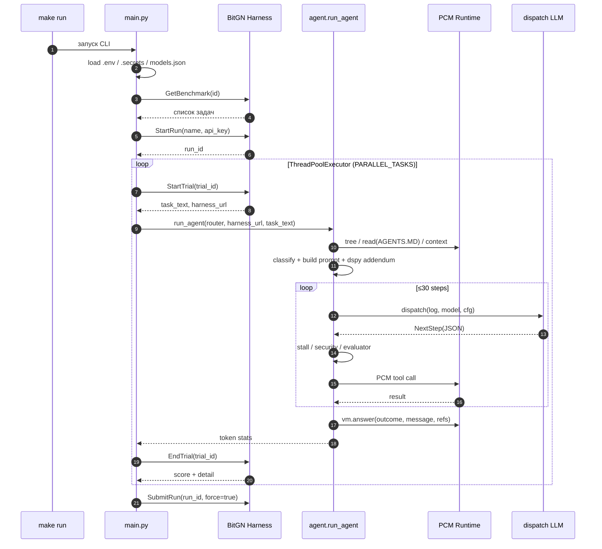
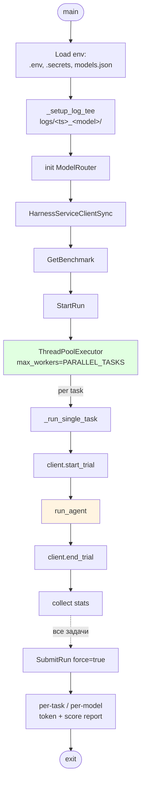
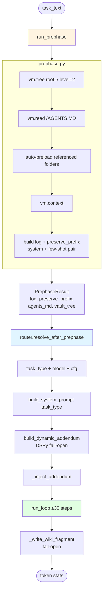
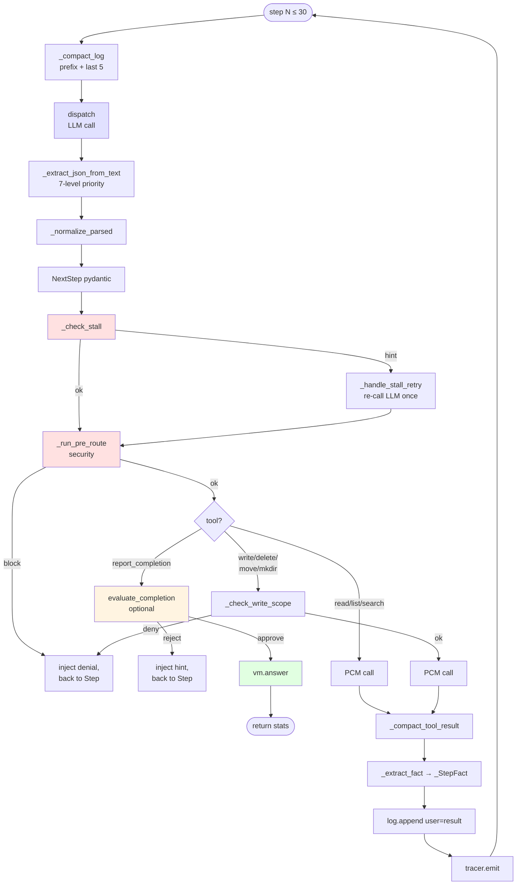

# 01 — Поток выполнения

Конвейер от `make run` до вызова `vm.answer()`: точка входа, prephase, главный loop и lifecycle одного шага.

## От harness до завершения задачи

## Оркестрация в main.py

## run_agent: конвейер одной задачи

## Жизненный цикл одного шага loop

## Ключевые файлы

| Файл | Роль |
|---|---|
| `main.py` | CLI, подключение к harness, ThreadPoolExecutor, общая статистика |
| `agent/__init__.py` | `run_agent()` — сборка pipeline для одной задачи |
| `agent/prephase.py` | Discovery-фаза: tree, AGENTS.MD, context, few-shot pair |
| `agent/loop.py` | Главный loop ≤30 шагов, оркестрация диспетчера/security/evaluator |
| `agent/models.py` | Pydantic-модели `NextStep`, `Req_Read`, `Req_Write` и т. д. |
| `agent/json_extract.py` | 7-уровневое извлечение JSON из ответа LLM |

## Ограничения и таймауты

- **≤30 шагов на задачу** — после этого форс-ретёрн `OUTCOME_ERR_INTERNAL`.
- **`TASK_TIMEOUT_S`** (по умолчанию 180 s) — принудительное прерывание воркером.
- **`PARALLEL_TASKS`** (по умолчанию 1) — степень параллелизма.
- **≤40K токенов в истории** — обеспечивается `log_compaction` (см. [09 — Наблюдаемость](09-observability.md)).

## Outcome-коды (см. `proto/bitgn/vm/pcm.proto`)

- `OUTCOME_OK` — задача выполнена.
- `OUTCOME_DENIED_SECURITY` — сработала защита.
- `OUTCOME_NONE_CLARIFICATION` — задача неоднозначна.
- `OUTCOME_NONE_UNSUPPORTED` — требует внешнего сервиса.
- `OUTCOME_ERR_INTERNAL` — внутренняя ошибка агента.
