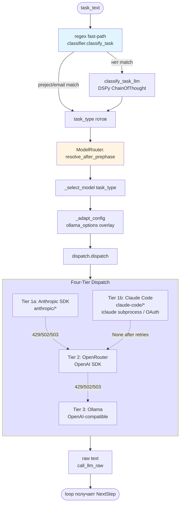
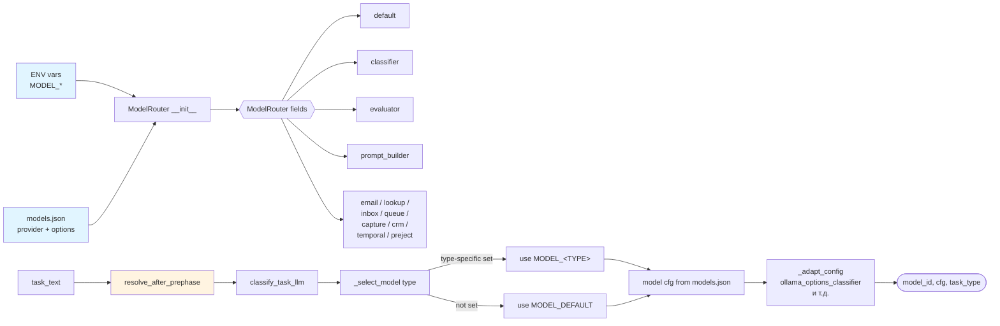
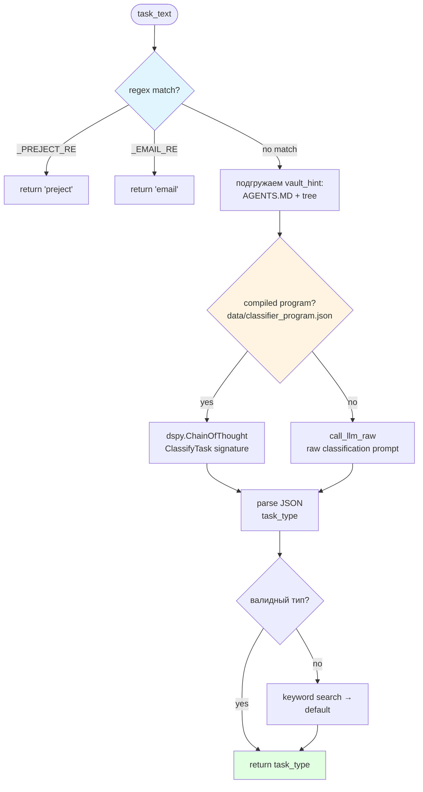
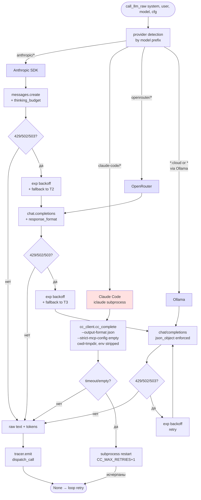
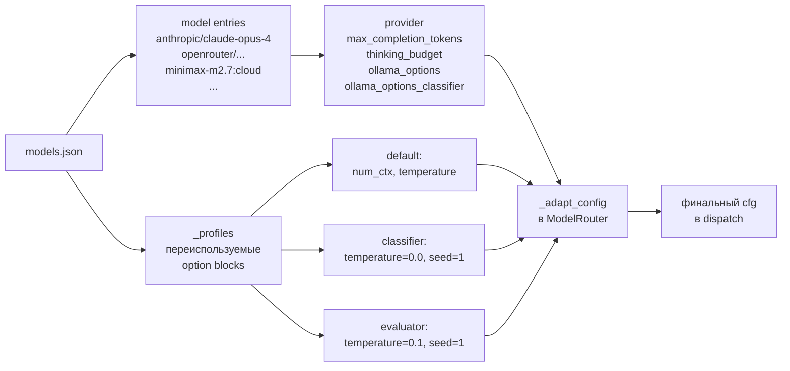

# 02 — LLM-маршрутизация

Как запрос к LLM проходит через классификацию задачи, выбор модели и четыре уровня провайдеров (Anthropic SDK / Claude Code (`iclaude` subprocess) → OpenRouter → Ollama).

## Общая схема

## ModelRouter: роутинг по типу задачи

### Таблица маппинга

| Task type | ENV переменная | Роль в агенте |
|---|---|---|
| `preject` | `MODEL_PREJECT` | Немедленный отказ (внешние сервисы) |
| `email` | `MODEL_EMAIL` | Составление письма в `/outbox/` |
| `inbox` | `MODEL_INBOX` | Обработка одного входящего |
| `queue` | `MODEL_QUEUE` → `MODEL_INBOX` | Пакетная обработка inbox |
| `lookup` | `MODEL_LOOKUP` | Read-only запросы к vault |
| `capture` | `MODEL_CAPTURE` | Фиксация сниппета в путь |
| `crm` | `MODEL_CRM` | Reschedule/reconnect + write |
| `temporal` | `MODEL_TEMPORAL` → `MODEL_LOOKUP` | Даты-относительные запросы |
| `distill` | — | Анализ + write summary (default) |
| `default` | `MODEL_DEFAULT` | Всё остальное |
| — | `MODEL_CLASSIFIER` | Классификация (обязательная) |
| — | `MODEL_EVALUATOR` | Reviewer перед submission |
| — | `MODEL_PROMPT_BUILDER` | Генерация DSPy-адендума |

## Classifier: regex + DSPy

Wiki-based type hints (см. [07 — Wiki-память](07-wiki-memory.md)) добавляются в `vault_hint` для снижения flip-ов между `inbox/queue`.

## Four-Tier Dispatch

### Особенности провайдеров

| Провайдер | JSON mode | Extended thinking | Retry |
|---|---|---|---|
| **Anthropic** | через `response_format` / native | `thinking_budget` | 429/502/503 |
| **Claude Code** | system-prompt trailer `"Return ONLY JSON"` (у CLI нет `response_format`) | `--effort low/medium/high/max` (маппинг в профилях `cc_*`) | `CC_MAX_RETRIES+1` subprocess-рестартов |
| **OpenRouter** | `response_format=json_object/json_schema` | — | 429/502/503 |
| **Ollama** | `response_format=json_object` (принудительно) | — | 429/502/503 |

- `probe_structured_output(model, cfg)` — динамически определяет возможности модели (cache в `.cache/`).
- `get_anthropic_model_id(model)` — нормализация имени (`anthropic/claude-opus-4` → `claude-opus-4-20250514`).
- Таймауты httpx: **read 180 s**, **connect 10 s**.

### Claude Code tier (изоляция iclaude)

Когда модель имеет префикс `claude-code/*` (и `CC_ENABLED=1`), `dispatch.py` перенаправляет вызов в `cc_client.cc_complete()` **вместо** Anthropic-tier — это взаимоисключающий выбор, а не каскад. `iclaude` запускается как stateless subprocess с полной изоляцией от host-проекта:

- `cwd=tempfile.mkdtemp()` — нет auto-discovery `CLAUDE.md` из проекта.
- `--no-save` — нет сессионной истории в `~/.claude/projects`.
- `--strict-mcp-config --mcp-config <empty.json>` — пустой список MCP-серверов, никаких tools модели не передаётся (stateless LLM use).
- `--print --output-format json` — headless non-interactive режим, parseable envelope.
- `--system-prompt <sys>` — явный system prompt с трейлером `"Return ONLY a valid JSON object"` (у CLI нет `response_format`).
- `env` очищен: `ANTHROPIC_API_KEY` / `OPENROUTER_API_KEY` / `OPENAI_API_KEY` удаляются при `CC_STRIP_PROJECT_ENV=1` — iclaude использует собственный OAuth.
- `start_new_session=True` + `killpg` SIGTERM→5s→SIGKILL для чистой остановки по таймауту.

Retry: до `CC_MAX_RETRIES+1` попыток с паузой `CC_RETRY_DELAY_S` между рестартами subprocess (по аналогии с Ollama). После исчерпания — `None`, и loop.py инициирует общий retry.

## models.json: структура конфигурации

## Ключевые файлы

| Файл | Что делает |
|---|---|
| `agent/dispatch.py` | 4-tier оркестрация, `call_llm_raw`, retry, probe |
| `agent/cc_client.py` | Claude Code tier: spawn `iclaude --print --output-format json`, парсинг envelope |
| `agent/classifier.py` | `classify_task` (regex), `classify_task_llm` (DSPy), `ModelRouter` |
| `agent/dspy_lm.py` | `DispatchLM` — адаптер `dspy.BaseLM` поверх `call_llm_raw` |
| `models.json` | Per-model и per-task-type конфигурация |

## Тесты

- `tests/test_classifier.py` — проверка типизации (regex + LLM fallback).
- `tests/test_capability_cache.py` — кеширование `probe_structured_output`.
