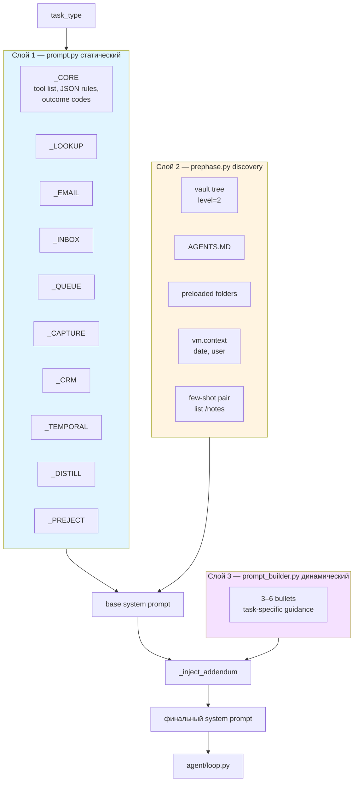
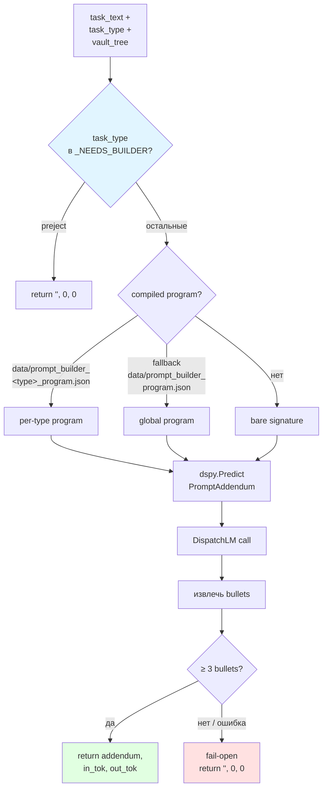
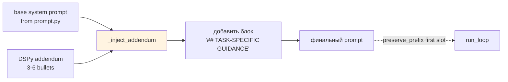

# 03 — Prompt-система

Как собирается финальный system prompt: статический базовый блок (`prompt.py`) + discovery-контекст (`prephase.py`) + динамический DSPy-аддендум (`prompt_builder.py`).

## Три слоя prompt-а



## Prephase: discovery перед loop

```mermaid
sequenceDiagram
    participant A as run_prephase
    participant VM as PCM Runtime
    participant Log as conversation log

    A->>VM: tree(root=/, level=2)
    VM-->>A: vault layout
    A->>VM: read(/AGENTS.MD)
    VM-->>A: folder semantics

    Note over A: извлечь упомянутые папки<br/>из AGENTS.MD
    loop для каждой referenced folder
        A->>VM: list(/&lt;folder&gt;)
        A->>VM: read(non-template files)
    end

    A->>VM: context()
    VM-->>A: {date, user, ...}

    A->>Log: append(system=base_prompt)
    A->>Log: append(user=tree+AGENTS.MD+context)
    A->>Log: append(assistant=few-shot response)
    A->>Log: append(user=real_task_text)

    Note over Log: preserve_prefix =<br/>system + few-shot pair
    A-->>A: PrephaseResult
```

**Зачем few-shot pair**:
- Сильнейший сигнал для формата JSON-ответа.
- Сохраняется при компактизации истории (см. [09 — Наблюдаемость](09-observability.md)).
- Типовой пример: `list /notes` → ожидаемый JSON NextStep.

## Prompt_builder: DSPy-аддендум



### PromptAddendum signature

```
Input:
  - task_text             (строка задачи)
  - vault_tree_text       (вывод tree)
  - vault_context_summary (AGENTS.MD + file counts)

Output:
  - addendum              (3-6 bullet points)

Правила:
  - Bullet 1: какую папку исследовать первой
  - Bullet 2: ключевой риск / правило валидации
  - Bullet 3+: task-specific поля или ограничения
  - НИКОГДА не копировать буквальные значения из task
    (email, ID, даты) — только перефразировать
```

## Inject addendum



## Task-type → промпт-блоки

| Task type | Блоки (композиция) | Особенности |
|---|---|---|
| `email` | `_CORE` + `_EMAIL` + `_LOOKUP` | Поиск контакта → запись в `/outbox/` |
| `inbox` | `_CORE` + `_INBOX` | Проверка формата `From:` / `Channel:` |
| `queue` | `_CORE` + `_QUEUE` + `_INBOX` | Batch-обработка inbox |
| `lookup` | `_CORE` + `_LOOKUP` | Read-only |
| `capture` | `_CORE` + `_CAPTURE` | Attribution + путь |
| `crm` | `_CORE` + `_CRM` | Date arithmetic + write |
| `temporal` | `_CORE` + `_TEMPORAL` | Relative dates |
| `distill` | `_CORE` + `_DISTILL` | Анализ + note |
| `preject` | `_CORE` + `_PREJECT` | Немедленный отказ |

## Ключевые принципы дизайна

- **Discovery-first** — никаких хардкод-путей. Агент находит всё через `list`/`search`/`find`.
- **Code-first output** (в PAC1 отключено в текущей версии) — агент пишет Python-код, который возвращает JSON.
- **Fail-open gates** — нечёткая задача → `OUTCOME_NONE_CLARIFICATION`, внешний сервис → `OUTCOME_NONE_UNSUPPORTED`.
- **Сохранение контекста** — system prompt + few-shot pair никогда не компактизуются.

## Ключевые файлы

| Файл | Функции |
|---|---|
| `agent/prompt.py` | `build_system_prompt(task_type)`, статические блоки `_CORE`, `_EMAIL`, … |
| `agent/prephase.py` | `run_prephase(vm, task_text, system_prompt_text)` → `PrephaseResult` |
| `agent/prompt_builder.py` | `build_dynamic_addendum(task_text, task_type, model, cfg, max_tokens)` |
| `agent/dspy_lm.py` | `DispatchLM` — обёртка над `call_llm_raw` для DSPy |

## Конфигурация

```bash
PROMPT_BUILDER_ENABLED=1          # включить DSPy-аддендум
PROMPT_BUILDER_MAX_TOKENS=500     # бюджет токенов для генерации
MODEL_PROMPT_BUILDER=...          # отдельная модель (иначе — classifier или default)
```

Скомпилированные программы — в `data/prompt_builder_*_program.json` (см. [04 — DSPy и оптимизация](04-dspy-optimization.md)).
