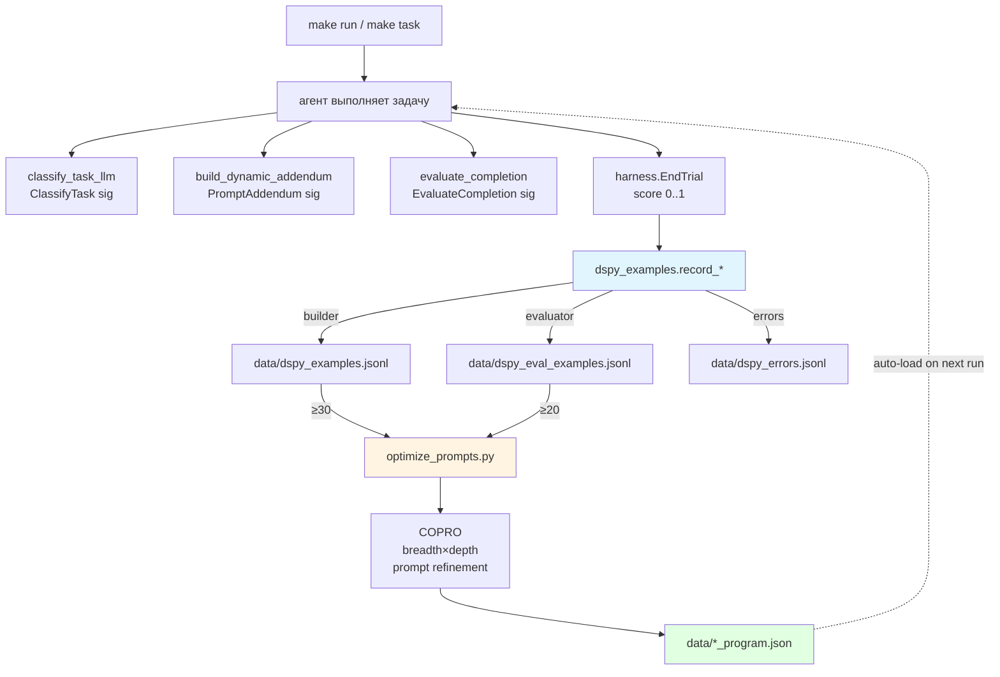
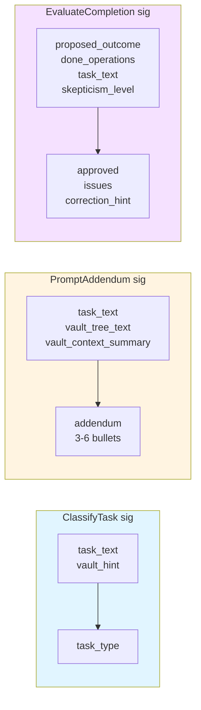
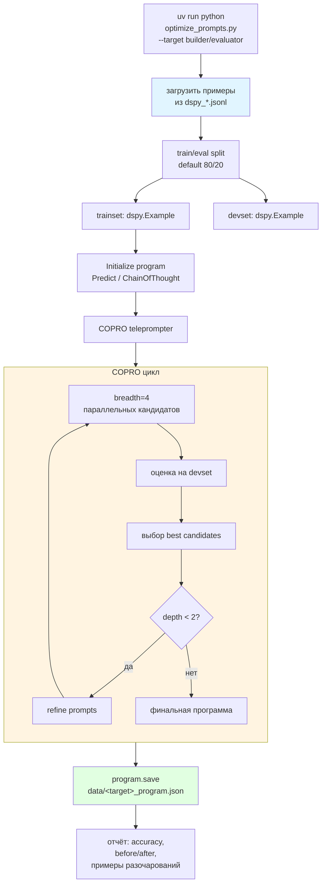
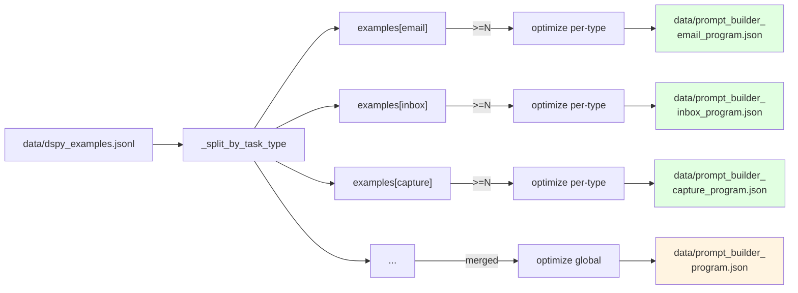
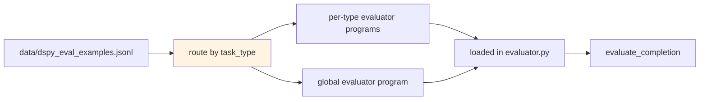
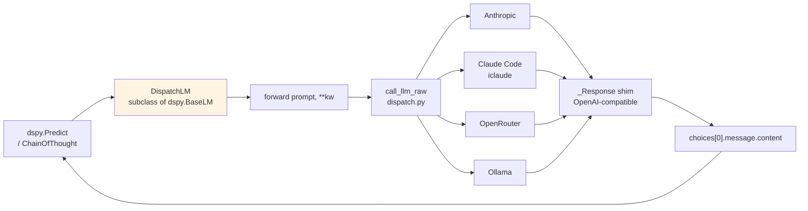
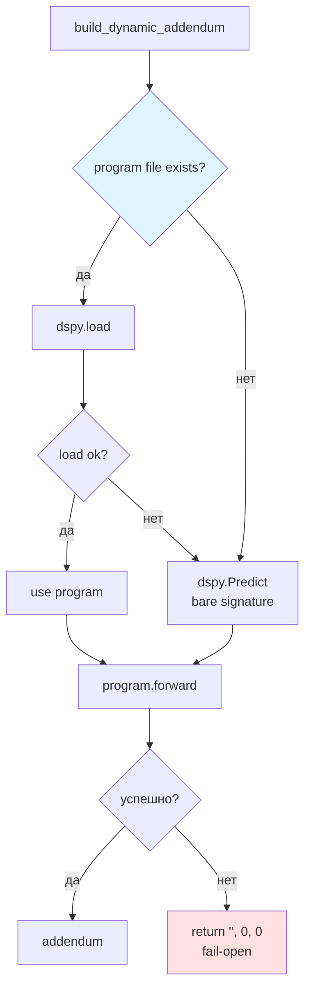

# 04 — DSPy и оптимизация промптов

Подсистема на базе DSPy, которая компилирует три сигнатуры (classifier, prompt_builder, evaluator) через алгоритм COPRO по собранным примерам.

## Общая схема workflow



## Три сигнатуры DSPy



Все три подключаются через `dspy.context(lm=DispatchLM(...))` — то есть используют общий 4-tier dispatch (включая Claude Code через `claude-code/*` префикс у `MODEL_EVALUATOR` / `MODEL_PROMPT_BUILDER` / `MODEL_OPTIMIZER`).

## Сбор примеров во время выполнения

```mermaid
sequenceDiagram
    participant Loop as agent/loop.py
    participant Builder as prompt_builder
    participant Eval as evaluator
    participant Rec as dspy_examples
    participant FS as data/*.jsonl

    Loop->>Builder: build_dynamic_addendum
    Builder-->>Loop: addendum (3-6 bullets)

    Note over Loop: задача выполнена
    Loop->>Eval: evaluate_completion(...)
    Eval-->>Loop: (approved, hint)

    Note over Loop: end_trial даёт score

    Loop->>Rec: record_example(<br/>task_text, task_type,<br/>addendum, score)
    Rec->>FS: append to dspy_examples.jsonl

    Loop->>Rec: record_eval_example(<br/>task_text, outcome,<br/>ops, score)
    Rec->>FS: append to dspy_eval_examples.jsonl

    Note over Rec: vault_tree и AGENTS.MD<br/>НЕ сохраняются<br/>(inflate x4–5)
```

### Что не сохраняется

| Поле | Почему |
|---|---|
| `vault_tree_text` | Почти константа — раздувает JSONL в 4-5 раз |
| `AGENTS.MD content` | То же самое, приводит к drift при paraphrase |
| `done_operations` полностью | Хранится только компактный summary |

## optimize_prompts.py: цикл оптимизации



## Per-task-type оптимизация



Fallback-цепочка при загрузке программы в `build_dynamic_addendum`:
```
per-type program → global program → bare signature (fail-open)
```

## Evaluator optimization: per-task-type маршрутизация

Отдельная оптимизация для `evaluator` проводится по тем же правилам, с делением по `task_type`. Это позволяет критику быть более скептичным на `email` и более мягким на `lookup`.



## Конфигурация COPRO

```bash
# optimize_prompts.py читает env
COPRO_BREADTH=4        # параллельных кандидатов на итерации
COPRO_DEPTH=2          # итераций refinement
DSPY_COLLECT=1         # включить сбор примеров в runtime
```

### Метрика

`COPRO` минимизирует `1 - mean(score)` по devset. Метрика — score от harness, нормализованный в [0, 1].

## DispatchLM: мост между DSPy и 4-tier



`DispatchLM` прозрачно переиспользует retry/fallback из [02 — LLM-маршрутизация](02-llm-routing.md).

## Fail-open: отсутствие скомпилированной программы



То же самое для `evaluator`: при любом сбое → auto-approve (никогда не блокирует).

## Ключевые файлы

| Файл | Назначение |
|---|---|
| `optimize_prompts.py` | CLI для COPRO: `--target builder\|evaluator` |
| `agent/dspy_lm.py` | `DispatchLM` — `dspy.BaseLM` adapter |
| `agent/dspy_examples.py` | `record_example`, `record_eval_example`, загрузчики |
| `agent/prompt_builder.py` | `PromptAddendum` signature + `build_dynamic_addendum` |
| `agent/evaluator.py` | `EvaluateCompletion` signature + `evaluate_completion` |
| `agent/classifier.py` | `ClassifyTask` signature + `classify_task_llm` |
| `data/prompt_builder_*.json` | скомпилированные builder-программы |
| `data/evaluator_program.json` | скомпилированная evaluator-программа |
| `data/dspy_examples.jsonl` | Собранные примеры builder |
| `data/dspy_eval_examples.jsonl` | Собранные примеры evaluator |
| `data/dspy_errors.jsonl` | Ошибки при загрузке / форсированные fail-open |

## Порог и запуск

```bash
# Собрать примеры автоматически (по ходу запуска задач)
make run

# Когда накопится ≥30 builder / ≥20 evaluator примеров
uv run python optimize_prompts.py --target builder
uv run python optimize_prompts.py --target evaluator

# Скомпилированные программы подгружаются автоматически
# при следующем run — без изменения кода
```
