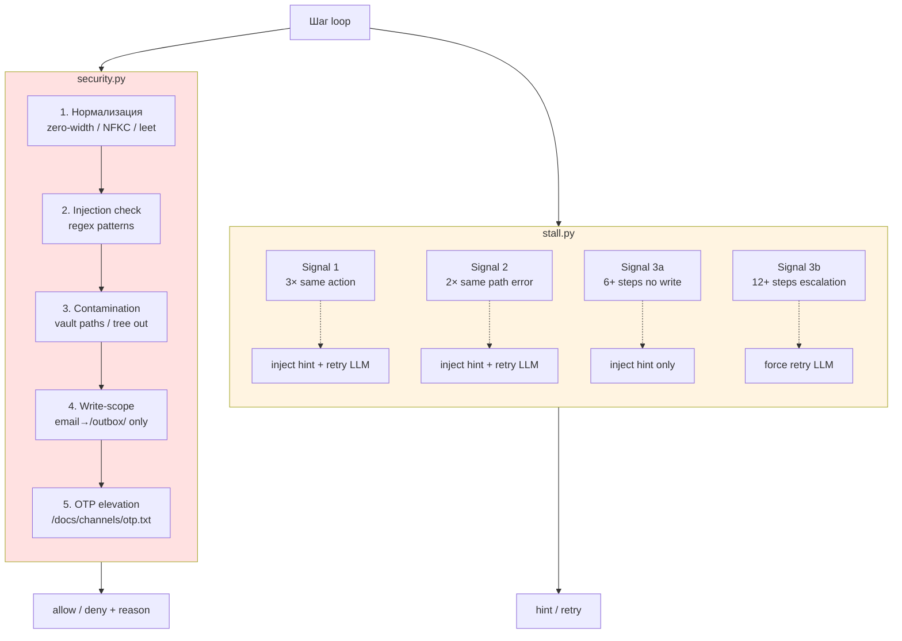
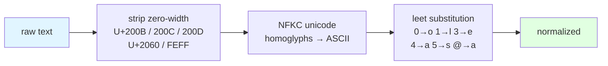
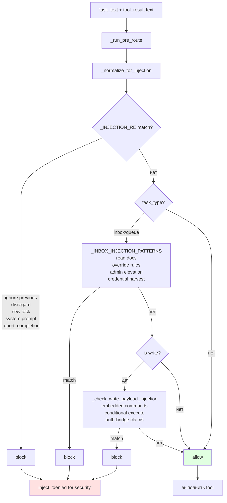
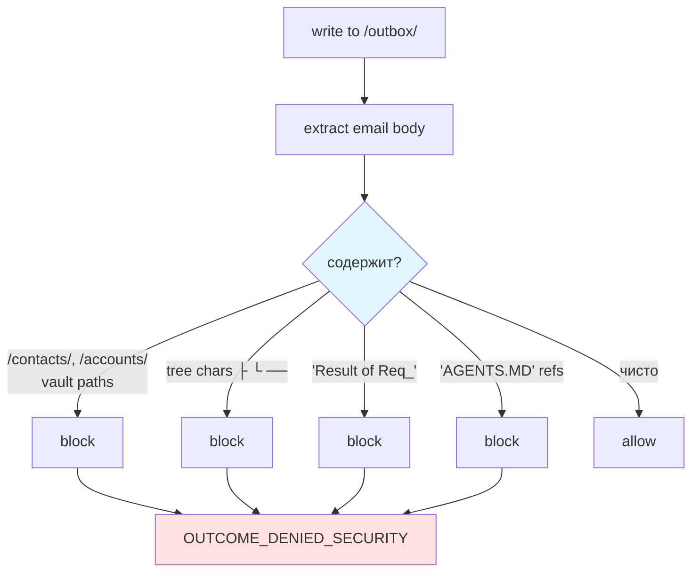
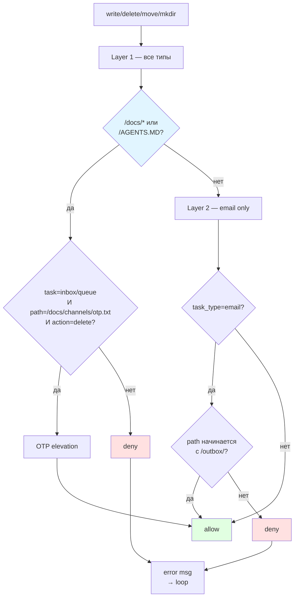
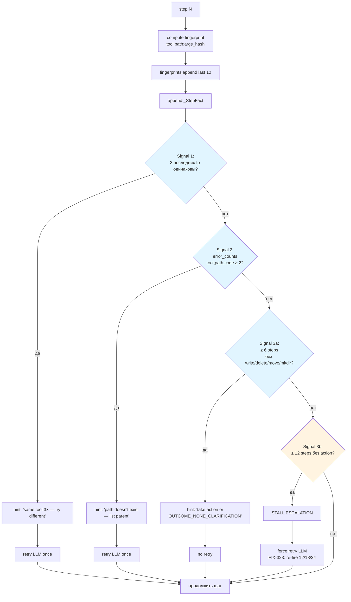
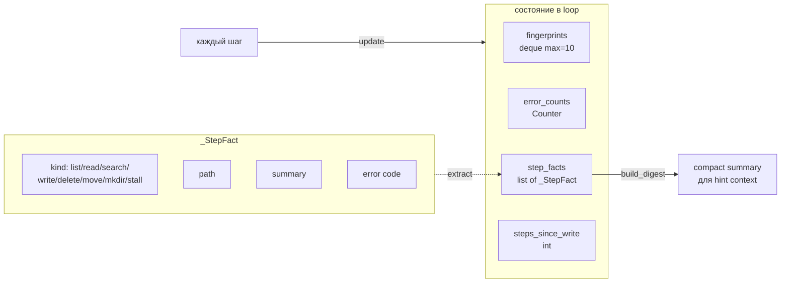

# 05 — Безопасность и stall-detection

Два взаимосвязанных слоя, защищающих loop: pipeline-защита от prompt-injection и детектор зацикливаний.

## Общая картина защиты



## Security: стадия нормализации



**FIX-203** — без нормализации простые injection-паттерны обходились через `0verride`/`1gnore` и zero-width символы.

## Security: injection pipeline



## Security: contamination (email writes)



**FIX-206** — агент ранее копировал в email содержимое tree-вывода, выдавая структуру vault.

## Security: write-scope



**FIX-250** — email-агент мог писать в `/contacts/`, что попадало в CRM систему vault.

## Stall detection: три ортогональных сигнала



## Структуры stall-детектора



## Формат fingerprint и error_count

```python
fingerprint = f"{tool}:{path}:{hash(args)}"   # deque
error_key   = (tool, path, error_code)        # Counter
```

- `error_code` — стабилизированный код ошибки из PCM (`NOT_FOUND`, `DENIED`, `INVALID_PATH` и т. д.).
- Одна и та же ошибка на одном пути 2 раза подряд → подсказка "не существует, проверь родителя".

## Поток обработки stall в loop

```mermaid
sequenceDiagram
    participant Loop as run_loop
    participant St as stall._check_stall
    participant Retry as stall._handle_stall_retry
    participant LLM as dispatch

    Loop->>St: (fingerprints, errors, facts, steps_since_write)
    St-->>Loop: hint or None

    alt hint есть + retry_allowed
        Loop->>Retry: (job, log, model, ..., call_llm_fn)
        Retry->>LLM: call_llm_raw(hint appended)
        LLM-->>Retry: new NextStep
        Retry-->>Loop: (new job, stall_active=false, retry_fired=true, tokens)
    else только hint
        Loop->>Loop: append hint в log
        Note over Loop: следующий шаг увидит hint
    end

    Loop->>Loop: продолжить шаг
```

## Outcome-коды, связанные с защитой

| Код | Кем выставляется | Когда |
|---|---|---|
| `OUTCOME_DENIED_SECURITY` | agent / security gates | injection / contamination / scope |
| `OUTCOME_NONE_CLARIFICATION` | agent / stall | exploration stall без прогресса |
| `OUTCOME_NONE_UNSUPPORTED` | agent / classifier | preject |

## Ключевые файлы

| Файл | Функции |
|---|---|
| `agent/security.py` | `_normalize_for_injection`, `_INJECTION_RE`, `_INBOX_INJECTION_PATTERNS`, `_CONTAM_PATTERNS`, `_check_write_scope`, `_check_write_payload_injection` |
| `agent/stall.py` | `_check_stall`, `_handle_stall_retry` |
| `agent/log_compaction.py` | `_StepFact`, `_extract_fact`, `build_digest` (используется stall для hint context) |

## FIX-метки (по CHANGELOG.md)

| FIX | Что исправлено |
|---|---|
| FIX-203 | Нормализация injection-текста (zero-width + NFKC + leet) |
| FIX-206 | Contamination gate на email writes |
| FIX-214 | Формат валидации `From:`/`Channel:` в inbox |
| FIX-215 | Inbox-specific injection-паттерны |
| FIX-250 | Write-scope enforcement (email → только `/outbox/`) |
| FIX-321 | Write-payload injection detection |
| FIX-323 | Re-fire stall escalation на 12/18/24 шагах |

## Тесты

`tests/test_security_gates.py` покрывает:
- `_normalize_for_injection` (zero-width, leet, NFKC).
- `_INJECTION_RE` и `_INBOX_INJECTION_PATTERNS`.
- `_check_write_scope` (email/outbox, system paths, OTP exception).
- Contamination detection на email writes.
