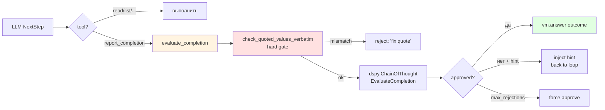
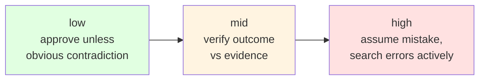
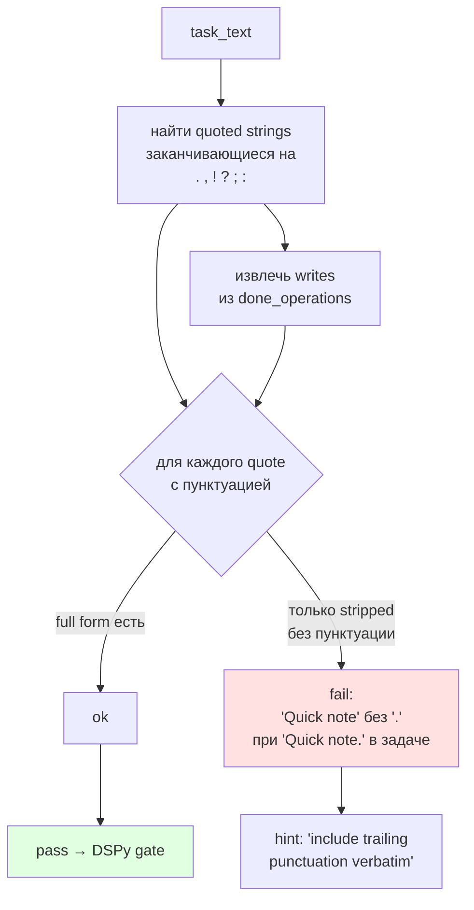
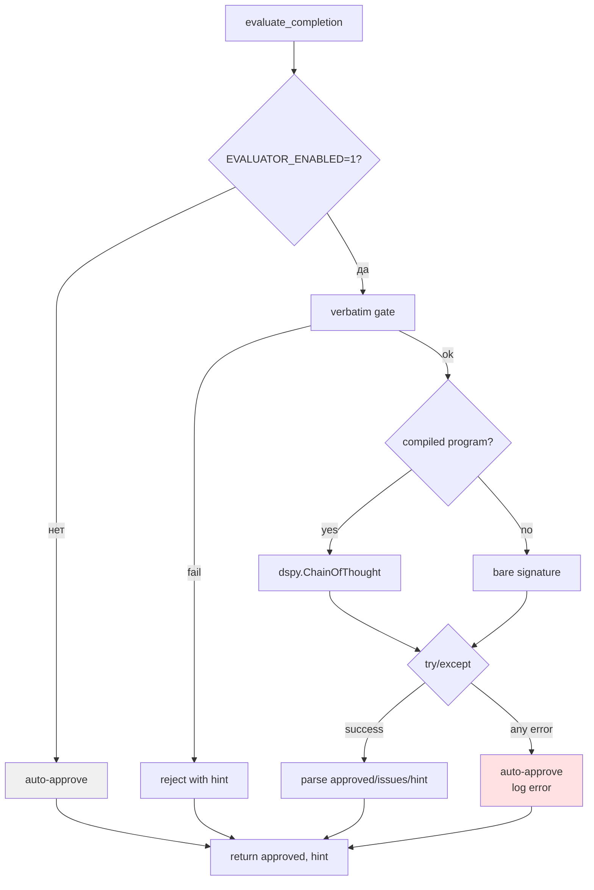
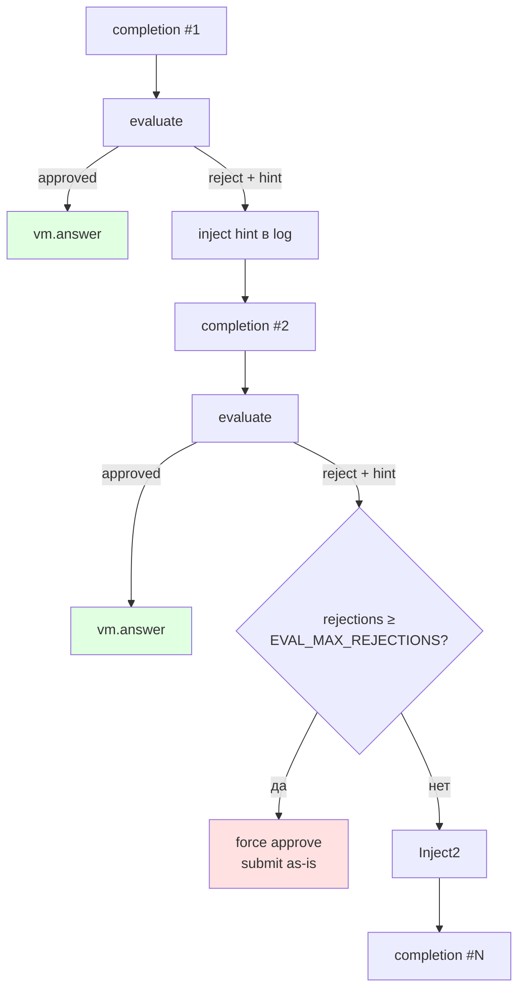
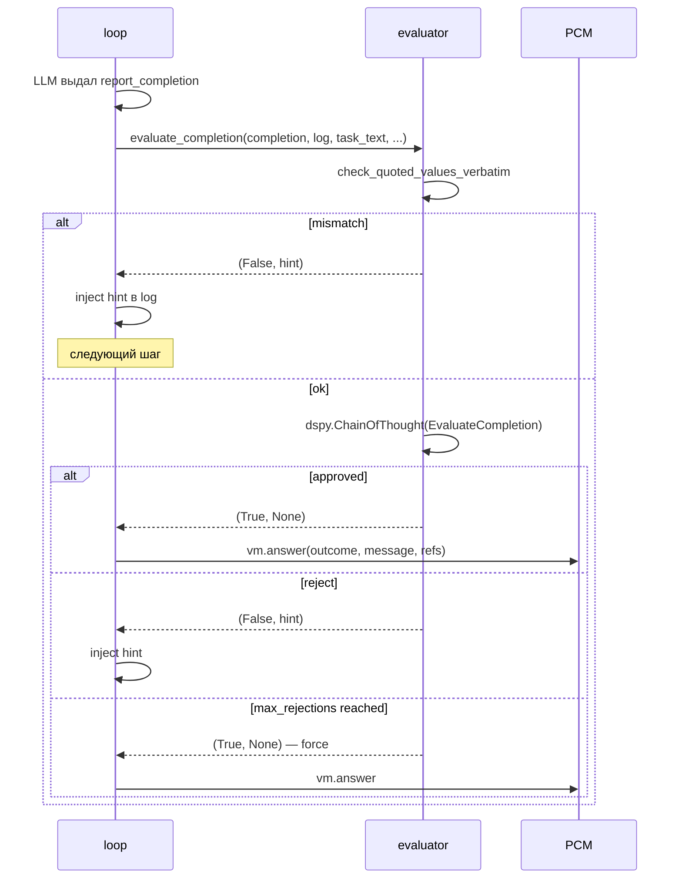

# 06 — Evaluator

Критический gate перед `vm.answer()`: ревью предложенного исхода на соответствие задаче и реально выполненным операциям.

## Роль в life-cycle шага



## EvaluateCompletion signature

```
Input:
  - proposed_outcome  : OUTCOME_OK | OUTCOME_DENIED_SECURITY |
                        OUTCOME_NONE_CLARIFICATION |
                        OUTCOME_NONE_UNSUPPORTED | OUTCOME_ERR_INTERNAL
  - done_operations   : ['WRITTEN: /outbox/5.json', 'READ: /contacts/maya.json', ...]
  - task_text         : оригинальный текст
  - skepticism_level  : low | mid | high

Output (ChainOfThought):
  - reasoning         : рассуждение модели
  - approved          : bool
  - issues            : list[str] — что не так
  - correction_hint   : str — как исправить
```

## Skepticism levels



Настраивается через `EVAL_SKEPTICISM=low|mid|high` (по умолчанию `mid`).

## Verbatim gate (hard)

Отдельный предпроверочный gate, не зависящий от LLM.



**Зачем это руками**: LLM-критик склонен paraphrase и дропать финальную пунктуацию, хотя бенчмарк проверяет exact match. Жёсткий предварительный регекс-gate ловит это до ChainOfThought.

## Fail-open policy



**Принцип**: evaluator никогда не блокирует задачу. Любой сбой → auto-approve. Это предотвращает превращение критика в источник отказов.

## Rejection loop



По умолчанию `EVAL_MAX_REJECTIONS=2` — критик может отклонить максимум 2 раза; третий completion проходит принудительно.

## Per-task-type evaluator

Благодаря оптимизации из [04 — DSPy и оптимизация](04-dspy-optimization.md), для разных типов задач могут быть разные скомпилированные evaluator-программы. Загрузка по цепочке:

```
data/evaluator_<task_type>_program.json
  → data/evaluator_program.json
  → bare signature
```

## Интеграция с loop.py



## Конфигурация

```bash
EVALUATOR_ENABLED=1           # включить критика (по умолчанию)
EVAL_SKEPTICISM=mid           # low|mid|high
EVAL_EFFICIENCY=mid           # low|mid|high — бюджет токенов
EVAL_MAX_REJECTIONS=2         # лимит отклонений
MODEL_EVALUATOR=...           # отдельная модель (иначе — основная агента)
```

## Ключевые файлы

| Файл | Экспорты |
|---|---|
| `agent/evaluator.py` | `evaluate_completion`, `check_quoted_values_verbatim`, `EvaluateCompletion` sig |
| `agent/dspy_lm.py` | `DispatchLM` — используется для вызова |
| `data/evaluator_program.json` | Скомпилированная программа (см. [04](04-dspy-optimization.md)) |
| `data/dspy_eval_examples.jsonl` | Собранные примеры для COPRO |

## Тесты

`tests/test_evaluator.py` покрывает:
- `check_quoted_values_verbatim` — trailing punctuation match.
- `evaluate_completion` — fail-open на ошибках DSPy/LLM.
- Rejection loop — cap на `EVAL_MAX_REJECTIONS`.
- Различные уровни `skepticism`.
