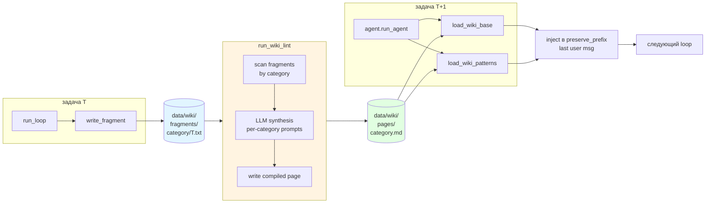
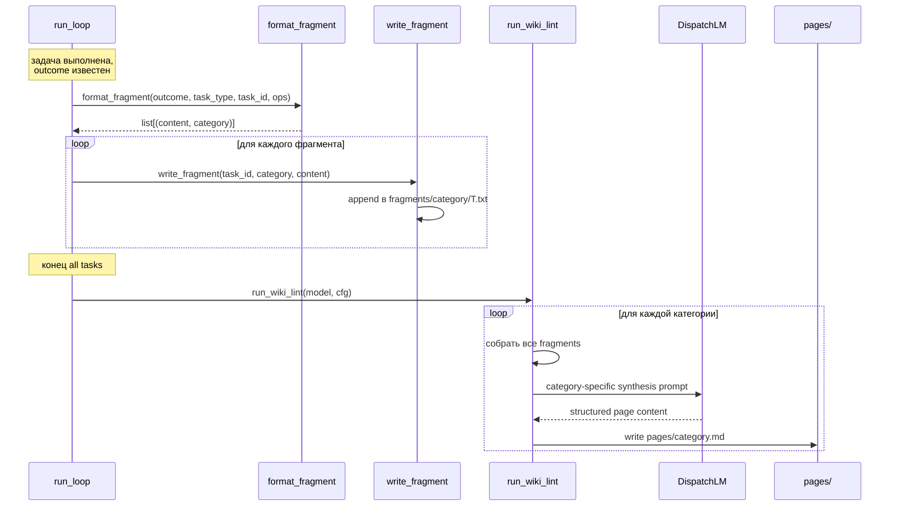
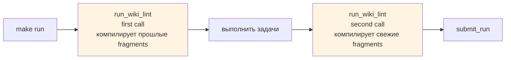
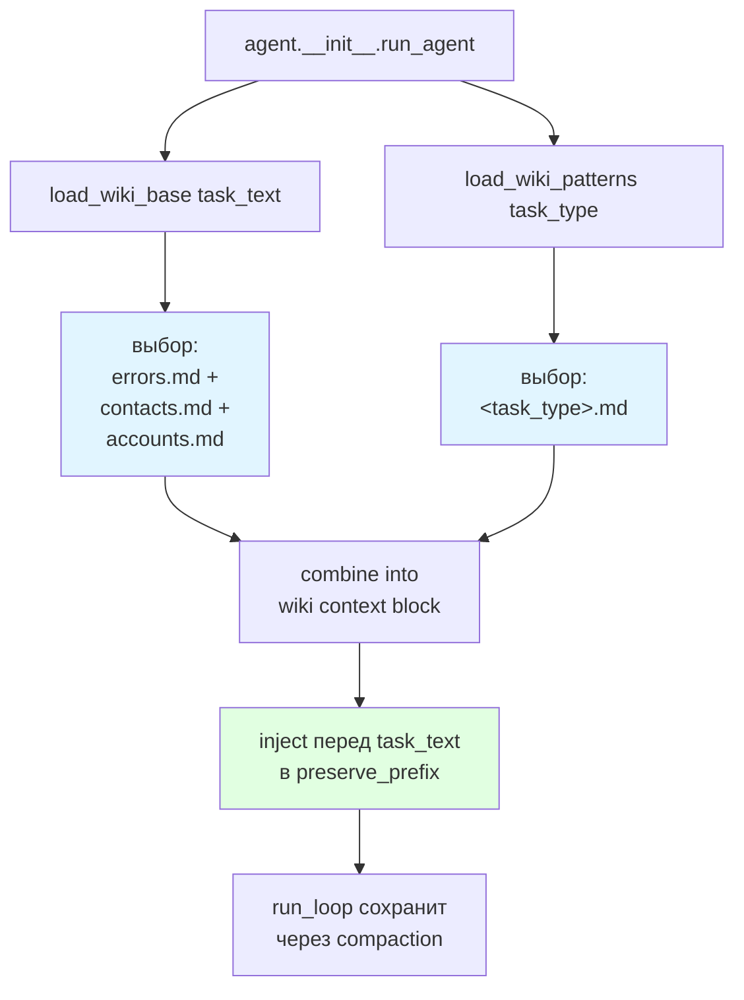
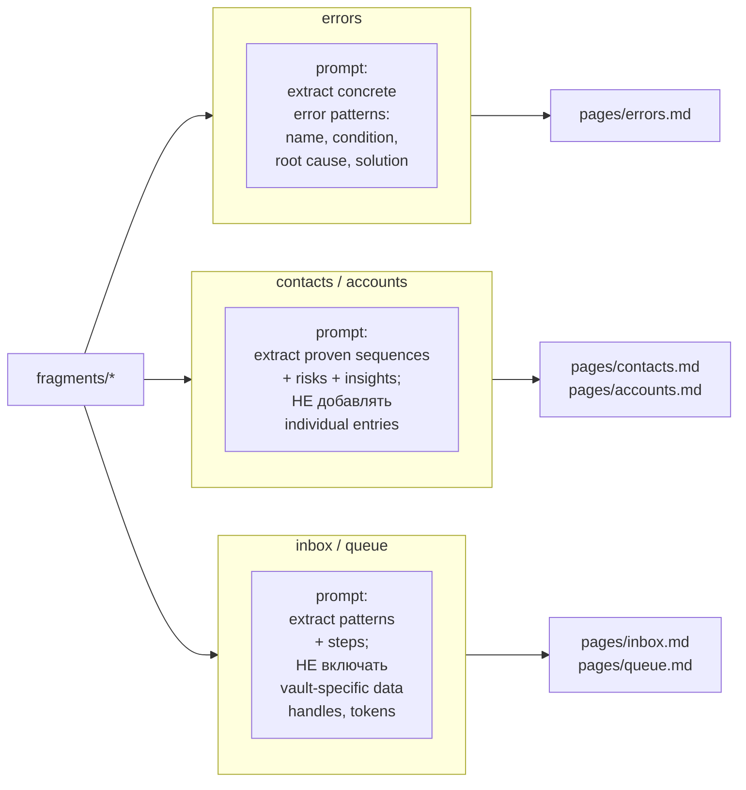
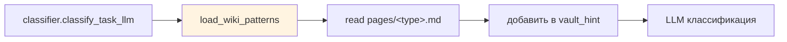
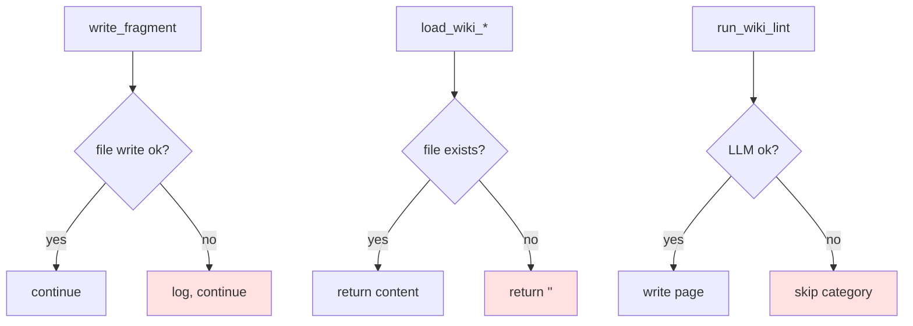

# 07 — Wiki-память

Механизм кросс-сессионной памяти: per-task фрагменты → LLM-lint в страницы → инъекция в preserve_prefix следующих задач.

## Общая схема



## Директории

```
data/wiki/
├── pages/               # compiled LLM-synth output
│   ├── default.md
│   ├── errors.md
│   ├── contacts.md
│   ├── accounts.md
│   ├── inbox.md
│   ├── queue.md
│   └── crm.md
├── fragments/           # append-only per-task raw writes
│   ├── errors/
│   ├── contacts/
│   ├── inbox/
│   └── ...
└── archive/             # устаревшие/ротированные фрагменты
    ├── accounts/
    └── contacts/
```

## Life-cycle фрагмента



## Когда запускается lint



Два вызова за запуск:
1. **Перед задачами** — чтобы задачи T+1...T+N видели страницы, собранные из T-1.
2. **После задач** — для следующего запуска.

## Инъекция в prompt



**Ключевое**: блок wiki помещён в `preserve_prefix`, то есть никогда не компактизуется (см. [09](09-observability.md)).

## Per-category synthesis prompts



**Правила синтеза**:
- Категории `contacts`/`accounts`: не содержат individual records (фрагменты могут, страницы — нет).
- Категории `inbox`/`queue`: не содержат vault-specific handles, channel names, tokens (во избежание leak в другие задачи).
- Категория `errors`: наоборот, максимально конкретные условия и решения.

## Classifier-hints из wiki



Wiki-страницы подгружаются в `vault_hint` для classifier → снижает flip-ы между `inbox` и `queue`.

## Fail-open по всей цепочке



Wiki-подсистема — опциональная: любой сбой переходит к baseline-поведению без inject.

## Конфигурация

```bash
WIKI_ENABLED=1          # инъекция wiki в prompts
WIKI_LINT_ENABLED=1     # компиляция фрагментов в страницы
```

## Ключевые файлы

| Файл | Что делает |
|---|---|
| `agent/wiki.py` | `load_wiki_base`, `load_wiki_patterns`, `format_fragment`, `write_fragment`, `run_wiki_lint` |
| `data/wiki/pages/` | Компилированные страницы (injected) |
| `data/wiki/fragments/` | Сырые фрагменты per-task |
| `data/wiki/archive/` | Ротированные фрагменты |

## Архитектурное решение

**Вариант C — LLM-синтез** выбран вместо двух альтернатив:
- **A**: Хранить каждый fragment как-есть. Минус: с ростом fragments контекст раздувается.
- **B**: Runtime-дедупликация фрагментов по хэшу. Минус: семантически близкие фрагменты остаются.
- **C** (выбрано): LLM синтезирует структурированные страницы из всех фрагментов категории. Плюс: компактно и структурировано. Минус: стоит LLM-вызова на `run_wiki_lint`.
