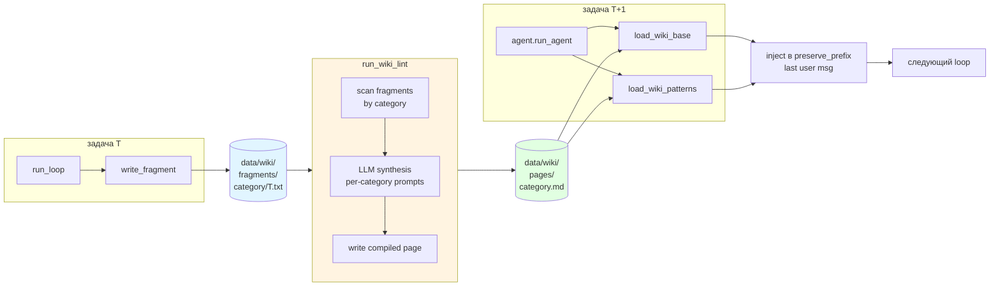
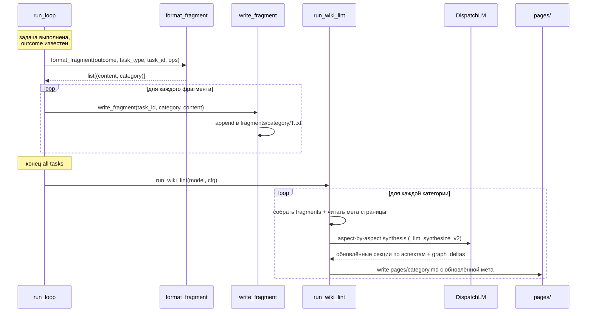
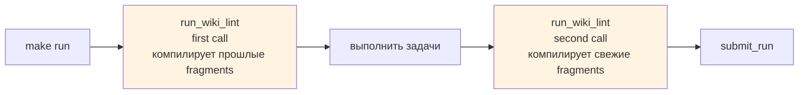
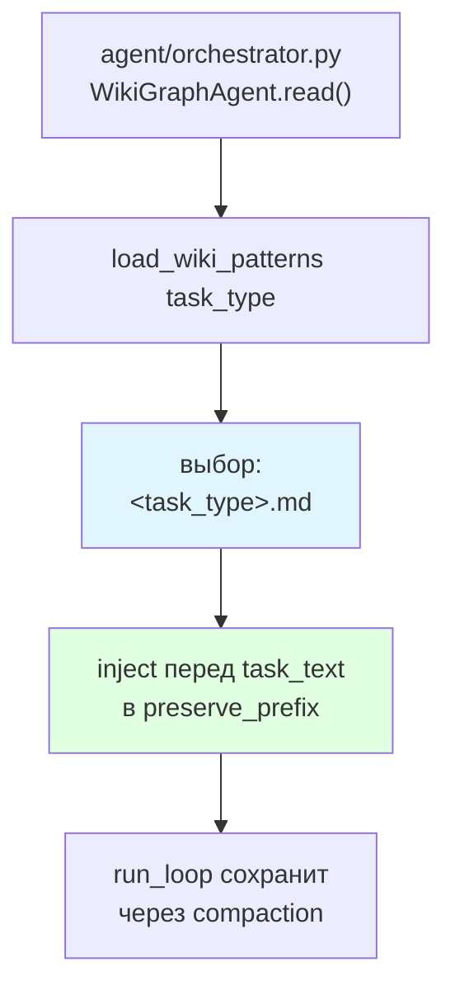
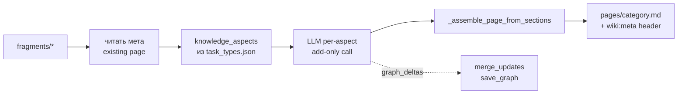
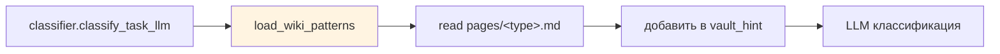
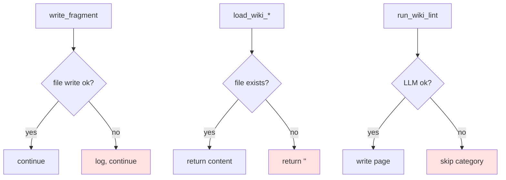
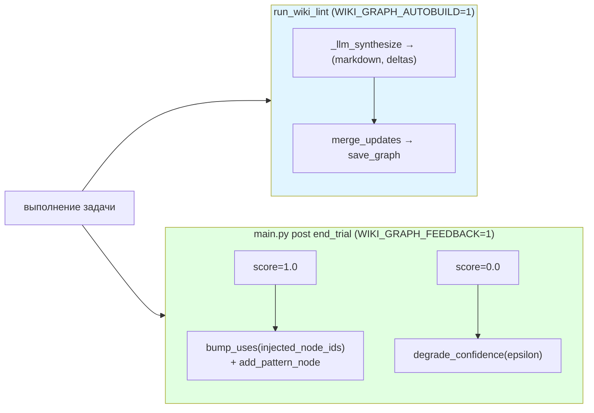

# 07 — Wiki-память

Механизм кросс-сессионной памяти: per-task фрагменты → LLM-lint в страницы → инъекция в preserve_prefix следующих задач.

## Общая схема



## Директории

```
data/wiki/
├── pages/               # compiled LLM-synth output
│   ├── default.md
│   ├── errors.md
│   ├── contacts.md
│   ├── accounts.md
│   ├── inbox.md
│   ├── queue.md
│   └── crm.md
├── fragments/           # append-only per-task raw writes
│   ├── errors/
│   ├── contacts/
│   ├── inbox/
│   └── ...
└── archive/             # устаревшие/ротированные фрагменты
    ├── accounts/
    └── contacts/
```

## Life-cycle фрагмента



## Когда запускается lint



Два вызова за запуск:
1. **Перед задачами** — чтобы задачи T+1...T+N видели страницы, собранные из T-1.
2. **После задач** — для следующего запуска.

## Инъекция в prompt



**Ключевое**: блок wiki помещён в `preserve_prefix`, то есть никогда не компактизуется (см. [09](09-observability.md)).

> **FIX-346/350**: `load_wiki_base` (contacts.md + accounts.md) удалена — entity-catalog injection была избыточна, т.к. agent теперь обязан читать из живого vault перед записью. Осталась только инъекция task-type patterns.

## Aspect-by-aspect синтез

`_llm_synthesize_v2` заменяет монолитный синтез: страница делится на аспекты из `data/task_types.json` (поле `knowledge_aspects`). Каждый аспект синтезируется отдельно (add-only), без перезаписи уже накопленных знаний.



**Правила синтеза** (сохраняются):
- Категории `contacts`/`accounts`: не содержат individual records.
- Категории `inbox`/`queue`: не содержат vault-specific handles, channel names, tokens.
- Категория `errors`: наоборот, максимально конкретные условия и решения.

## Page quality

Каждая страница хранит мета-блок `<!-- wiki:meta ... -->` с полем `quality`:

| Уровень | Условие | Эффект |
|---|---|---|
| `nascent` | fragment_count < 5 | `load_wiki_patterns` добавляет `[draft — limited data]` заголовок; evaluator char limit 500 |
| `developing` | 5 ≤ count < 15 | evaluator char limit 2000 |
| `mature` | count ≥ 15 | evaluator char limit 4000; graph-узлы получают тег `wiki_mature` |

## Classifier-hints из wiki



Wiki-страницы подгружаются в `vault_hint` для classifier → снижает flip-ы между `inbox` и `queue`.

## Fail-open по всей цепочке



Wiki-подсистема — опциональная: любой сбой переходит к baseline-поведению без inject.

## Knowledge Graph

Граф знаний расширяет wiki-память структурированными узлами с уровнями уверенности.

### Структура

- **Узлы**: типы `insight`, `rule`, `pattern`, `antipattern`; поля `{tags, confidence, uses, last_seen}`
- **Рёбра**: `requires`, `conflicts_with`, `generalizes`, `precedes`
- **Файл**: `data/wiki/graph.json` (committed + runtime-updated)

### Два пути заполнения



**LLM-extractor** (lint): промпт просит модель приложить fenced ` ```json {graph_deltas: ...} ``` ` после markdown-страницы. Fail-open: невалидный JSON → пишем только markdown.

**Confidence feedback** (post-trial): `stats["graph_injected_node_ids"]` фиксирует какие узлы агент видел в trial — `main.py` целит feedback ровно по ним.

### Retrieval

`retrieve_relevant_with_ids(graph, task_type, task_text, top_k)` — scoring = tag_overlap + text-token overlap + confidence × log(uses).

Граф читается в **трёх** точках, все гейчены `WIKI_GRAPH_ENABLED=1`:

| Точка | Как используется |
|---|---|
| System prompt | Инжектируется через `WikiGraphAgent.read()` → `orchestrator.py` |
| DSPy addendum | `graph_context` InputField в `PromptAddendum` signature |
| Evaluator | `_load_graph_insights()` в `evaluator.py` (advisory) |

### Конфигурация графа

```bash
WIKI_GRAPH_ENABLED=1               # чтение в prompt/addendum/evaluator
WIKI_GRAPH_TOP_K=5                 # кол-во узлов при retrieval
WIKI_GRAPH_AUTOBUILD=1             # LLM-extractor в run_wiki_lint
WIKI_GRAPH_FEEDBACK=1              # confidence feedback post-trial
WIKI_GRAPH_CONFIDENCE_EPSILON=0.05 # шаг degrade при score=0
WIKI_GRAPH_MIN_CONFIDENCE=0.1      # нижняя граница confidence
```

### Инспекция и обслуживание

```bash
uv run python scripts/print_graph.py             # все узлы
uv run python scripts/print_graph.py --tag email # по тегу
uv run python scripts/print_graph.py --edges     # с рёбрами
uv run python scripts/purge_research_contamination.py --apply  # очистка contaminated узлов
```

## Конфигурация

```bash
WIKI_ENABLED=1          # инъекция wiki в prompts
WIKI_LINT_ENABLED=1     # компиляция фрагментов в страницы
WIKI_GRAPH_ENABLED=1    # граф активен (читается агентом, evaluator, DSPy)
WIKI_GRAPH_AUTOBUILD=1  # LLM-extractor в run_wiki_lint
WIKI_GRAPH_FEEDBACK=1   # confidence feedback post-trial
```

## Ключевые файлы

| Файл | Что делает |
|---|---|
| `agent/wiki.py` | `load_wiki_patterns`, `format_fragment`, `write_fragment`, `run_wiki_lint` |
| `agent/wiki_graph.py` | `load_graph`, `save_graph`, `retrieve_relevant_with_ids`, `bump_uses`, `degrade_confidence`, `merge_updates` |
| `agent/agents/wiki_graph_agent.py` | `WikiGraphAgent` — обёртка над wiki + wiki_graph |
| `data/wiki/pages/` | Скомпилированные страницы (injected) |
| `data/wiki/fragments/` | Сырые фрагменты per-task |
| `data/wiki/graph.json` | Персистентный граф знаний |
| `data/wiki/archive/` | Ротированные фрагменты |
| `scripts/purge_research_contamination.py` | Очистка contaminated узлов из графа |
| `scripts/print_graph.py` | Инспекция графа |

## Архитектурное решение

**Вариант C — LLM-синтез** выбран вместо двух альтернатив:
- **A**: Хранить каждый fragment как-есть. Минус: с ростом fragments контекст раздувается.
- **B**: Runtime-дедупликация фрагментов по хэшу. Минус: семантически близкие фрагменты остаются.
- **C** (выбрано): LLM синтезирует структурированные страницы из всех фрагментов категории. Плюс: компактно и структурировано. Минус: стоит LLM-вызова на `run_wiki_lint`.
