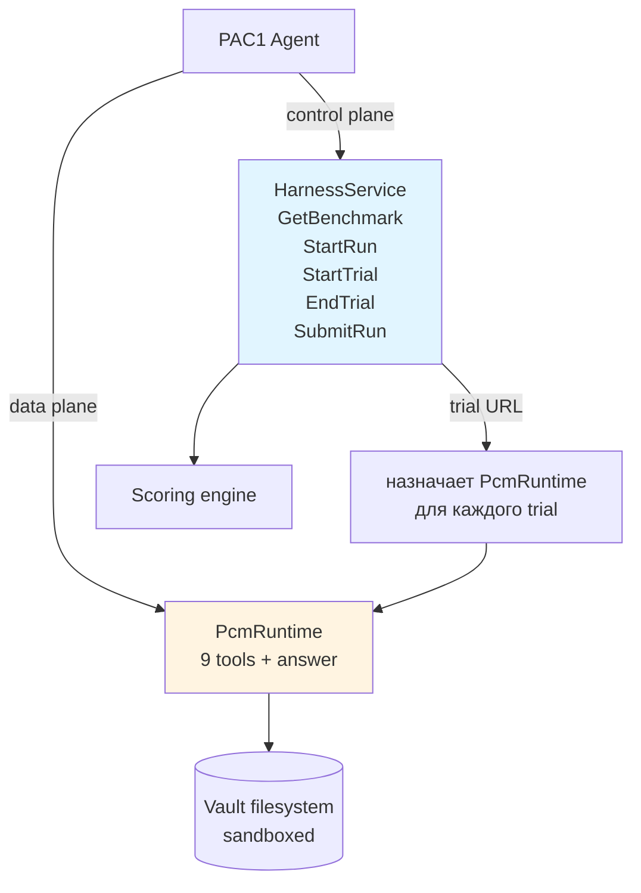
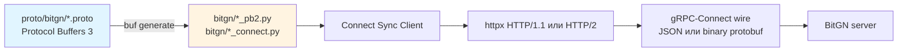
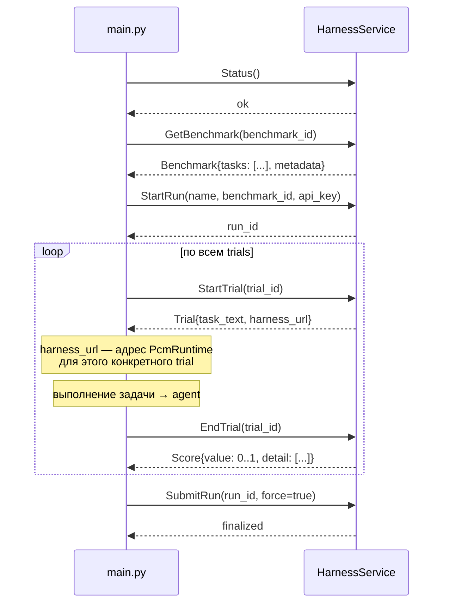
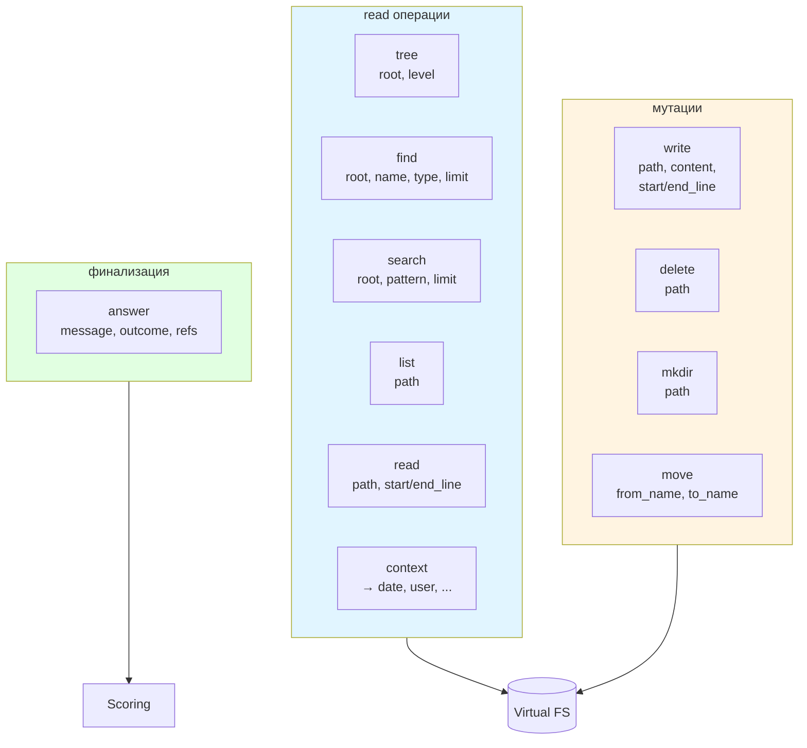
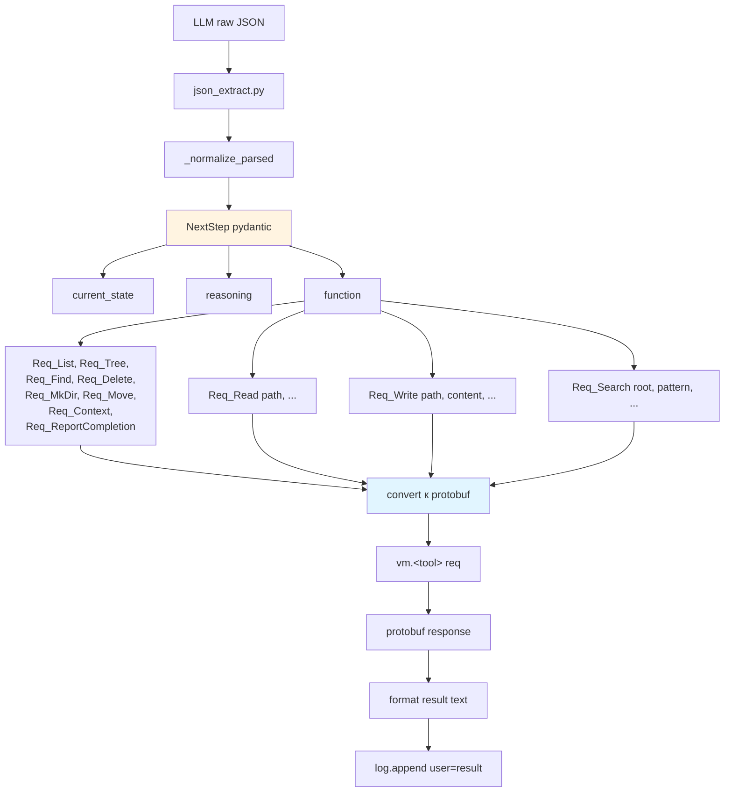
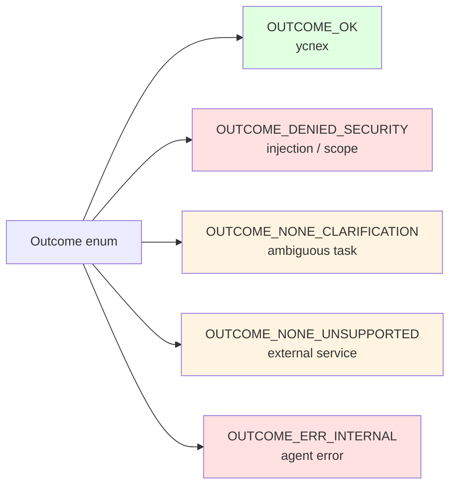

# 08 — Harness и PCM

Два внешних интерфейса через gRPC-Connect over HTTP: сервис `HarnessService` управляет прогоном бенчмарка, сервис `PcmRuntime` предоставляет 9 vault-инструментов.

## Два сервиса



## Protocol stack



`bitgn/_connect.py` — тонкая обёртка над `ConnectClient` (gRPC-Connect sync). **Файлы `bitgn/*` — сгенерированы; редактировать нельзя** (`make proto` перезаписывает).

## HarnessService



## PcmRuntime: 9 инструментов + answer



## Формальная таблица инструментов

| Tool | Request fields | Response | Назначение |
|---|---|---|---|
| `tree` | `root`, `level` | TreeResponse(nodes) | Рекурсивное дерево vault |
| `find` | `root`, `name`, `type`, `limit` | `list[str]` | Поиск по имени |
| `search` | `root`, `pattern`, `limit` | `list[SearchMatch]` | Full-text поиск |
| `list` | `path` | `list[ListEntry]` | Listing директории |
| `read` | `path`, `number`, `start_line`, `end_line` | `content` | Чтение файла/диапазона |
| `write` | `path`, `content`, `start_line`, `end_line` | empty | Create/overwrite/append |
| `delete` | `path` | empty | Удаление |
| `mkdir` | `path` | empty | Создание директории |
| `move` | `from_name`, `to_name` | empty | Переименование |
| `context` | — | `content (JSON)` | Метаданные задачи (дата, user) |
| `answer` | `message`, `outcome`, `refs` | empty | Финализация |

## Pydantic layer: NextStep и Req_*



`agent/models.py` определяет:
- `NextStep` — контейнер ответа LLM.
- `Req_Read`, `Req_Write`, ..., `Req_ReportCompletion` — 10 discriminated unions.

## Outcome enum (из `proto/bitgn/vm/pcm.proto`)



## Пример запроса `write`

```mermaid
sequenceDiagram
    participant LLM
    participant Loop as agent/loop
    participant Pyd as NextStep/<br/>Req_Write
    participant Pb as pcm_pb2.<br/>WriteRequest
    participant Stub as pcm_connect.<br/>PcmRuntimeClientSync
    participant PCM as PcmRuntime

    LLM-->>Loop: {"tool":"write","path":"/outbox/5.json","content":"..."}
    Loop->>Pyd: Req_Write(**args)
    Pyd-->>Loop: validated
    Loop->>Pb: WriteRequest(path=..., content=...)
    Loop->>Stub: vm.write(req)
    Stub->>PCM: POST /bitgn.vm.pcm.PcmRuntime/Write
    PCM-->>Stub: WriteResponse()
    Stub-->>Loop: empty ok
    Loop->>Loop: format "WRITTEN: /outbox/5.json"
    Loop->>Loop: log.append(user=result)
```

## Регенерация protobuf-стабов

```bash
# Makefile target
make proto

# или вручную
buf generate
```

Стабы генерируются в `bitgn/` (flat) и `bitgn/vm/`. Ручные правки будут перезаписаны.

## Ключевые файлы

| Файл | Содержимое |
|---|---|
| `proto/bitgn/harness.proto` | HarnessService definition |
| `proto/bitgn/vm/pcm.proto` | PcmRuntime definition + 9 tools |
| `bitgn/harness_connect.py` | gRPC-Connect stub (HarnessService) |
| `bitgn/harness_pb2.py` | Protobuf message классы |
| `bitgn/vm/pcm_connect.py` | gRPC-Connect stub (PcmRuntime) |
| `bitgn/vm/pcm_pb2.py` | Protobuf message классы |
| `bitgn/_connect.py` | Общая обёртка `ConnectClient` |
| `agent/models.py` | Pydantic-слой (`NextStep`, `Req_*`) |

## Таймауты и ретраи

- HTTP read timeout: **180 s**.
- Connect timeout: **10 s**.
- При `429/502/503` от любого сервиса — retry с экспоненциальным backoff (см. [02 — LLM-маршрутизация](02-llm-routing.md), ту же логику используют и PCM-вызовы через httpx).
