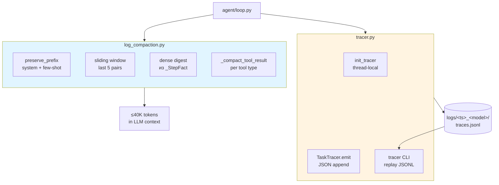
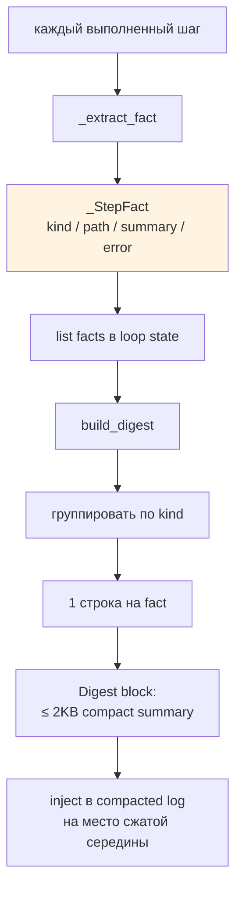
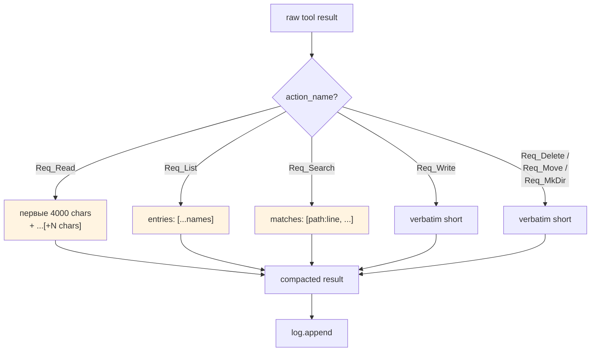
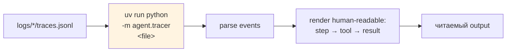
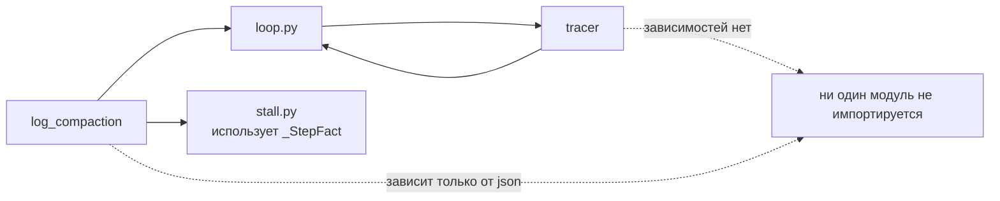

# 09 — Наблюдаемость

Два взаимодополняющих механизма: управление контекстом (`log_compaction.py`) для удержания ≤40K токенов и event-трассировка (`tracer.py`) для post-hoc replay.

## Два слоя наблюдаемости



## Prefix-preservation compaction

```mermaid
flowchart LR
    subgraph Log[полный log]
        Sys[system prompt]
        UFs[user few-shot]
        AFs[assistant few-shot]
        U0[user task_text]
        A1[asst step 1]
        U1[user result 1]
        A2[asst step 2]
        U2[...]
        AN[asst step N]
        UN[user result N]
    end

    subgraph Compacted[после компактизации]
        SysC[system prompt]
        UFsC[user few-shot]
        AFsC[assistant few-shot]
        U0C[user task_text]
        Digest[user DIGEST<br/>compact summary<br/>из _StepFact]
        ANm4[asst step N-4]
        UNm4[user result N-4]
        Last5[... last 5 pairs]
    end

    Log --> Rule[_compact_log<br/>preserve_prefix intact,<br/>middle → digest,<br/>keep last 5]
    Rule --> Compacted

    style Sys fill:#e1ffe1
    style UFs fill:#e1ffe1
    style AFs fill:#e1ffe1
    style U0 fill:#e1ffe1
    style SysC fill:#e1ffe1
    style UFsC fill:#e1ffe1
    style AFsC fill:#e1ffe1
    style U0C fill:#e1ffe1
    style Digest fill:#fff4e1
```



**Неприкосновенные части** (`preserve_prefix`):
- System prompt (с DSPy-аддендумом).
- User few-shot.
- Assistant few-shot.
- User task_text (+ wiki-инъекция).

**Sliding window**: всегда сохраняются последние ≤5 pair-ов (assistant/user).

## _StepFact — компактный digest



Формат одного `_StepFact`:

```python
@dataclass
class _StepFact:
    kind: str       # list | read | search | write | delete | move | mkdir | stall
    path: str
    summary: str    # 1-line descr
    error: str      # error code if failed
```

Error field критичен: сохраняется сквозь компактизацию → stall-detector видит повторы.

## Per-tool result compaction



Цель: предотвратить разрастание истории от больших `read` и `search` результатов.

## Tracer: append-only JSONL events

```mermaid
sequenceDiagram
    participant Main as main.py
    participant TS as tracer
    participant W as worker thread
    participant Loop as run_loop

    Main->>TS: init_tracer(log_dir)
    TS->>TS: open logs/.../traces.jsonl
    TS->>TS: thread-safe lock

    Main->>W: spawn task
    W->>TS: set_task_id("t01") — thread-local
    W->>Loop: run_loop

    loop каждый step
        Loop->>TS: emit("dispatch_call", step_num, data)
        TS->>TS: append JSON line
        Loop->>TS: emit("tool_executed", step_num, data)
        Loop->>TS: emit("stall_detected", ...) при stall
    end

    Note over TS: fail-open:<br/>write error → log + continue
```

## Event schema

```json
{
  "task_id": "t01",
  "step_num": 5,
  "event": "dispatch_call",
  "timestamp": "2026-04-21T19:30:45Z",
  "data": {
    "model": "anthropic/claude-opus-4",
    "in_tokens": 1234,
    "out_tokens": 567,
    "latency_ms": 4200
  }
}
```

Типы событий:
- `dispatch_call` — LLM-вызов (модель, токены, latency).
- `tool_executed` — вызов PCM-инструмента.
- `stall_detected` — обнаружение stall + signal.
- `security_block` — срабатывание security gate.
- `evaluator_reject` — критик отклонил completion.
- `wiki_fragment_written` — фрагмент записан.

## Tracer replay



`agent.tracer.__main__` (если включён) показывает пошаговую ретроспективу задачи: input → tool_call → result → evaluator verdict.

## Конфигурация

```bash
TRACE_ENABLED=0          # по умолчанию off — нулевой overhead
LOG_LEVEL=INFO           # DEBUG включает full LLM response logging
```

При `TRACE_ENABLED=0` все `tracer.emit` — no-op (проверяется через `get_task_tracer()`).

## Log directory структура

```
logs/
└── 20260421_193045_claude-opus-4/
    ├── stdout.log           # tee'd stdout
    ├── stderr.log           # tee'd stderr
    ├── traces.jsonl         # tracer events (если включён)
    └── per-task/
        ├── t01.log
        ├── t02.log
        └── ...
```

## Ключевые файлы

| Файл | Экспорты |
|---|---|
| `agent/log_compaction.py` | `_StepFact`, `_extract_fact`, `build_digest`, `_compact_log`, `_compact_tool_result`, `_history_action_repr` |
| `agent/tracer.py` | `init_tracer`, `set_task_id`, `get_task_tracer`, `TaskTracer.emit` |
| `main.py::_setup_log_tee` | tee stdout/stderr в per-model директорию |

## Взаимосвязь с другими подсистемами



Оба модуля — "листья" дерева зависимостей, что делает их безопасными и легко-тестируемыми.
