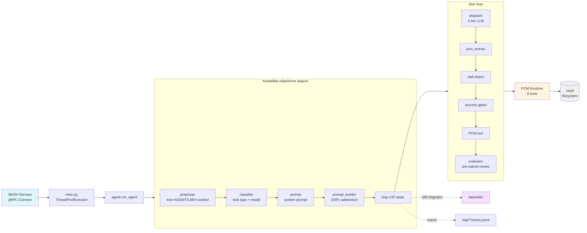
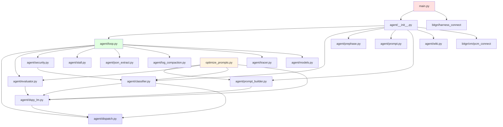

# Архитектура PAC1-Tool

Python-агент для бенчмарка BitGN PAC1, управляющий персональным knowledge-vault через 9 инструментов PCM (`tree`, `find`, `search`, `list`, `read`, `write`, `delete`, `mkdir`, `move`, `report_completion`). Связь с harness — Protobuf + gRPC-Connect.

## Обзор на одном экране



## Ключевые архитектурные решения

| Паттерн | Реализация | Зачем |
|---|---|---|
| **Discovery-First** | Пути vault не хардкодятся; агент читает `AGENTS.MD` | Переносимость между профилями vault |
| **Four-Tier Dispatch** | Anthropic SDK / Claude Code (`iclaude`) → OpenRouter → Ollama, ретраи на `429/502/503` | Устойчивость к перебоям + локальный OAuth-фолбэк без API-ключей |
| **Codegen-prompt** | Модель пишет Python-код, а не сырой JSON | Сложный анализ (агрегации, даты) |
| **Prefix-Compaction** | Первые system+few-shot сохраняются, середина сжимается | Удержание ≤40K токенов в контексте |
| **Fail-Open DSPy** | Отсутствие скомпилированной программы → baseline | Агент работает без оптимизации |
| **Multi-Stage Security** | Нормализация → injection → contamination → write-scope → OTP | Защита от prompt-injection |
| **Stall Detection** | 3 сигнала: action-loop / path-error / exploration | Выход из зацикливаний |
| **Wiki-Memory** | Фрагменты per-task → LLM-lint в страницы | Кросс-сессионная память |

## Разделы документации по доменам

1. [**01 — Поток выполнения**](01-execution-flow.md) — `main.py`, `run_agent`, `loop.py`, жизненный цикл шага.
2. [**02 — LLM-маршрутизация**](02-llm-routing.md) — four-tier `dispatch.py` (+ `cc_client.py`), `classifier.py`, `ModelRouter`, `models.json`.
3. [**03 — Prompt-система**](03-prompt-system.md) — `prompt.py` (статический), `prephase.py` (discovery), `prompt_builder.py` (DSPy addendum).
4. [**04 — DSPy и оптимизация**](04-dspy-optimization.md) — сигнатуры, `optimize_prompts.py`, COPRO, сбор примеров.
5. [**05 — Безопасность и stall-detection**](05-security-stall.md) — `security.py`, `stall.py`, многоуровневый pipeline защиты.
6. [**06 — Evaluator**](06-evaluator.md) — `evaluator.py`, pre-submission review, verbatim-gate.
7. [**07 — Wiki-память**](07-wiki-memory.md) — `wiki.py`, fragments/pages/lint, кросс-сессионные знания.
8. [**08 — Harness и PCM**](08-harness-protocol.md) — `bitgn/`, `proto/`, 9 инструментов, gRPC-Connect.
9. [**09 — Наблюдаемость**](09-observability.md) — `tracer.py`, `log_compaction.py`, JSONL-трейсы.

## Дерево модулей



## Где что лежит

| Путь | Содержимое |
|---|---|
| `main.py` | Точка входа, подключение к harness, ThreadPoolExecutor |
| `agent/` | Ядро агента: loop, dispatch, классификатор, security и т.д. |
| `bitgn/` | Сгенерированные gRPC-Connect стабы (не редактировать вручную) |
| `proto/bitgn/` | `.proto` определения (harness + PCM) |
| `data/wiki/` | Страницы/фрагменты wiki-памяти |
| `data/*.json` | Скомпилированные DSPy-программы (COPRO) |
| `data/*.jsonl` | Собранные примеры для оптимизации |
| `models.json` | Конфигурация моделей и per-task маршрутизация |
| `logs/<ts>_<model>/` | Лог-артефакты одного запуска (stdout, traces) |
| `tests/` | Тесты: classifier, json_extract, evaluator, security_gates |

## Запуск

```bash
make sync                           # uv sync
make run                            # все задачи бенчмарка
make task TASKS='t01,t02'           # подмножество
uv run python -m agent.tracer logs/<file>.jsonl   # реплей
uv run python optimize_prompts.py --target builder
uv run python optimize_prompts.py --target evaluator
```
