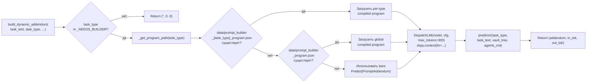
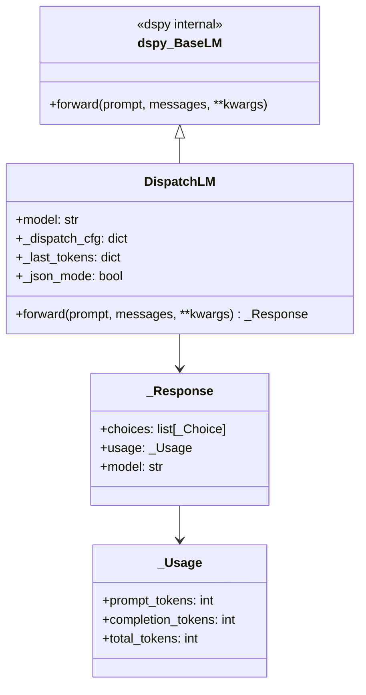
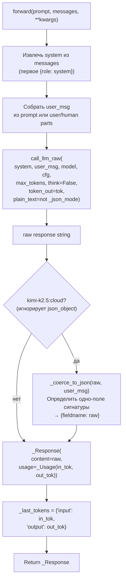
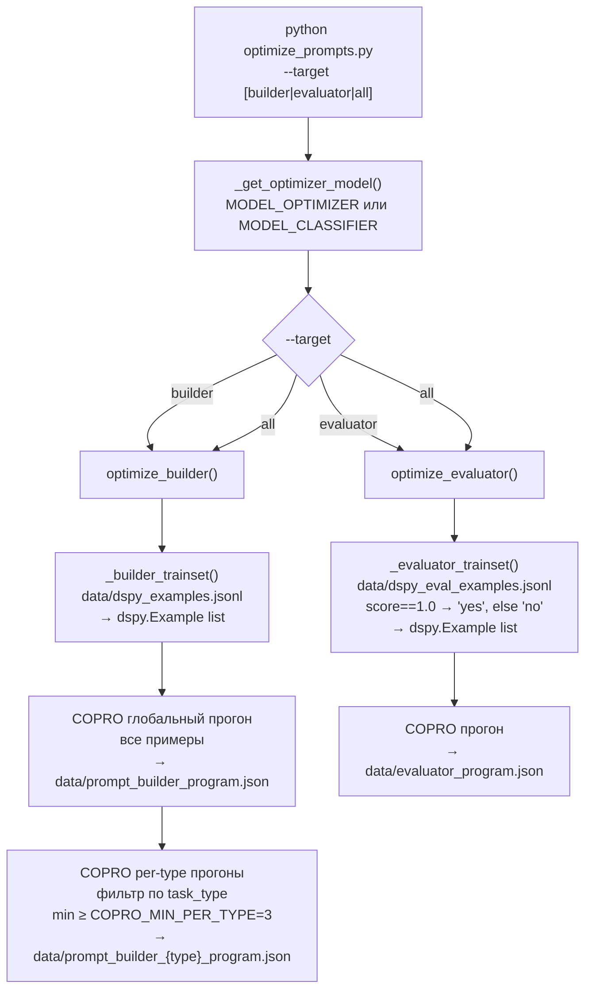

# DSPy: Оптимизация промтов

Описывает DSPy-компоненты агента: `prompt_builder.py`, `evaluator.py`, `dspy_lm.py` и процесс офлайн-оптимизации через `optimize_prompts.py`.

---

## Архитектурная роль DSPy

```mermaid
graph TD
    subgraph Online["Онлайн (каждая задача)"]
        PB["prompt_builder.py\nDSPy Predict\nbuild_dynamic_addendum()"] --> ADDENDUM["3–6 task-specific bullets\n→ system prompt"]
        EVAL["evaluator.py\nDSPy ChainOfThought\nevaluate_completion()"] --> VERDICT["EvalVerdict\napproved / issues / hint"]
    end

    subgraph Offline["Офлайн (optimize_prompts.py)"]
        COPRO["COPRO optimizer\nБатчевая оптимизация"] --> PB_PROG["data/prompt_builder_program.json"]
        COPRO --> EVAL_PROG["data/evaluator_program.json"]
    end

    subgraph Adapter["DSPy → dispatch bridge"]
        DLM["dspy_lm.py\nDispatchLM\n3-tier routing"]
    end

    PB_PROG -->|загрузка при старте| PB
    EVAL_PROG -->|загрузка при старте| EVAL
    PB --> DLM
    EVAL --> DLM
    DLM -->|call_llm_raw()| LLM["Anthropic / OpenRouter / Ollama"]
```

Оба компонента — **fail-open**: если compiled program отсутствует или LLM недоступен, агент продолжает работу с базовой сигнатурой / без addendum.

---

## prompt_builder.py: DSPy Predict

### Сигнатура PromptAddendum

```python
class PromptAddendum(dspy.Signature):
    """Generate 3–6 task-specific guidance bullets for an AI file-system agent.
    ...120+ строк правил в docstring...
    """
    task_type:  str = dspy.InputField(desc="classified task type")
    task_text:  str = dspy.InputField(desc="full task description")
    vault_tree: str = dspy.InputField(desc="rendered vault directory tree")
    agents_md:  str = dspy.InputField(desc="content of AGENTS.MD")

    addendum: str = dspy.OutputField(
        desc="3–6 bullets, no JSON preamble, max 300 tokens"
    )
```

Используется через `dspy.Predict(PromptAddendum)`.

### Правила генерации (из docstring сигнатуры)

**Rejection evaluation** — первый приоритет:

```
Calendar/meetings/events           → [SKIP] OUTCOME_NONE_UNSUPPORTED
External CRM/URL/API               → [SKIP] OUTCOME_NONE_UNSUPPORTED
Ambiguous/vague/truncated task     → [SKIP] OUTCOME_NONE_CLARIFICATION
```

**Person lookup** — первый bullet обязан содержать:

```
- Search contacts/ for person's record BEFORE any other action
  (case-insensitive, both name orders, manager = mgr_XXX.json)
```

**Date handling** — PAC1 offset rule:

```
- Compute relative dates from VAULT_DATE (not system time)
- Add 8 to stated days: "2 weeks" = 14 + 8 = 22 days
```

**Bulk scanning**:

```
- list /accounts/ FIRST, then read each
- Never hardcode ranges (acct_001..acct_010)
- Finance aggregation: always list folder first
```

**Email outbox timestamp**:

```
- Outbox filename timestamp = current UTC from TASK CONTEXT
- NOT received_at / created_at from source message
```

**Security check (inbox/email)**:

```
- Verify described entity == sender's account BEFORE writing
- Mismatch → OUTCOME_DENIED_SECURITY, zero mutations
```

**Exact match requirement**:

```
- Exact date lookup with no match → OUTCOME_NONE_CLARIFICATION
- Do NOT report OUTCOME_OK with "nearest matches"
```

### Активация по типу задачи

```python
_NEEDS_BUILDER: frozenset[str] = frozenset({
    "default", "queue", "capture", "crm", "temporal",
    "lookup", "email", "inbox", "distill"
})
# Исключён: preject (немедленный отказ, builder бесполезен)
```

### Поиск compiled program (per-type → global fallback)



---

## evaluator.py: DSPy ChainOfThought

### Сигнатура EvaluateCompletion

```python
class EvaluateCompletion(dspy.Signature):
    """Evaluate whether an AI agent correctly completed a task.
    ...правила верификации...
    """
    task_text:        str = dspy.InputField()
    task_type:        str = dspy.InputField()
    proposed_outcome: str = dspy.InputField()  # OUTCOME_OK / DENIED / ...
    agent_message:    str = dspy.InputField()
    done_ops:         str = dspy.InputField()  # "WRITTEN: /path" или "(none)"
    completed_steps:  str = dspy.InputField()  # лаконичные шаги
    skepticism_level: str = dspy.InputField()  # low / mid / high

    approved_str:      str = dspy.OutputField()  # "yes" / "no"
    issues_str:        str = dspy.OutputField()  # через запятую или ""
    correction_hint:   str = dspy.OutputField()  # OUTCOME_CODE или ""
```

Используется через `dspy.ChainOfThought(EvaluateCompletion)`.

### Уровни скептицизма

| Уровень | Поведение | max\_tokens |
|---------|----------|-----------|
| `low` | Approve если нет явных противоречий | 256 |
| `mid` | Верифицировать outcome по evidence, проверить truncation | 512 |
| `high` | Активно искать ошибки, approve только при полном соответствии | 1024 |

`skepticism` и `efficiency` передаются из `loop.py` → `_EVAL_SKEPTICISM` / `_EVAL_EFFICIENCY` env-vars.

### Правила отклонения

```
OUTCOME_OK + done_ops пусто + задача требовала write         → reject
OUTCOME_OK + task_text truncated/garbled                      → reject → CLARIFICATION
OUTCOME_CLARIFICATION + явная цель найдена в vault            → reject → OUTCOME_OK
"all" в задаче + меньше ops сделано                           → reject (неполное удаление)
OUTCOME_OK + "no match" для exact-date lookup                 → reject
```

**Принцип**: отклонять только при прямом противоречии между done\_ops/completed\_steps и outcome. Отсутствие доказательств ≠ противоречие.

### EvalVerdict и fail-open

```python
@dataclass
class EvalVerdict:
    approved: bool
    issues: list[str] = field(default_factory=list)
    correction_hint: str = ""

# В evaluate_completion():
try:
    result = predictor(...)
    approved = result.approved_str.lower() in ("yes", "true", "1")
    if approved:
        correction_hint = ""  # Enforce: не должен быть заполнен при approve
    return EvalVerdict(approved, issues, correction_hint)
except Exception:
    return EvalVerdict(approved=True)  # Fail-open: ошибка → не блокировать агента
```

---

## dspy_lm.py: DispatchLM адаптер

### Архитектура



### forward(): обработка DSPy-запроса



### kimi-k2.5 coercion (обходной путь)

```python
# _JSONADAPTER_SINGLE_RE детектирует DSPy JSONAdapter trailer:
# "Respond with a JSON object in the following order of fields: `fieldname`."
_JSONADAPTER_SINGLE_RE = re.compile(
    r'Respond with a JSON object in the following order of fields: `(\w+)`\.'
)

def _coerce_to_json(raw: str, user_msg: str) -> str:
    m = _JSONADAPTER_SINGLE_RE.search(user_msg)
    if m:
        fieldname = m.group(1)
        return json.dumps({fieldname: raw}, ensure_ascii=False)
    return raw  # multi-field signature — не трогать
```

---

## optimize_prompts.py: офлайн COPRO-оптимизация

### Workflow



### Параметры COPRO

```python
COPRO_BREADTH      = 4    # Кандидатов per iteration
COPRO_DEPTH        = 2    # Итераций оптимизации
COPRO_TEMPERATURE  = 0.9  # Семплирование кандидатов
COPRO_THREADS      = 1    # Параллелизм evaluation
COPRO_MIN_PER_TYPE = 3    # Минимум примеров для per-type прогона
```

### Метрики оптимизации

```python
def _builder_metric(example, pred, trace=None) -> float:
    addendum = getattr(pred, "addendum", "") or ""
    bullets = [l for l in addendum.splitlines() if l.strip().startswith("-")]
    return 1.0 if len(bullets) >= 2 else 0.0
    # Минимальный порог: ≥2 bullet points

def _evaluator_metric(example, pred, trace=None) -> float:
    expected = getattr(example, "approved_str", "")
    predicted = getattr(pred, "approved_str", "").strip().lower()
    return 1.0 if predicted == expected.lower() else 0.0
    # Точное совпадение: yes/no
```

### _LoggingDispatchLM: логирование оптимизации

Обёртка над `DispatchLM` для офлайн-прогонов:

```python
class _LoggingDispatchLM(DispatchLM):
    def forward(self, *args, **kwargs):
        start = time.time()
        result = super().forward(*args, **kwargs)
        elapsed = time.time() - start
        # Записать в data/optimize_runs.jsonl:
        {
            "ts": "ISO timestamp",
            "model": model_id,
            "elapsed_s": elapsed,
            "input_tokens": self._last_tokens["input"],
            "output_tokens": self._last_tokens["output"],
            "response_len": len(result.choices[0].message.content)
        }
        return result
```

### Сбор примеров (dspy_examples.jsonl)

Примеры записываются автоматически при `DSPY_COLLECT=1`:

```python
# main.py: после run_agent() если builder_addendum присутствует
{
    "task_type":   "email",
    "task_text":   "Send a reply to ...",
    "vault_tree":  "<tree output>",
    "agents_md":   "<AGENTS.MD content>",
    "addendum":    "<builder output>",   # ground truth
    "score":       1.0,                  # 1.0 если task успешна
    "ts":          "2026-04-20T10:00:00Z"
}
```

Evaluation examples (`dspy_eval_examples.jsonl`) — ground truth для evaluator:

```python
{
    "task_text":        "...",
    "task_type":        "inbox",
    "proposed_outcome": "OUTCOME_OK",
    "agent_message":    "...",
    "done_ops":         "WRITTEN: /outbox/...",
    "completed_steps":  "searched contacts, wrote outbox",
    "skepticism_level": "mid",
    "approved_str":     "yes",   # score==1.0 → "yes", иначе "no"
    "issues_str":       "",
    "correction_hint":  ""
}
```

---

## Bootstrap examples (fallback)

При `< 30` реальных примеров `optimize_prompts.py` использует захардкоженные bootstrap-примеры (строки 352–405):

```python
_BOOTSTRAP_EXAMPLES = [
    dspy.Example(
        task_type="email",
        task_text="Send a meeting recap to ...",
        vault_tree="...",
        agents_md="...",
        addendum="- Search contacts/ for recipient...\n- Use current date..."
    ).with_inputs("task_type", "task_text", "vault_tree", "agents_md"),
    # ... ещё примеры для crm, lookup, inbox, temporal
]
```

---

## Взаимодействие компонентов

```mermaid
sequenceDiagram
    participant AGENT as run_agent()
    participant PB as prompt_builder
    participant DLM as DispatchLM
    participant CLR as call_llm_raw
    participant LOOP as run_loop
    participant EVAL as evaluator

    AGENT->>PB: build_dynamic_addendum(\ntask_text, task_type,\nagents_md, vault_tree)
    PB->>PB: Загрузить compiled program\n(per-type → global → bare)
    PB->>DLM: dspy.context(lm=DispatchLM(...))
    PB->>DLM: predictor(inputs)
    DLM->>CLR: call_llm_raw(system, user_msg,\nmodel, cfg, max_tokens=300)
    CLR-->>DLM: raw text
    DLM-->>PB: _Response
    PB-->>AGENT: (addendum, in_tok, out_tok)

    AGENT->>LOOP: run_loop(... addendum в system prompt ...)

    loop Evaluator gate
        LOOP->>EVAL: evaluate_completion(\ntask_text, task_type,\nreport, done_ops, digest)
        EVAL->>EVAL: Загрузить compiled program
        EVAL->>DLM: dspy.context(lm=DispatchLM(...,\nmax_tokens=efficiency_budget))
        EVAL->>DLM: predictor(inputs)
        DLM->>CLR: call_llm_raw(...)
        CLR-->>DLM: raw text
        DLM-->>EVAL: _Response
        EVAL-->>LOOP: EvalVerdict(approved, issues, hint)
    end
```

---

## Временны́е шкалы: онлайн vs офлайн

| Компонент | Когда | Как обновляется |
|-----------|-------|----------------|
| `prompt_builder_program.json` | Батчево | `optimize_prompts.py --target builder` |
| `evaluator_program.json` | Батчево | `optimize_prompts.py --target evaluator` |
| `dspy_examples.jsonl` | Онлайн, каждый run | `DSPY_COLLECT=1` в main.py |
| DSPy signature docstring | При коммите | Разработчик вручную |

Wiki и DSPy работают на разных шкалах и не конкурируют: wiki — быстрый онлайн-слой, COPRO — медленный офлайн-слой оптимизации инструкций.

---

## Команды запуска

```bash
# Собрать примеры (автоматически при обычном запуске)
DSPY_COLLECT=1 make run

# Оптимизировать prompt builder (глобально + per-type)
uv run python optimize_prompts.py --target builder

# Оптимизировать evaluator
uv run python optimize_prompts.py --target evaluator

# Оба компонента
uv run python optimize_prompts.py --target all

# Логи оптимизации
cat data/optimize_runs.jsonl | python -m json.tool
```
