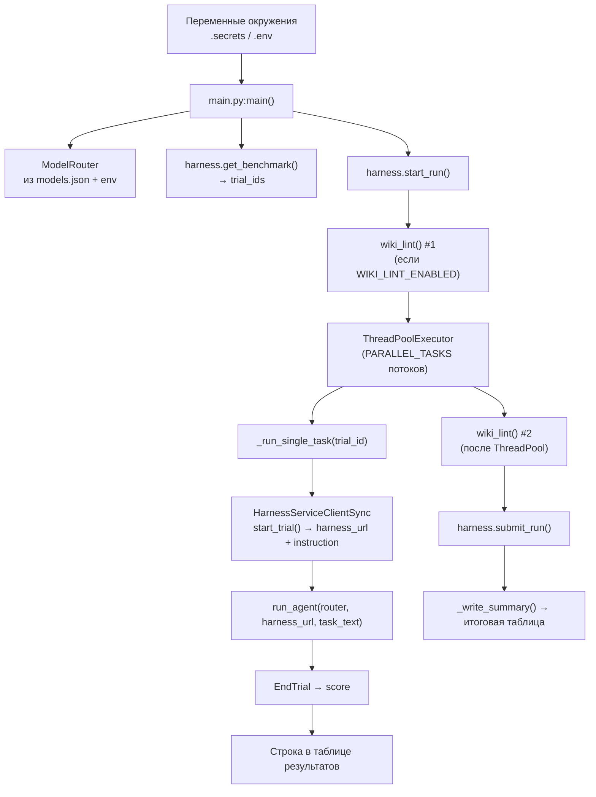
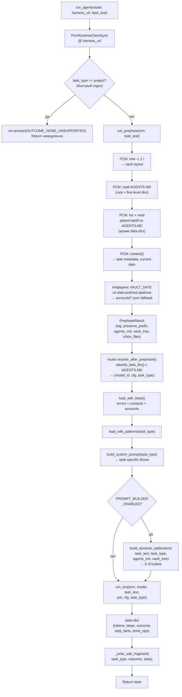
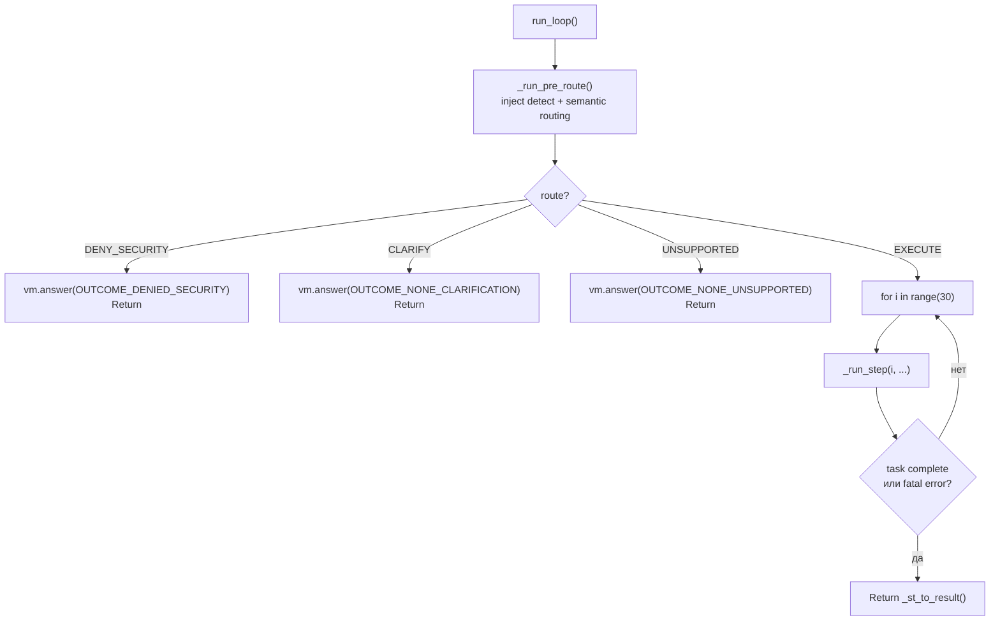
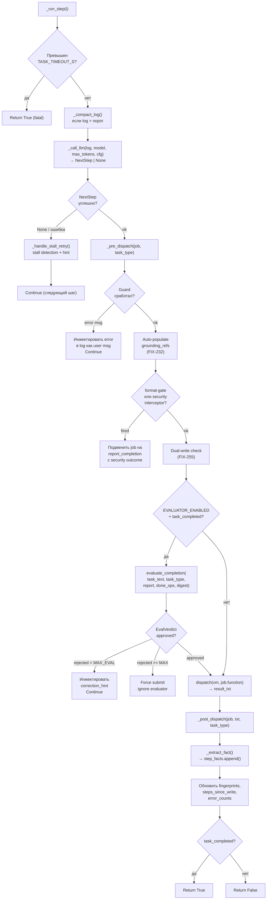
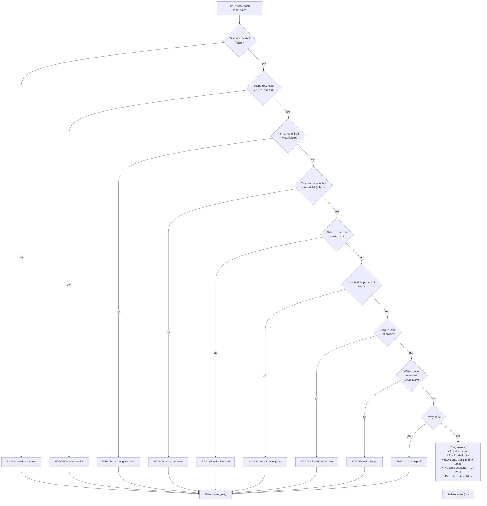
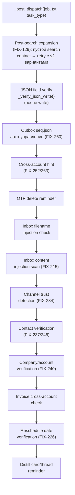
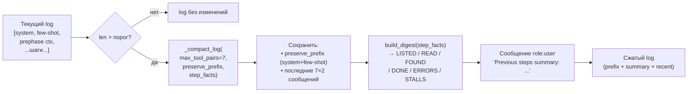
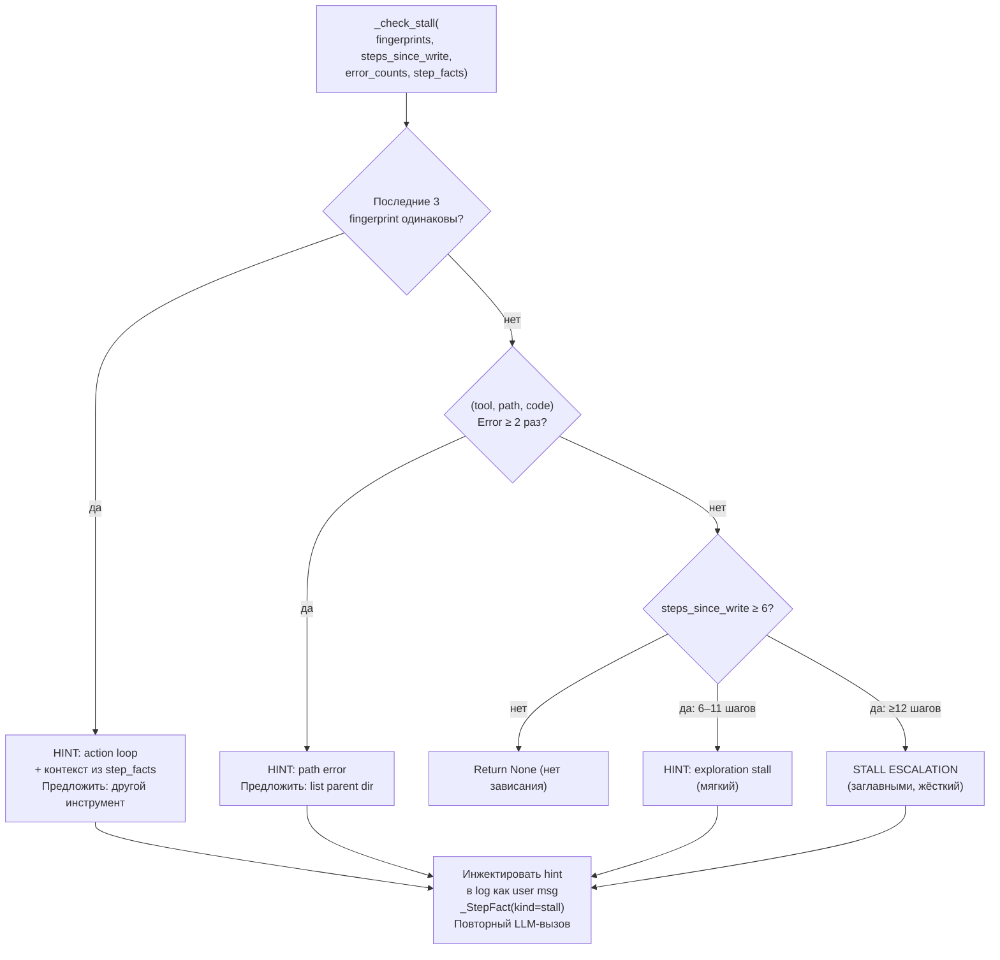
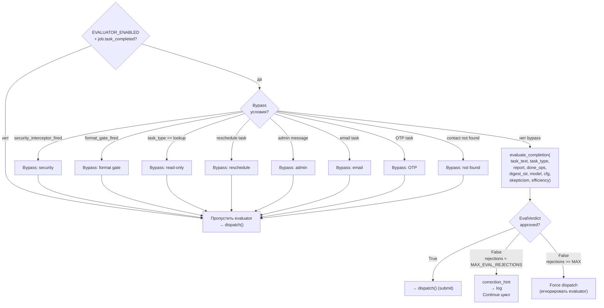
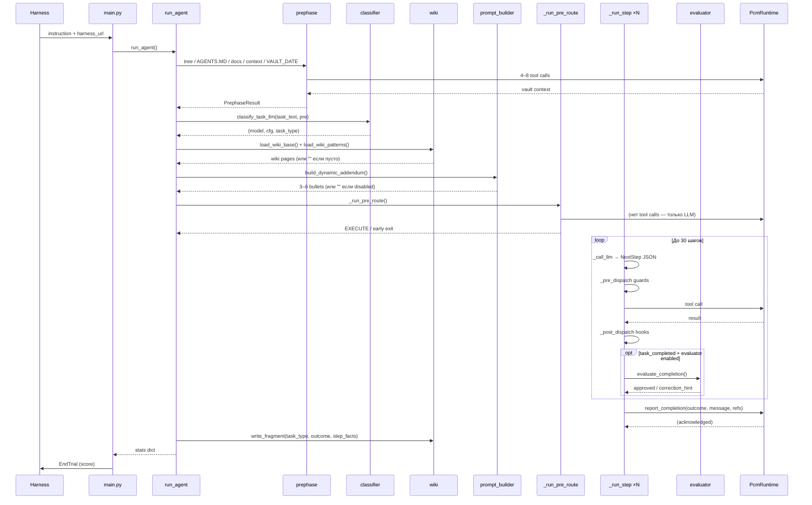

# Execution Flow: Полный путь выполнения задачи

Описывает поток управления от `main.py` до финального `vm.answer()`, включая все фазы, хуки и ветки принятия решений.

---

## Верхний уровень: main.py → run_agent()



---

## run_agent(): сборка контекста перед циклом



---

## run_loop(): детальный шаг выполнения



### _run_step(): внутренний цикл шага



---

## _pre_dispatch(): защитные проверки (в порядке приоритета)



---

## _post_dispatch(): хуки после успешного tool call



---

## _run_pre_route(): семантическая маршрутизация до цикла

```mermaid
sequenceDiagram
    participant LOOP as run_loop
    participant PREROUTE as _run_pre_route
    participant CACHE as _ROUTE_CACHE
    participant LLM as _call_llm (router)
    participant SEC as security.py

    LOOP->>PREROUTE: task_text, pre, model

    PREROUTE->>SEC: _normalize_for_injection(task_text)
    SEC-->>PREROUTE: normalized_text

    PREROUTE->>SEC: _INBOX_INJECTION_PATTERNS match?
    alt инъекция найдена (prephase inbox)
        PREROUTE-->>LOOP: return True (DENY)
    end

    PREROUTE->>CACHE: sha256(task_text[:800])
    alt cache hit
        CACHE-->>PREROUTE: cached TaskRoute
    else cache miss
        PREROUTE->>LLM: TaskRoute schema\n(injection_signals, route, reason)
        LLM-->>PREROUTE: TaskRoute | None
        alt None / retry failed
            PREROUTE->>PREROUTE: _ROUTER_FALLBACK (EXECUTE/CLARIFY)
        end
        PREROUTE->>CACHE: store result
    end

    alt route == DENY_SECURITY
        PREROUTE-->>LOOP: True (early exit)
    else route == CLARIFY / UNSUPPORTED
        PREROUTE-->>LOOP: True (early exit)
    else route == EXECUTE
        PREROUTE-->>LOOP: False (продолжить цикл)
    end
```

---

## Сжатие лога (_compact_log)



---

## Обнаружение зависания (stall.py)



---

## Evaluator gate: условия вызова и bypass



---

## Итоговая схема: полный путь одной задачи


