# LLM Routing: 3-Tier Dispatch

Описывает архитектуру маршрутизации LLM-запросов через три уровня провайдеров, управление моделями и capability detection.

---

## Трёхуровневая иерархия провайдеров

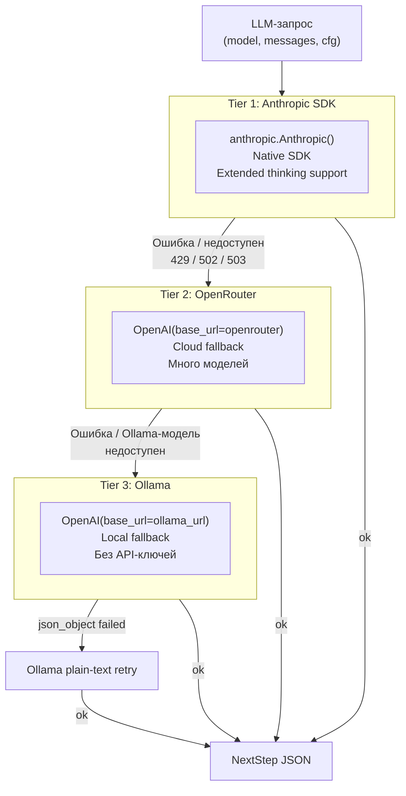

**Правила выбора tier:**
- `anthropic_client` существует и модель не ollama → Tier 1
- `openrouter_client` существует и модель не ollama → Tier 2
- Иначе → Tier 3 (Ollama)
- Ollama-модели (`name:tag` без `/`) → всегда Tier 3, пропускают T2

---

## Определение провайдера модели

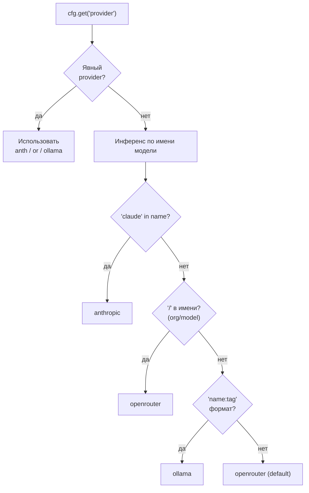

`get_provider(model, cfg)` — единственная точка определения провайдера в `dispatch.py`.

---

## Capability Detection: response_format

Разные модели поддерживают разные режимы структурированного вывода. Определяется один раз и кэшируется.

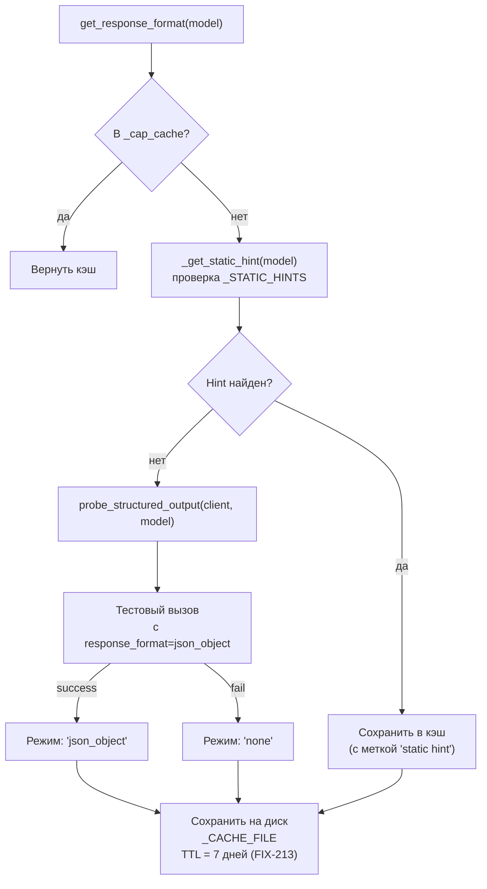

**Режимы response_format:**

| Режим | Когда | Поведение |
|-------|-------|-----------|
| `json_object` | Большинство Ollama/OR моделей | `{"type": "json_object"}` |
| `none` | Модели без поддержки | Без response_format |
| `plain_text` | `plain_text=True` флаг | Пропустить response_format (codegen) |

Кэш хранится в `data/.capability_cache.json`. Записи старше 7 дней удаляются при загрузке.

---

## call_llm_raw(): лёгкий LLM-вызов

Используется классификатором, wiki-lint, route-LLM. В отличие от `_call_llm()` в loop.py — без NextStep-схемы.

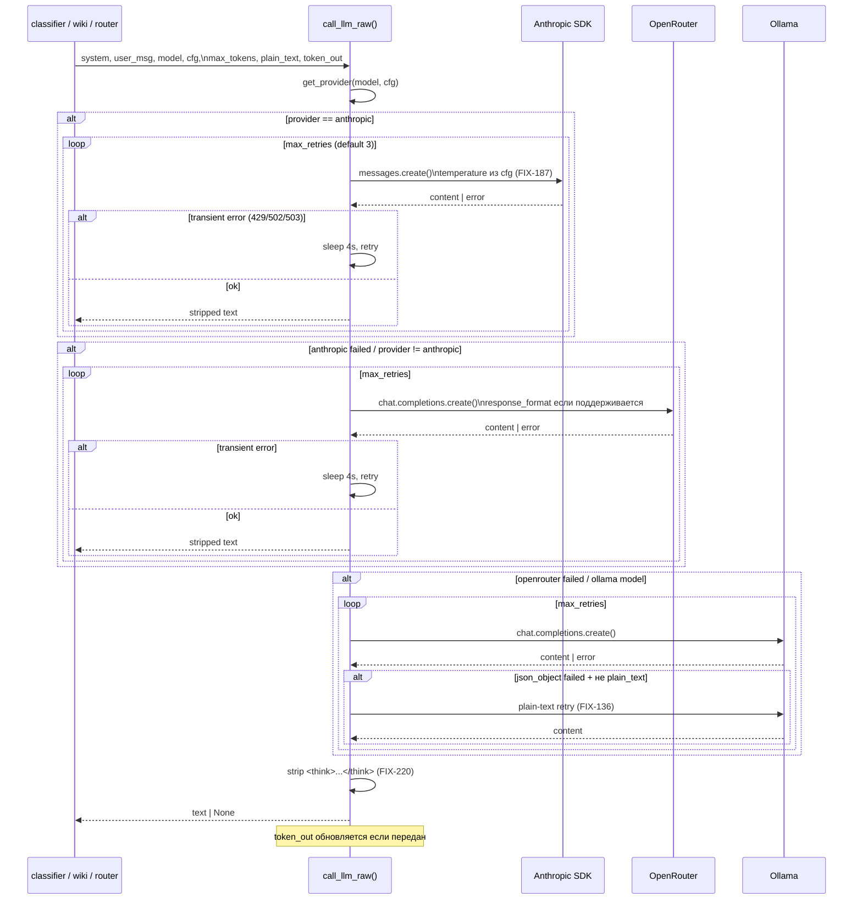

---

## _call_llm(): главный LLM-вызов в loop.py

Используется в основном агентском цикле. Возвращает `NextStep | None` + метрики.

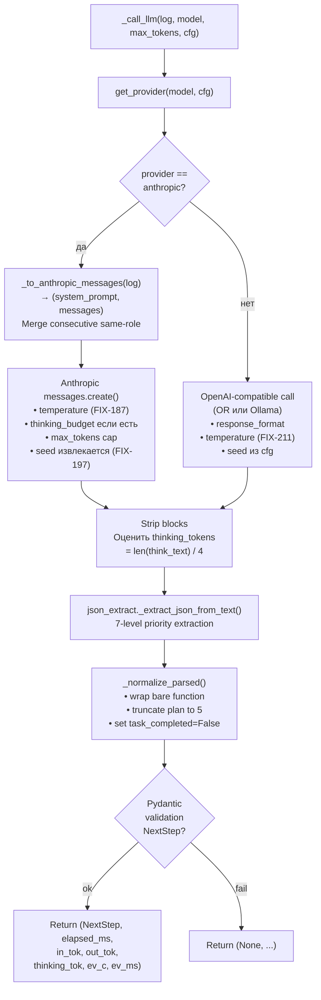

---

## Anthropic: конвертация формата сообщений

Anthropic API требует отдельного `system` параметра. `_to_anthropic_messages()` конвертирует OpenAI-формат.

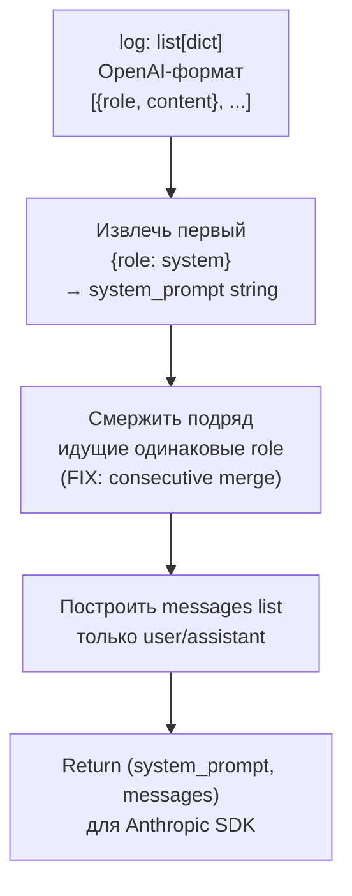

**Важно:** Anthropic не поддерживает `seed`. Значение извлекается из `cfg` для логирования, но не передаётся в API (FIX-197).

---

## models.json: конфигурация моделей

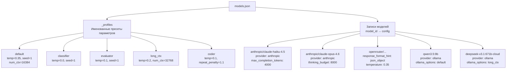

**Резолюция профилей** (FIX-119, `main.py` строки 131–137):

```python
# При запуске: строковые ссылки на профили → раскрыть в dict
for model_id, cfg in models.items():
    if isinstance(cfg.get("ollama_options"), str):
        cfg["ollama_options"] = profiles[cfg["ollama_options"]]
```

---

## ModelRouter: маршрутизация по типу задачи

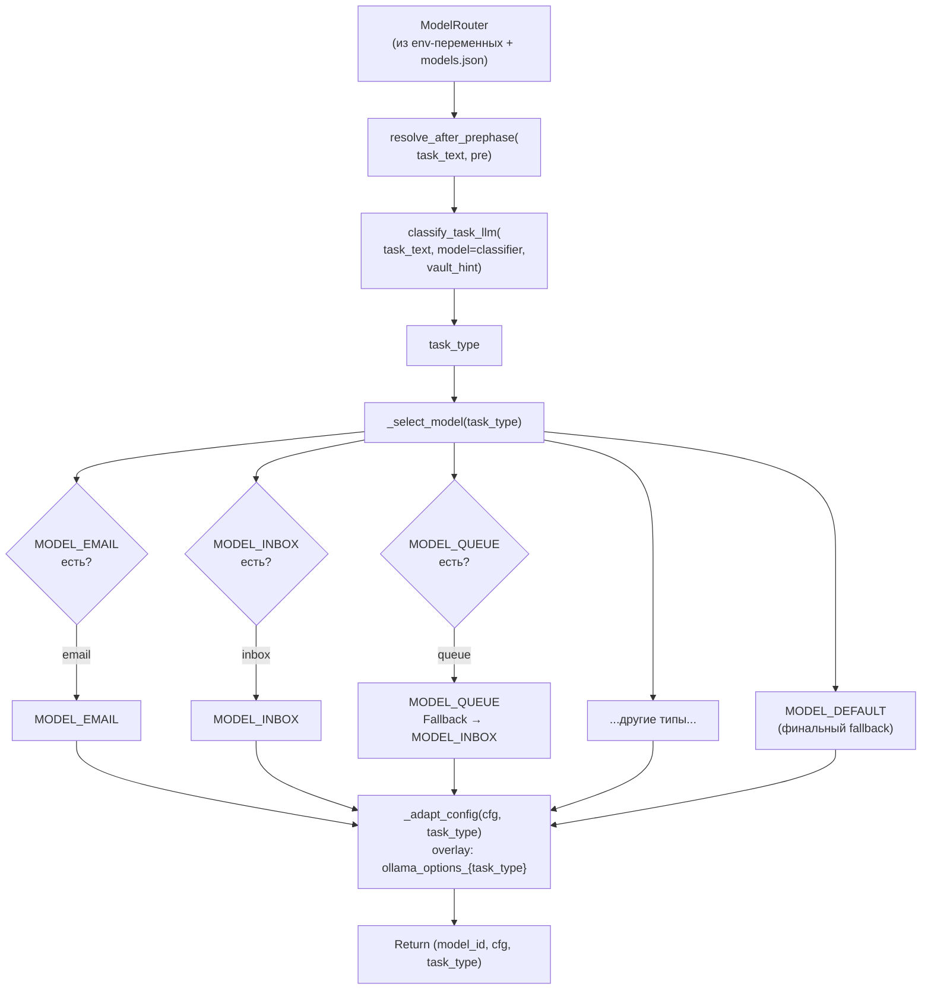

**Переменные окружения для моделей:**

| Переменная | Тип задачи | Fallback |
|-----------|-----------|---------|
| `MODEL_DEFAULT` | все | — |
| `MODEL_EMAIL` | email | MODEL\_DEFAULT |
| `MODEL_LOOKUP` | lookup | MODEL\_DEFAULT |
| `MODEL_INBOX` | inbox | MODEL\_DEFAULT |
| `MODEL_QUEUE` | queue | MODEL\_INBOX → MODEL\_DEFAULT |
| `MODEL_CAPTURE` | capture | MODEL\_DEFAULT |
| `MODEL_CRM` | crm | MODEL\_DEFAULT |
| `MODEL_TEMPORAL` | temporal | MODEL\_DEFAULT |
| `MODEL_PREJECT` | preject | MODEL\_DEFAULT |
| `MODEL_EVALUATOR` | evaluator | MODEL\_DEFAULT |
| `MODEL_PROMPT_BUILDER` | prompt\_builder | MODEL\_CLASSIFIER |
| `MODEL_CLASSIFIER` | classify / wiki-lint | MODEL\_DEFAULT |

---

## Classify: двухуровневая классификация

```mermaid
flowchart TD
    TXT["task_text"] --> REGEX["classify_task()\nRegex fast-path\nO(1) matching"]

    REGEX --> HC{"Высокая уверенность?\n(preject, email)"}
    HC -->|да| SKIP_LLM["Пропустить LLM\nReturn task_type"]

    HC -->|нет / default| VHINT["_count_tree_files(prephase_log)\n→ vault_hint строка"]
    VHINT --> LLM_C["classify_task_llm()\ncall_llm_raw() + plain-text prompt\nReturn JSON {type: X}"]

    LLM_C --> PARSE_C{"JSON parse\nуспешен?"}
    PARSE_C -->|да| EXT["Извлечь task_type\nиз поля 'type'"]
    PARSE_C -->|нет| RE_EXT["Regex extraction\n{\"type\": \"X\"}"]
    RE_EXT --> KW{"Ключевое слово\nв тексте?"}
    KW -->|да| KW_TYPE["task_type по ключевому слову"]
    KW -->|нет| FALLBACK["Regex fallback\nclassify_task()"]

    EXT & KW_TYPE & FALLBACK --> FINAL["Return task_type"]
```

**Regex-правила классификации** (приоритет сверху вниз):

| Тип | Паттерн |
|-----|---------|
| `preject` | calendar invite / sync to external / upload to salesforce |
| `queue` | work through / take care of / process bulk inbox |
| `inbox` | process/check/handle + single inbox/inbound |
| `email` | send/compose/write email + recipient/subject |
| `lookup` | find/search contact/account / count\_query без write |
| `capture` | capture + snippet/from/into |
| `crm` | reschedule/reconnect + date arithmetic |
| `temporal` | N days ago / in N days / what date |
| `distill` | analyze/summarize/evaluate (think words) |
| `default` | всё остальное |

---

## Write-protection в dispatch()

`dispatch()` реализует code-level защиту независимо от агентских решений (FIX-205):

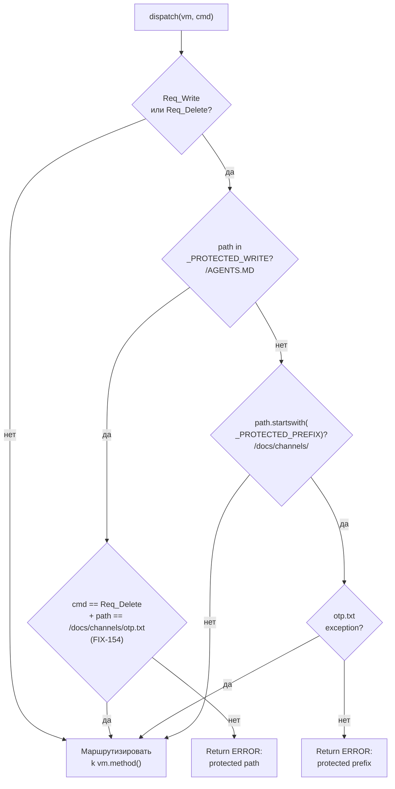

---

## Think-блоки: обработка extended thinking

Anthropic-модели с `thinking_budget` возвращают `<think>...</think>` блоки внутри ответа.

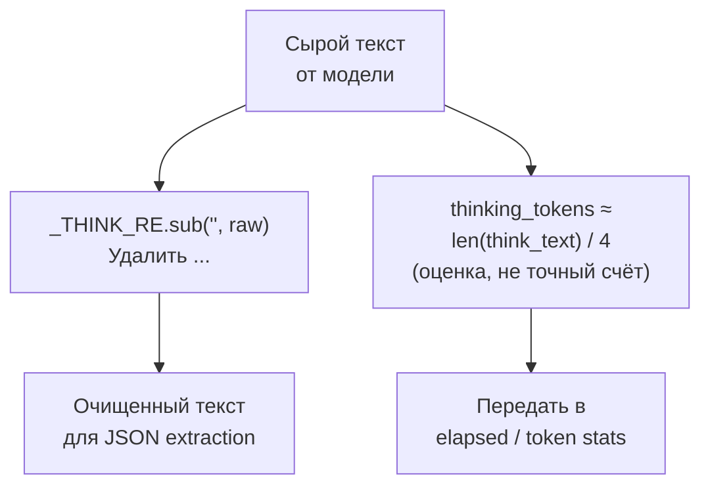

`LOG_LEVEL=DEBUG` → think-блоки дополнительно логируются в файл задачи.

---

## Transient-error retry

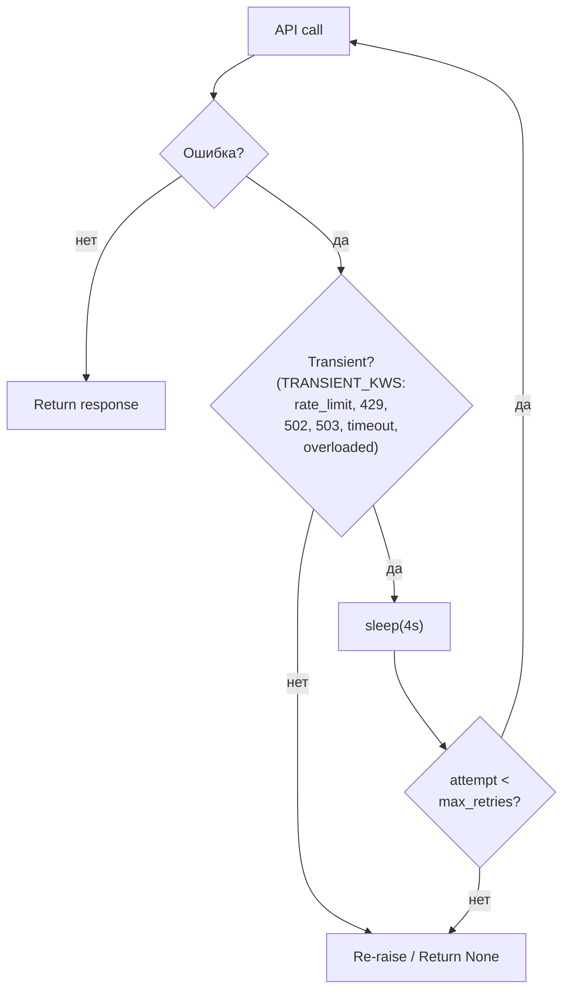

`max_retries=3` по умолчанию → до 4 попыток на tier. Суммарно с тремя tier: до 12 попыток перед финальным отказом.
