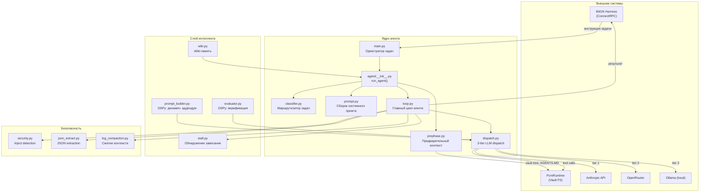
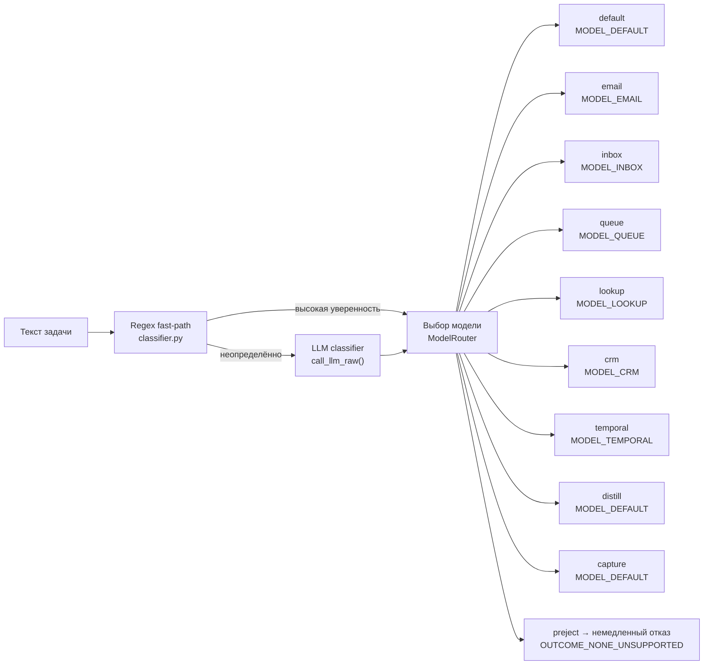
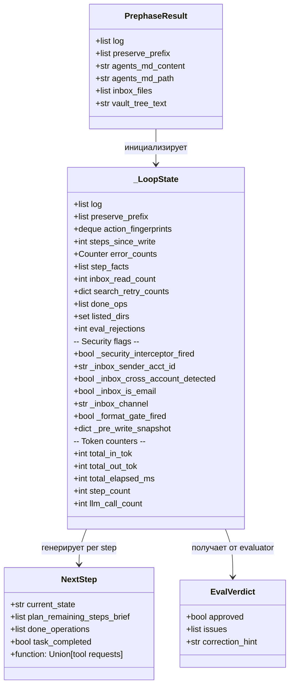

# PAC1-Tool: Архитектурный обзор

PAC1-Tool — Python-агент для бенчмарка BitGN PAC1. Управляет персональным knowledge vault через 9-инструментальный файловый интерфейс (tree, find, search, list, read, write, delete, mkdir, move, report\_completion). Связь с harness'ом — через Protocol Buffers / gRPC-Connect.

---

## Компоненты верхнего уровня



---

## Жизненный цикл одной задачи

```mermaid
sequenceDiagram
    participant H as BitGN Harness
    participant M as main.py
    participant A as run_agent()
    participant PRE as prephase
    participant CLS as classifier
    participant WIKI as wiki
    participant PB as prompt_builder
    participant LOOP as loop
    participant EVAL as evaluator
    participant PCM as PcmRuntime

    H->>M: StartTrial → instruction + harness_url
    M->>A: run_agent(router, url, task)

    A->>PRE: run_prephase(vm, task_text)
    PRE->>PCM: tree / read AGENTS.MD / list docs/
    PCM-->>PRE: vault layout + context
    PRE-->>A: PrephaseResult

    A->>CLS: resolve_after_prephase(task, pre)
    CLS-->>A: (model_id, cfg, task_type)

    A->>WIKI: load_wiki_base() + load_wiki_patterns(task_type)
    WIKI-->>A: cross-session knowledge pages

    A->>PB: build_dynamic_addendum(...)
    PB-->>A: 3–6 task-specific bullets

    A->>LOOP: run_loop(vm, model, task, pre, cfg)

    loop До 30 шагов
        LOOP->>LOOP: _call_llm → NextStep JSON
        LOOP->>LOOP: _pre_dispatch guards
        LOOP->>PCM: tool call (read/write/delete/...)
        PCM-->>LOOP: result
        LOOP->>LOOP: _post_dispatch checks
        opt Оценка завершения
            LOOP->>EVAL: evaluate_completion(...)
            EVAL-->>LOOP: EvalVerdict (approved/rejected)
        end
    end

    LOOP->>PCM: report_completion (outcome + message)
    PCM-->>LOOP: score
    LOOP-->>A: stats dict
    A->>WIKI: write_fragment(task_type, outcome, facts)
    A-->>M: token_stats
    M->>H: EndTrial → score
```

---

## Структура директорий

```
pac1-tool/
├── main.py                  # Точка входа, параллельный запуск задач
├── optimize_prompts.py      # DSPy COPRO оптимизация
├── models.json              # Конфиги моделей и профили
├── CHANGELOG.md             # История FIX-N меток
│
├── agent/
│   ├── __init__.py          # run_agent()
│   ├── loop.py              # Главный цикл (≤30 шагов)
│   ├── dispatch.py          # 3-tier LLM + PCM dispatch
│   ├── classifier.py        # Классификатор типов задач
│   ├── prompt.py            # Блоки системного промта
│   ├── prephase.py          # Предзагрузка контекста vault
│   ├── security.py          # Инъекции, scope-guard
│   ├── stall.py             # Обнаружение зависаний
│   ├── evaluator.py         # DSPy ChainOfThought критик
│   ├── prompt_builder.py    # DSPy Predict аддендум
│   ├── log_compaction.py    # Сжатие истории сообщений
│   ├── json_extract.py      # 7-уровневое извлечение JSON
│   ├── wiki.py              # Персистентная wiki-память
│   ├── models.py            # Pydantic-схемы (NextStep, tool req)
│   └── dspy_lm.py           # DSPy → dispatch адаптер
│
├── bitgn/
│   ├── harness_connect.py   # HarnessService клиент
│   └── vm/pcm_connect.py    # PcmRuntime клиент
│
├── proto/
│   ├── bitgn/harness.proto  # gRPC: управление бенчмарком
│   └── vm/pcm.proto         # gRPC: файловая система vault
│
└── data/
    ├── wiki/                # Wiki-страницы + фрагменты
    ├── dspy_examples.jsonl  # Примеры для COPRO
    ├── prompt_builder_program.json
    └── evaluator_program.json
```

---

## Типы задач и маршрутизация моделей



| Тип | Ключевые признаки | Особый промт-блок |
|-----|------------------|-------------------|
| `email` | send/compose + recipient | `_EMAIL`, `_LOOKUP` |
| `inbox` | process/handle + inbox/inbound | `_INBOX`, `_EMAIL`, `_LOOKUP` |
| `queue` | work through + bulk inbox | `_INBOX`, `_EMAIL`, `_LOOKUP` |
| `lookup` | find/search contact/account | `_LOOKUP` |
| `crm` | reschedule/reconnect + дата | `_CRM`, `_LOOKUP` |
| `temporal` | N days ago/from now | `_TEMPORAL`, `_LOOKUP` |
| `distill` | analyze/summarize/evaluate | `_DISTILL`, `_LOOKUP` |
| `capture` | capture + snippet/from/into | `_DISTILL` |
| `preject` | calendar invite / external API | только `_CORE` |
| `default` | всё остальное | все блоки |

---

## Внутренние данные состояния цикла



---

## Ключевые архитектурные принципы

1. **Discovery-first**: никаких hardcoded путей — агент открывает роли папок из `AGENTS.MD`.
2. **Three-tier LLM dispatch**: Anthropic → OpenRouter → Ollama с автоматическим fallback.
3. **Codegen architecture**: промт инструктирует писать Python-код вместо raw JSON для сложного анализа.
4. **Fail-open**: ошибки DSPy-компонентов (evaluator, prompt\_builder) не прерывают агент.
5. **FIX-N аудит**: каждое нетривиальное изменение поведения тегировано последовательным номером (текущий: FIX-318+).
6. **Prefix compaction**: первый системный промт + few-shot пара сохраняются; середина сжимается до последних 5 пар.
