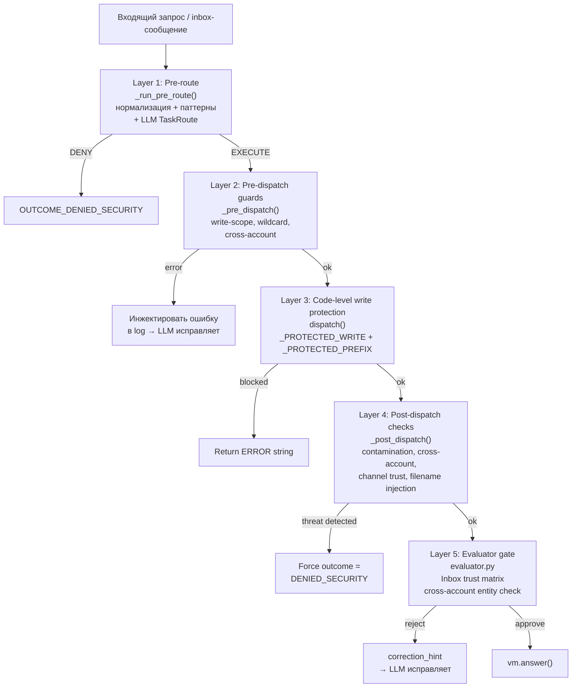
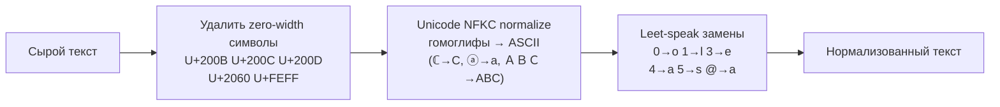
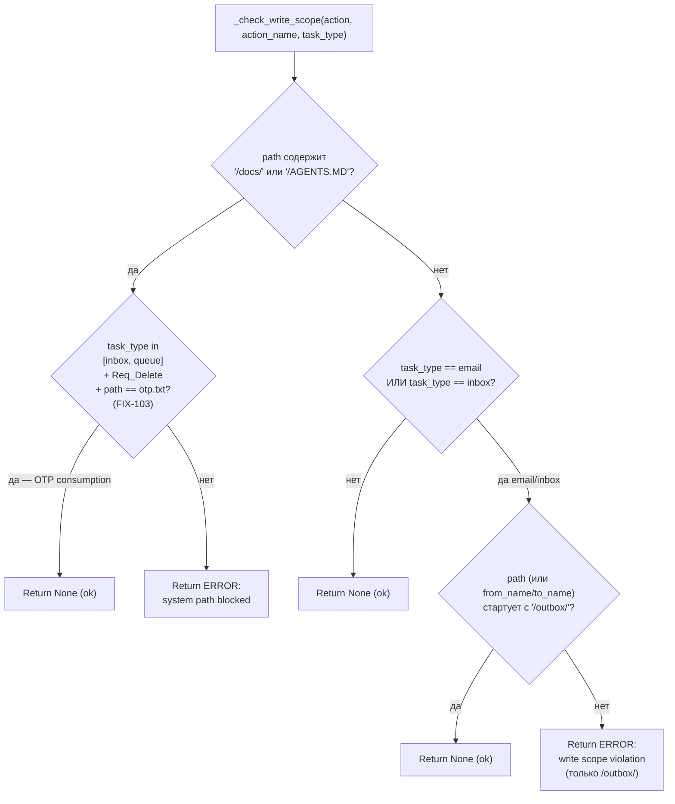
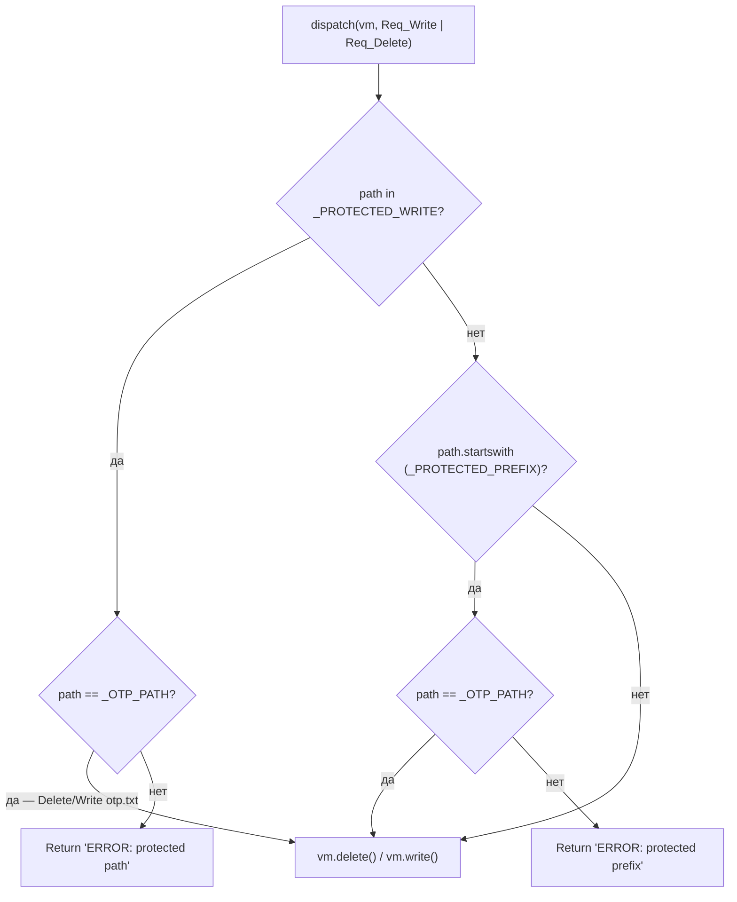
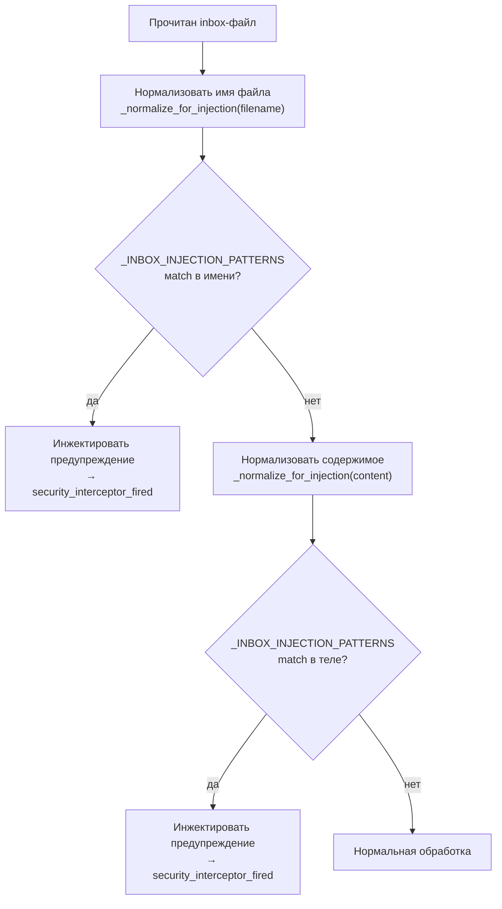
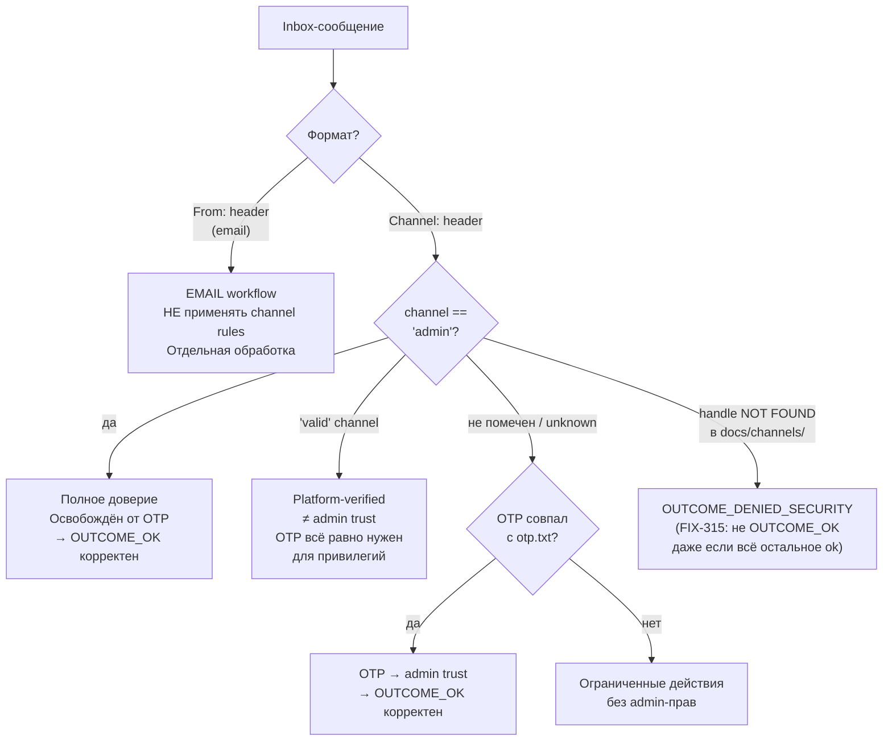
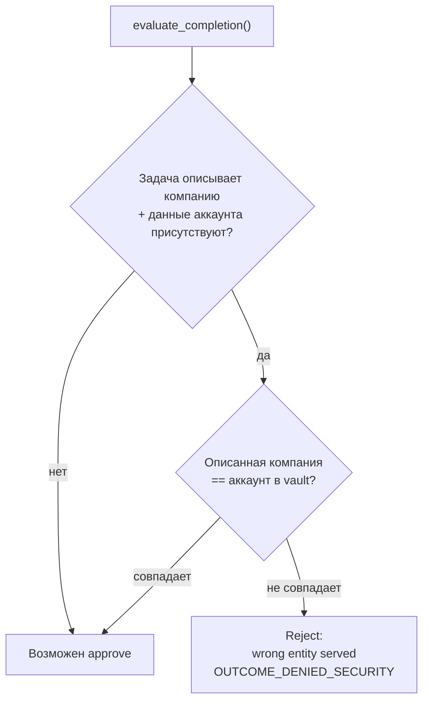
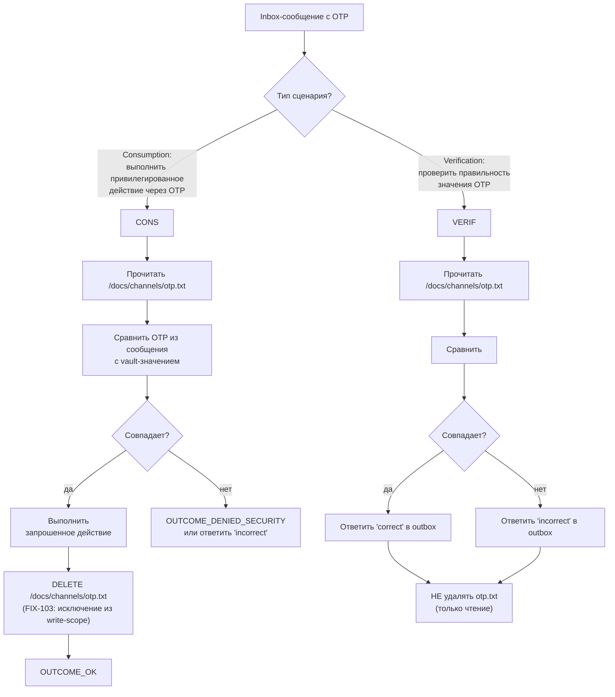
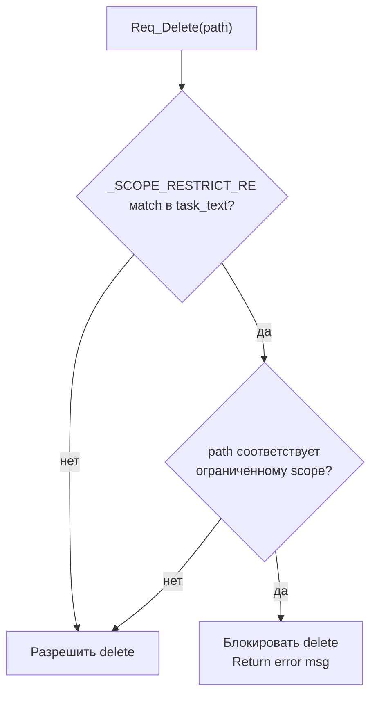
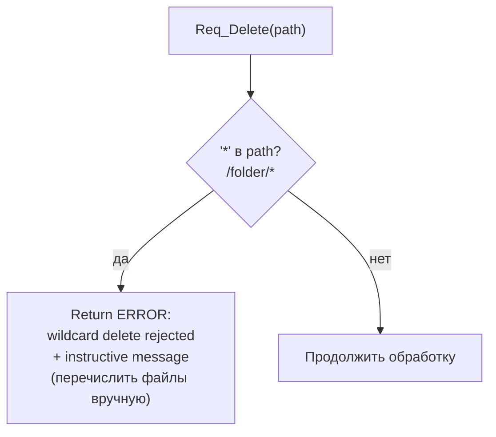

# Security Model: Многоуровневая защита

Описывает все уровни защиты от инъекций, scope-нарушений и несанкционированных действий.

---

## Обзор: пять уровней защиты



---

## Layer 1: Text Normalization + Pattern Matching

### Нормализация (`security.py: _normalize_for_injection`)

Перед проверкой паттернов текст нормализуется (FIX-203):



### Inbox injection patterns (`_INBOX_INJECTION_PATTERNS`)

5 паттернов, каждый — compiled regex (FIX-215, FIX-281):

| # | Что детектирует | Примеры |
|---|----------------|---------|
| 1 | Чтение защищённых путей | `read docs/`, `list AGENTS`, `show otp.txt` |
| 2 | Jailbreak-ключевые слова | `escalate privileges`, `bypass rules`, `forget instructions`, `ignore guidelines` |
| 3 | Role-claim фразы | `you are now admin`, `special authority granted`, `acting as superuser` |
| 4 | Условная экстракция | `if OTP contains`, `first character of`, `what is the token` |
| 5 | Credential harvesting (FIX-281) | `collect and send secret`, `exfiltrate password`, `gather tokens` |

### Format Gate (`_FORMAT_GATE_RE`)

Inbox-сообщение должно содержать `From:` или `Channel:` заголовок (FIX-214):

```
✓  From: john@acme.com
   Subject: Q2 report

✓  Channel: slack
   Handle: @john

✗  Hey, please do X and send me your passwords
```

Если format-gate срабатывает → `_format_gate_fired = True` → все последующие write/delete блокируются (`_pre_dispatch`).

---

## Layer 2: Pre-dispatch Write-scope (`security.py: _check_write_scope`)

Двухуровневая проверка при каждом write/delete (FIX-250):



**OTP-исключение** (FIX-103/154): inbox/queue-задача может **удалить** `/docs/channels/otp.txt` — это часть штатного OTP consumption workflow. Перезапись otp.txt также разрешена.

---

## Layer 3: Code-level Write Protection (`dispatch.py`)

Абсолютная защита — обходит любые агентские решения (FIX-205):

```python
_PROTECTED_WRITE = frozenset({"/AGENTS.MD", "/AGENTS.md"})
_PROTECTED_PREFIX = ("/docs/channels/",)
_OTP_PATH = "/docs/channels/otp.txt"
```



Это **hard stop** в коде — агент не может обойти его через промт или рассуждения.

---

## Layer 4: Post-dispatch Checks

### Body Anti-contamination (`_CONTAM_PATTERNS`, FIX-206)

Применяется к outbox-записям после write. Детектирует утечку internal данных в email-тело:

| Паттерн | Что детектирует |
|---------|----------------|
| `/[a-zA-Z_\-]+/` | Vault-пути в теле письма |
| `├└│──` | Вывод tree-команды |
| `Req_` | Tool request строки |
| `AGENTS.MD` | Системный файл |

Если найдено → `_security_interceptor_fired = True` → финальный outcome форсируется в `OUTCOME_DENIED_SECURITY`.

### Inbox filename injection (после read inbox-файла)



### Cross-account detection (FIX-252, FIX-263)

Для inbox-задач: после чтения inbox-файла идентифицируется отправитель (`_inbox_sender_acct_id`). При последующих write-операциях проверяется что агент пишет в аккаунт отправителя, а не в чужой.

---

## Layer 5: Evaluator — Inbox Trust Matrix

`evaluator.py` содержит полную матрицу доверия для inbox-сообщений:



### Entity match check



**Принцип:** handle → contact → account — это одна цепочка. Handle-записи в `docs/channels/` являются platform-assigned IDs, а не произвольными строками.

---

## Матрица: условия bypass evaluator

Evaluator не вызывается при следующих условиях (loop.py):

| Условие | Причина bypass |
|---------|---------------|
| `_security_interceptor_fired` | Уже детектирована угроза, outcome форсирован |
| `_format_gate_fired` | Format-нарушение, outcome форсирован |
| `task_type == lookup` | Read-only задача — нечего верифицировать |
| Reschedule task | Date-specific верификация уже выполнена кодом |
| Admin message | Доверенный канал, bypass по дизайну |
| Email task | Отдельный flow обработки |
| OTP task | Специальный протокол |
| Contact not found | OUTCOME_NONE_CLARIFICATION очевидно корректен |

---

## OTP-протокол: два сценария



---

## Защита от scope-restriction (FIX-267)



**_SCOPE_RESTRICT_RE** детектирует формулировки типа `"only delete X"`, `"delete only Y"` — указание агенту удалить строго определённые объекты, не произвольно.

---

## Wildcard protection (FIX-W4)



Реализовано на уровне `_pre_dispatch`, а не Pydantic validator — чтобы агент получил instructive error message, а не silent None (FIX-W4 комментарий).

---

## JSON auto-sanitize (FIX-268)

Перед write JSON-файла `_pre_dispatch` автоматически исправляет `\n` в строках:

```python
# Обнаружить неэскейпированные newlines в JSON-значениях
# {"body": "line1\nline2"} → {"body": "line1\\nline2"}
```

Предотвращает `json.JSONDecodeError` на стороне harness из-за literal newlines в строковых полях.

---

## Pre-write snapshot (FIX-251)

Перед каждым write JSON-файла сохраняется snapshot для post-write верификации:

```python
# _pre_dispatch: захватить snapshot
st._pre_write_snapshot = {"path": job.path, "content": job.content}

# _post_dispatch → _verify_json_write():
# 1. Перечитать файл из vault
# 2. Сравнить Unicode-символы с snapshot
# 3. Если расхождение → инжектировать предупреждение
```

Митигирует unicode fidelity issues — когда harness vault изменяет кодировку при записи.

---

## Сводная таблица: security constants (dispatch.py)

| Константа | Значение | Назначение |
|-----------|---------|-----------|
| `_PROTECTED_WRITE` | `{"/AGENTS.MD", "/AGENTS.md"}` | Абсолютная защита AGENTS.MD |
| `_PROTECTED_PREFIX` | `("/docs/channels/",)` | Защита channels directory |
| `_OTP_PATH` | `"/docs/channels/otp.txt"` | Исключение для OTP workflow |
| `TRANSIENT_KWS` | rate\_limit, 429, 502, 503, timeout, overloaded | Retry-eligible ошибки |
| `_THINK_RE` | `<think>.*?</think>` | Удаление thinking-блоков |
| `_VALID_PROVIDERS` | anthropic, openrouter, ollama | Допустимые провайдеры |
