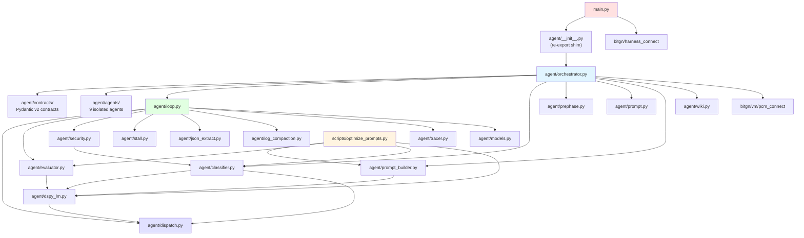
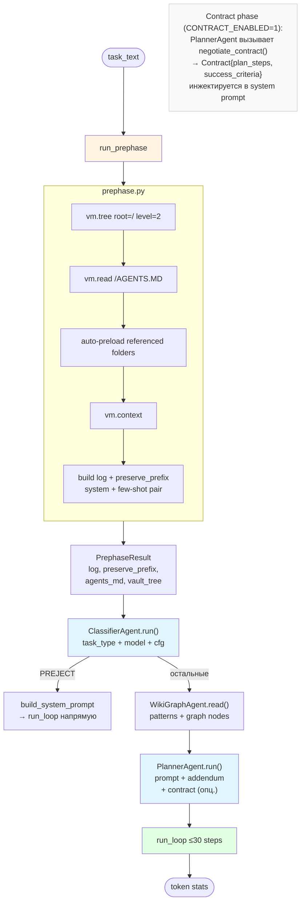
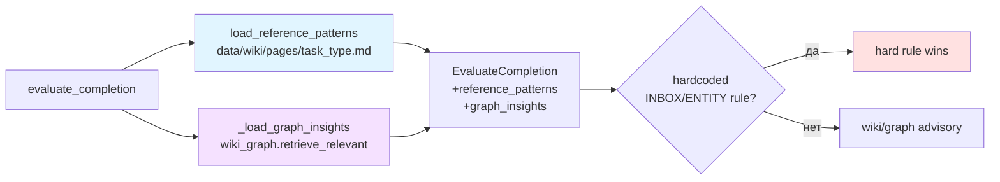
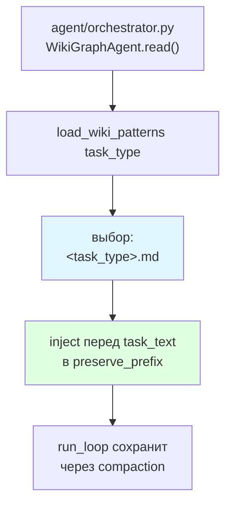
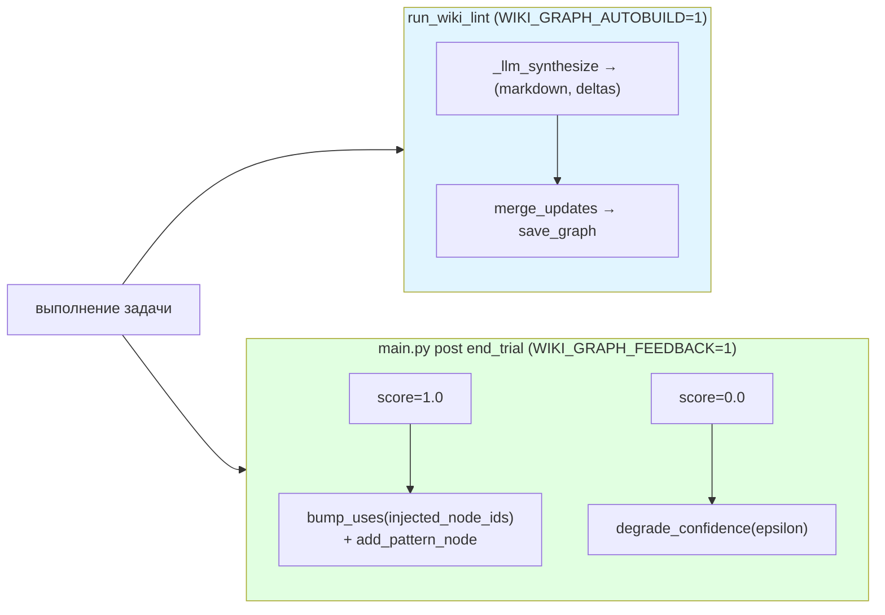

# Architecture Docs Actualization Implementation Plan

> **For agentic workers:** REQUIRED SUB-SKILL: Use superpowers:subagent-driven-development (recommended) or superpowers:executing-plans to implement this plan task-by-task. Steps use checkbox (`- [ ]`) syntax for tracking.

**Goal:** Обновить 5 файлов `docs/architecture/` чтобы отразить Hub-and-Spoke рефакторинг, contract phase, knowledge graph, GEPA backend и evaluator wiki injection.

**Architecture:** Чисто документационные правки — только markdown. Каждая задача изолирована (один файл). Нет зависимостей между задачами, их можно выполнять в любом порядке.

**Tech Stack:** Markdown, Mermaid diagrams (проверка синтаксиса вручную)

---

## Карта файлов

**Изменить:**
- `docs/architecture/README.md` — модульное дерево + две таблицы
- `docs/architecture/01-execution-flow.md` — flowchart run_agent + таблица ключевых файлов
- `docs/architecture/04-dspy-optimization.md` — диаграмма workflow + секция contract phase + таблица файлов
- `docs/architecture/06-evaluator.md` — секция wiki/graph injection + signature block + env vars
- `docs/architecture/07-wiki-memory.md` — инъекция-диаграмма + новая секция Knowledge Graph

---

## Task 1: README.md — Hub-and-Spoke в дереве модулей и таблицах

**Files:**
- Modify: `docs/architecture/README.md`

- [ ] **Step 1: Заменить диаграмму «Дерево модулей»**

Найти блок начинающийся с ` ```mermaid` после строки `## Дерево модулей` (строки ~71–110). Заменить всё содержимое mermaid-блока:



- [ ] **Step 2: Добавить строки в таблицу «Где что лежит»**

Найти строку `| \`data/*.json\` | Скомпилированные DSPy-программы (COPRO) |` и вставить две строки ПЕРЕД ней:

```
| `agent/agents/` | 9 изолированных агентов-обёрток (security, stall, compaction, step_guard, classifier, wiki_graph, verifier, planner, executor) |
| `agent/contracts/` | Typed Pydantic v2 контракты — единственный shared import между агентами |
```

- [ ] **Step 3: Добавить строку в таблицу «Ключевые архитектурные решения»**

Найти строку `| **Multi-Stage Security**` и вставить строку ПЕРЕД ней:

```
| **Hub-and-Spoke Agents** | `agent/orchestrator.py` координирует 9 агентов через `agent/contracts/` (Pydantic v2) | Изоляция зависимостей, тестируемость, DI для security/stall/evaluator |
```

- [ ] **Step 4: Проверить и закоммитить**

Открыть файл, убедиться что mermaid-диаграмма синтаксически корректна (все стрелки `-->`, кавычки сбалансированы), таблицы выровнены.

```bash
git add docs/architecture/README.md
git commit -m "docs(arch): update README — add Hub-and-Spoke to module tree and tables"
```

---

## Task 2: 01-execution-flow.md — Агентный pipeline вместо монолитного

**Files:**
- Modify: `docs/architecture/01-execution-flow.md`

- [ ] **Step 1: Заменить заголовок секции и flowchart run_agent**

Найти секцию `## run_agent: конвейер одной задачи` (~строка 75). Заменить весь mermaid-блок этой секции (до следующего `##`):



- [ ] **Step 2: Обновить таблицу «Ключевые файлы»**

Найти таблицу `## Ключевые файлы` (~строка 151). Заменить строки про `agent/__init__.py` и добавить новые:

Было:
```
| `agent/__init__.py` | `run_agent()` — сборка pipeline для одной задачи |
```

Стало (заменить эту строку на три):
```
| `agent/__init__.py` | Re-export shim: `from .orchestrator import run_agent, write_wiki_fragment` |
| `agent/orchestrator.py` | Hub-and-Spoke pipeline: ClassifierAgent → WikiGraphAgent → PlannerAgent → run_loop |
| `agent/contracts/__init__.py` | Typed Pydantic v2 контракты между агентами |
```

- [ ] **Step 3: Проверить и закоммитить**

```bash
git add docs/architecture/01-execution-flow.md
git commit -m "docs(arch): update 01 — replace monolithic run_agent diagram with agent pipeline"
```

---

## Task 3: 04-dspy-optimization.md — GEPA в диаграмме, contract phase DSPy

**Files:**
- Modify: `docs/architecture/04-dspy-optimization.md`

- [ ] **Step 1: Добавить GEPA ветку в основную workflow-диаграмму**

Найти строки в основном flowchart (~строки 26–28):
```
    Optimize --> Copro[COPRO<br/>breadth×depth<br/>prompt refinement]
    Copro --> Compiled[data/*_program.json]
```

Заменить на:
```
    Optimize --> BackendSel{OPTIMIZER_TARGET?}
    BackendSel -->|copro default| Copro[COPRO<br/>breadth×depth<br/>prompt refinement]
    BackendSel -->|gepa| Gepa[GEPA<br/>Genetic-Pareto<br/>Reflective Evolution]
    Copro --> Compiled[data/*_program.json]
    Gepa --> Compiled
    Gepa -.pareto frontier.-> Pareto["data/&lt;target&gt;_program_pareto/"]
```

И добавить в конец блока `style`:
```
    style BackendSel fill:#e1f5ff
    style Gepa fill:#f5e1ff
    style Pareto fill:#f0f0f0
```

- [ ] **Step 2: Добавить секцию «Contract phase: дополнительные сигнатуры»**

Вставить новую секцию ПЕРЕД `## DispatchLM: мост между DSPy и 4-tier` (~строка 206):

```markdown
## Contract phase: дополнительные сигнатуры

Фаза переговоров (`agent/contract_phase.py`) использует две отдельные DSPy-сигнатуры:

- **`ContractExecutor`** signature: генерирует `plan_steps` и `success_criteria` для executor-роли
- **`ContractEvaluator`** signature: верифицирует предложенный план с позиции evaluator-роли

Сбор примеров: `data/dspy_contract_examples.jsonl` — пишется только при `is_default=False` (т.е. когда negotiation действительно состоялась, а не использован дефолтный контракт).

Порог: ≥30 контрактных примеров → оптимизация:
```bash
uv run python scripts/optimize_prompts.py --target contract
```

Compiled programs: `data/contract_executor_program.json`, `data/contract_evaluator_program.json`. Fail-open: при отсутствии файлов используется bare signature.
```

- [ ] **Step 3: Обновить таблицу «Ключевые файлы»**

Найти таблицу `## Ключевые файлы` в конце файла (~строка 259). Добавить строки в конец таблицы:

```
| `agent/optimization/` | `CoproBackend`, `GepaBackend`, `OptimizerProtocol`, `metrics.py`, `feedback.py` |
| `data/dspy_contract_examples.jsonl` | Собранные примеры contract phase |
| `data/contract_executor_program.json` | Скомпилированная executor-программа контракта |
| `data/contract_evaluator_program.json` | Скомпилированная evaluator-программа контракта |
```

Также найти строку:
```
| `scripts/optimize_prompts.py` | CLI для COPRO: `--target builder\|evaluator` |
```
и заменить на:
```
| `scripts/optimize_prompts.py` | CLI: `--target builder\|evaluator\|classifier\|contract` |
```

- [ ] **Step 4: Проверить и закоммитить**

```bash
git add docs/architecture/04-dspy-optimization.md
git commit -m "docs(arch): update 04 — add GEPA branch to diagram and contract phase DSPy section"
```

---

## Task 4: 06-evaluator.md — Wiki + Graph injection

**Files:**
- Modify: `docs/architecture/06-evaluator.md`

- [ ] **Step 1: Обновить блок EvaluateCompletion signature**

Найти блок ` ``` ` после `## EvaluateCompletion signature` (~строки 29–43). Заменить содержимое:

```
Input:
  - proposed_outcome  : OUTCOME_OK | OUTCOME_DENIED_SECURITY |
                        OUTCOME_NONE_CLARIFICATION |
                        OUTCOME_NONE_UNSUPPORTED | OUTCOME_ERR_INTERNAL
  - done_operations   : ['WRITTEN: /outbox/5.json', 'READ: /contacts/maya.json', ...]
  - task_text         : оригинальный текст
  - skepticism_level  : low | mid | high
  - reference_patterns: str — wiki page content (advisory; "" если EVALUATOR_WIKI_ENABLED=0)
  - graph_insights    : str — top-K graph nodes (advisory; "" если WIKI_GRAPH_ENABLED=0)
  - account_evidence  : str — INBOX/entity evidence (hardcoded gate, не advisory)
  - inbox_evidence    : str — inbox-specific evidence

Output (ChainOfThought):
  - reasoning         : рассуждение модели
  - approved          : bool
  - issues            : list[str] — что не так
  - correction_hint   : str — как исправить
```

- [ ] **Step 2: Добавить секцию «Wiki + Graph injection» после «Per-task-type evaluator»**

Найти конец секции `## Per-task-type evaluator` (~строка 144, после блока с fallback-цепочкой). Вставить новую секцию:

```markdown
## Wiki + Graph injection (FIX-367)

`evaluate_completion()` получает два дополнительных advisory InputField, инжектируемых перед вызовом DSPy:

- **`reference_patterns`**: содержимое `data/wiki/pages/<task_type>.md` — раздел «Successful patterns» и «Verified refusals». Ограничен `EVALUATOR_WIKI_MAX_CHARS` символами.
- **`graph_insights`**: top-K релевантных узлов из `wiki_graph.retrieve_relevant()`. Требует `WIKI_GRAPH_ENABLED=1`.

**Advisory, не binding**: при конфликте с хардкодированными INBOX/ENTITY правилами побеждают правила. При любом сбое чтения wiki/graph — пустая строка (fail-open).


```

- [ ] **Step 3: Добавить env vars в «Конфигурация»**

Найти блок `## Конфигурация` (~строка 179). Добавить в конец bash-блока:

```
EVALUATOR_WIKI_ENABLED=1      # инъекция wiki страниц в evaluator (по умолчанию 1)
EVALUATOR_WIKI_MAX_CHARS=3000 # лимит символов wiki-контекста
EVALUATOR_GRAPH_TOP_K=5       # кол-во узлов графа (требует WIKI_GRAPH_ENABLED=1)
```

- [ ] **Step 4: Проверить и закоммитить**

```bash
git add docs/architecture/06-evaluator.md
git commit -m "docs(arch): update 06 — add wiki+graph injection section and updated signature"
```

---

## Task 5: 07-wiki-memory.md — Убрать load_wiki_base, добавить Knowledge Graph

**Files:**
- Modify: `docs/architecture/07-wiki-memory.md`

- [ ] **Step 1: Исправить диаграмму «Инъекция в prompt»**

Найти секцию `## Инъекция в prompt` (~строка 112). Заменить весь mermaid-блок:



После диаграммы добавить примечание:

```
> **FIX-346/350**: `load_wiki_base` (contacts.md + accounts.md) удалена — entity-catalog injection была избыточна, т.к. agent теперь обязан читать из живого vault перед записью. Осталась только инъекция task-type patterns.
```

- [ ] **Step 2: Добавить секцию «Knowledge Graph» перед «## Конфигурация»**

Найти `## Конфигурация` (~строка 201). Вставить новую секцию перед ней:

```markdown
## Knowledge Graph

Граф знаний расширяет wiki-память структурированными узлами с уровнями уверенности.

### Структура

- **Узлы**: типы `insight`, `rule`, `pattern`, `antipattern`; поля `{tags, confidence, uses, last_seen}`
- **Рёбра**: `requires`, `conflicts_with`, `generalizes`, `precedes`
- **Файл**: `data/wiki/graph.json` (committed + runtime-updated)

### Два пути заполнения



**LLM-extractor** (lint): промпт просит модель приложить fenced ` ```json {graph_deltas: ...} ``` ` после markdown-страницы. Fail-open: невалидный JSON → пишем только markdown.

**Confidence feedback** (post-trial): `stats["graph_injected_node_ids"]` фиксирует какие узлы агент видел в trial — `main.py` целит feedback ровно по ним.

### Retrieval

`retrieve_relevant_with_ids(graph, task_type, task_text, top_k)` — scoring = tag_overlap + text-token overlap + confidence × log(uses).

Граф читается в **трёх** точках, все гейчены `WIKI_GRAPH_ENABLED=1`:

| Точка | Как используется |
|---|---|
| System prompt | Инжектируется через `WikiGraphAgent.read()` → `orchestrator.py` |
| DSPy addendum | `graph_context` InputField в `PromptAddendum` signature |
| Evaluator | `_load_graph_insights()` в `evaluator.py` (advisory) |

### Конфигурация графа

```bash
WIKI_GRAPH_ENABLED=1               # чтение в prompt/addendum/evaluator
WIKI_GRAPH_TOP_K=5                 # кол-во узлов при retrieval
WIKI_GRAPH_AUTOBUILD=1             # LLM-extractor в run_wiki_lint
WIKI_GRAPH_FEEDBACK=1              # confidence feedback post-trial
WIKI_GRAPH_CONFIDENCE_EPSILON=0.05 # шаг degrade при score=0
WIKI_GRAPH_MIN_CONFIDENCE=0.1      # нижняя граница confidence
```

### Инспекция и обслуживание

```bash
uv run python scripts/print_graph.py             # все узлы
uv run python scripts/print_graph.py --tag email # по тегу
uv run python scripts/print_graph.py --edges     # с рёбрами
uv run python scripts/purge_research_contamination.py --apply  # очистка contaminated узлов
```
```

- [ ] **Step 3: Обновить таблицу «Ключевые файлы» и «Конфигурация»**

Найти `## Ключевые файлы` (~строка 209). Заменить таблицу:

```markdown
| Файл | Что делает |
|---|---|
| `agent/wiki.py` | `load_wiki_patterns`, `format_fragment`, `write_fragment`, `run_wiki_lint` |
| `agent/wiki_graph.py` | `load_graph`, `save_graph`, `retrieve_relevant_with_ids`, `bump_uses`, `degrade_confidence`, `merge_updates` |
| `agent/agents/wiki_graph_agent.py` | `WikiGraphAgent` — обёртка над wiki + wiki_graph |
| `data/wiki/pages/` | Скомпилированные страницы (injected) |
| `data/wiki/fragments/` | Сырые фрагменты per-task |
| `data/wiki/graph.json` | Персистентный граф знаний |
| `data/wiki/archive/` | Ротированные фрагменты |
| `scripts/purge_research_contamination.py` | Очистка contaminated узлов из графа |
| `scripts/print_graph.py` | Инспекция графа |
```

Найти `## Конфигурация` (~строка 201) и добавить в конец bash-блока:

```
WIKI_GRAPH_ENABLED=1               # граф активен (читается агентом, evaluator, DSPy)
WIKI_GRAPH_AUTOBUILD=1             # LLM-extractor в run_wiki_lint
WIKI_GRAPH_FEEDBACK=1              # confidence feedback post-trial
```

- [ ] **Step 4: Проверить и закоммитить**

```bash
git add docs/architecture/07-wiki-memory.md
git commit -m "docs(arch): update 07 — fix injection diagram, add Knowledge Graph section"
```

---

## Self-Review

**Spec coverage:**
- ✅ README.md: 1.1 module tree, 1.2 file table, 1.3 решения table
- ✅ 01: 2.1 flowchart, 2.2 contract note, 2.3 key files table
- ✅ 04: 3.1 GEPA в диаграмме, 3.2 contract DSPy секция, 3.3 файлы table
- ✅ 06: 4.1 wiki+graph секция, 4.2 signature, 4.3 env vars
- ✅ 07: 5.1 убрать load_wiki_base, 5.2 Knowledge Graph секция, 5.3 файлы+конфиг

**Что НЕ меняется:** 02, 03, 05, 08, 09 — без изменений, как указано в spec.
