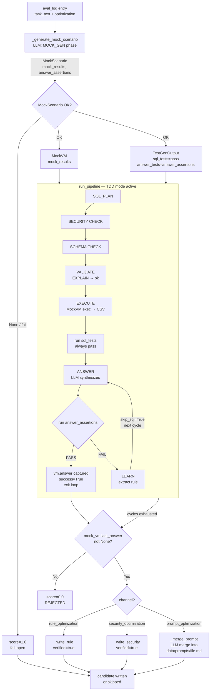

# Mock Validation Pipeline — Design Spec

**Date:** 2026-05-16  
**Status:** Approved (rev 3 — 2026-05-16)

## Problem

`propose_optimizations.py` validates optimization candidates (rules, security gates, prompt patches)
by re-running the originating task through the live BitGN harness with `validate_recommendation`.
This requires `BITGN_API_KEY`, `BENCHMARK_HOST`, `BENCHMARK_ID` — not available offline —
and adds network latency to every candidate.

## Goal

Replace `validate_recommendation` with offline mock validation:
- No VM, no harness, no API keys required
- Binary score: `1.0` (assertions passed) or `0.0` (failed)
- **If `1.0` → write candidate with `verified: true` (immediately active)**
- If `0.0` → reject
- Answer assertions run **inside the pipeline loop** — LEARN retries on failure

## Scope

`propose_optimizations.py`, `agent/pipeline.py` (two new parameters), and output writers.
MockVM is duck-type compatible with `EcomRuntimeClientSync` — rest of pipeline unchanged.

---

## Design

### Pipeline Schema



### Flow (text summary)

```
eval_log entry {task_text, rule_optimization / security_optimization / prompt_optimization}
   ↓
_generate_mock_scenario(task_text, model, cfg)    [LLM: MOCK_GEN phase]
   ↓ MockScenario {mock_results: [CSV...], answer_assertions: "def test_answer(...)"}
   ↓
MockVM(mock_results)  +  TestGenOutput(sql_tests="pass", answer_tests=answer_assertions)
   ↓
run_pipeline(mock_vm, ..., injected_candidate, max_cycles=15, injected_test_gen=test_gen)
   TDD-mode active (injected_test_gen != None regardless of TDD_ENABLED env var)
   Loop (up to 15 cycles):
     SQL_PLAN → SECURITY → SCHEMA → VALIDATE(EXPLAIN→"ok") → mock EXECUTE
     → run sql_tests (empty/pass always)
     → ANSWER
     → run answer_assertions
       PASS → success=True → exit loop → vm.answer() captured in MockVM
       FAIL → LEARN → next cycle (skip_sql=True → retry ANSWER with same sql_results)
   Cycles exhausted → success=False
   ↓
mock_score = 1.0 if success else 0.0
   ↓
1.0 → write candidate with verified=true (rules/security) or merge prompt into data/prompts/<file>
0.0 → REJECTED
```

### MockVM (agent/mock_vm.py)

Duck-type replacement for `EcomRuntimeClientSync`. Implements `.exec()` and `.answer()`.

- `exec(ExecRequest)` with EXPLAIN query → returns `_MockResult("ok")`
- `exec(ExecRequest)` with data query → returns `_MockResult(mock_results[i])`, cycles through list (clamped to last)
- `answer(AnswerRequest)` → captures to `self.last_answer` (no network call)

```python
class _MockResult:
    def __init__(self, stdout: str):
        self.stdout = stdout

class MockVM:
    def __init__(self, mock_results: list[str]) -> None:
        self._results = mock_results
        self._exec_count = 0
        self.last_answer = None

    def exec(self, req) -> _MockResult:
        args = list(req.args or [])
        if args and args[0].upper().startswith("EXPLAIN"):
            return _MockResult("ok")
        idx = min(self._exec_count, max(len(self._results) - 1, 0))
        result = self._results[idx] if self._results else ""
        self._exec_count += 1
        return _MockResult(result)

    def answer(self, req) -> None:
        self.last_answer = req
```

### MockScenario (agent/models.py addition)

```python
class MockScenario(BaseModel):
    reasoning: str
    mock_results: list[str]   # plausible CSV rows per expected query
    answer_assertions: str    # Python def test_answer(sql_results, answer): ...
```

### run_pipeline changes (agent/pipeline.py)

Two new parameters:

```python
def run_pipeline(
    vm,
    model: str,
    task_text: str,
    pre: PrephaseResult,
    cfg: dict,
    task_id: str = "",
    injected_session_rules: list[str] | None = None,
    injected_prompt_addendum: str = "",
    injected_security_gates: list[dict] | None = None,
    max_cycles: int | None = None,             # NEW: override _MAX_CYCLES
    injected_test_gen: "TestGenOutput | None" = None,  # NEW: bypass _run_test_gen
) -> tuple[dict, threading.Thread | None]:
    _cycle_limit = max_cycles if max_cycles is not None else _MAX_CYCLES
    _use_tdd = _TDD_ENABLED or (injected_test_gen is not None)
    test_gen_out = injected_test_gen
    if _use_tdd and test_gen_out is None:
        test_gen_out = _run_test_gen(model, cfg, task_text, pre.db_schema, pre.agents_md_content)
        if test_gen_out is None:
            # hard stop (same as current TDD hard-stop path)
            ...
    for cycle in range(_cycle_limit):  # was range(_MAX_CYCLES)
        ...
    # Replace all `if _TDD_ENABLED` with `if _use_tdd`
```

**No other changes to pipeline logic.** The existing TDD code path (LEARN on answer fail, `_skip_sql=True`) handles mock validation naturally.

### MOCK_GEN Phase (data/prompts/mock_gen.md)

LLM prompt that receives `task_text` + known schema tables
(`products`, `product_properties`, `inventory`, `kinds`, `carts`, `cart_items`)
and generates:

- `mock_results`: 1–5 CSV rows matching the columns queried by the task (e.g. `sku,path,name,price`
  for product lookups; `sku,quantity` for inventory checks). At least one row must contain a
  non-trivial value the correct answer can reference (non-empty SKU, non-zero price/quantity).
- `answer_assertions`: Python function `def test_answer(sql_results, answer): ...` with two explicit
  criteria: (1) `answer["outcome"] == "OUTCOME_OK"`; (2) at least one task-specific identifier or
  numeric result present in `answer["message"]` via an `in` check. Do NOT assert on exact phrasing.
  Do NOT hardcode the literal task text verbatim.

Output schema: `MockScenario` JSON.

### _generate_mock_scenario (propose_optimizations.py)

```python
def _generate_mock_scenario(task_text: str, model: str, cfg: dict) -> MockScenario | None:
    guide = _load_prompt("mock_gen")
    system = guide or "# PHASE: mock_gen\nGenerate mock_results and answer_assertions as JSON."
    raw = call_llm_raw(system, f"TASK: {task_text}", model, cfg, max_tokens=1024)
    if not raw:
        return None
    parsed = _extract_json_from_text(raw)
    if not isinstance(parsed, dict):
        return None
    try:
        return MockScenario.model_validate(parsed)
    except Exception:
        return None
```

### validate_mock (propose_optimizations.py)

Returns `(score: float, reason: str)`. Fail-open on MockScenario generation failure.

**Dual-run validation:** `validate_mock` runs the pipeline twice — first a baseline run
without the candidate (empty rules/gates/addendum), then a candidate run with the candidate injected.
If the baseline also passes, assertions are too weak and the candidate is rejected.
Only `candidate_pass=True` AND `baseline_pass=False` is accepted → the candidate genuinely improves behavior.

**answer format:** `test_answer(sql_results, answer)` receives `answer = answer_out.model_dump()` —
a dict with keys `reasoning`, `message`, `outcome` (string literal e.g. `"OUTCOME_OK"`), `grounding_refs`,
`completed_steps`. This is correct: pipeline calls `run_tests(..., {"answer": answer_out.model_dump()}, ...)`
before calling `vm.answer()`.

**Schema digest:** `pre` uses `_MOCK_SCHEMA_DIGEST` — a hardcoded minimal schema for known
ECOM tables — so `schema_gate` validates column names correctly instead of passing everything with empty digest.

```python
_MOCK_SCHEMA_DIGEST: dict[str, list[str]] = {
    "products": ["sku", "kind_id", "path"],
    "product_properties": ["product_id", "key", "value"],
    "inventory": ["sku", "store_id", "quantity"],
    "kinds": ["id", "name"],
    "carts": ["id", "customer_id"],
    "cart_items": ["cart_id", "sku", "quantity"],
}


def validate_mock(
    entry: dict,
    *,
    injected_session_rules: list[str] | None = None,
    injected_prompt_addendum: str = "",
    injected_security_gates: list[dict] | None = None,
    model: str,
    cfg: dict,
) -> tuple[float, str]:
    from agent.mock_vm import MockVM
    from agent.models import TestGenOutput
    from agent.pipeline import run_pipeline
    from agent.prephase import PrephaseResult

    task_text = entry["task_text"]
    scenario = _generate_mock_scenario(task_text, model, cfg)
    if scenario is None:
        return 1.0, "mock_gen failed — fail open"

    pre = PrephaseResult(
        db_schema="", agents_md_content="", agents_md_index={},
        schema_digest=_MOCK_SCHEMA_DIGEST, agent_id="", current_date="",
    )
    test_gen = TestGenOutput(
        reasoning="mock validation",
        sql_tests="def test_sql(results): pass\n",
        answer_tests=scenario.answer_assertions,
    )

    # Baseline run — no candidate injected
    baseline_vm = MockVM(scenario.mock_results)
    run_pipeline(
        baseline_vm, model, task_text, pre, cfg,
        injected_session_rules=[], injected_prompt_addendum="",
        injected_security_gates=[],
        max_cycles=15, injected_test_gen=test_gen,
    )
    baseline_pass = baseline_vm.last_answer is not None

    # Candidate run — candidate injected
    candidate_vm = MockVM(scenario.mock_results)
    run_pipeline(
        candidate_vm, model, task_text, pre, cfg,
        injected_session_rules=injected_session_rules or [],
        injected_prompt_addendum=injected_prompt_addendum,
        injected_security_gates=injected_security_gates or [],
        max_cycles=15, injected_test_gen=test_gen,
    )
    candidate_pass = candidate_vm.last_answer is not None

    if not candidate_pass:
        return 0.0, "pipeline produced no answer with candidate"
    if baseline_pass:
        return 0.0, "assertions too weak — baseline also passes without candidate"
    return 1.0, "ok"
```

**Note:** `vm.answer()` is called only on TDD success. If pipeline exhausts all cycles without passing
answer tests, `last_answer` remains `None`.

### Output writers when mock passes

**Rules** (`_write_rule`): `verified=True` (was `False`). Include `mock_validated` metadata field for audit trail:

```yaml
mock_validated: "2026-05-16"  # auto-verified via mock; not hand-reviewed
verified: true
```

**Security gates** (`_write_security`): same — `verified=True` + `mock_validated` date field.

**Prompts** (`_merge_prompt`): new function — replaces `_write_prompt`.
- Reads existing `data/prompts/<target_file>`
- LLM call: merge existing content + patch content (remove superseded/duplicate sections, add new)
- Write merged result back to `data/prompts/<target_file>`
- No file in `optimized/` created

**Backup before overwrite:** before writing, copy existing file to `<file>.bak`
so git and manual recovery are possible if LLM merge degrades content.

```python
def _merge_prompt(patch_result: dict, model: str, cfg: dict) -> Path:
    target = _PROMPTS_DIR / patch_result["target_file"]
    existing = target.read_text(encoding="utf-8") if target.exists() else ""
    if existing:
        target.with_suffix(target.suffix + ".bak").write_text(existing, encoding="utf-8")
    system = (
        "Merge the patch section into the existing prompt file. "
        "Remove content that covers the same topic as the patch but with less specificity or older guidance. "
        "Remove exact or near-exact duplicate sentences. Keep all other content intact. "
        "Return only the merged file content, no extra text."
    )
    user_msg = f"EXISTING:\n{existing}\n\nPATCH:\n{patch_result['content']}"
    merged = call_llm_raw(system, user_msg, model, cfg, max_tokens=4096, plain_text=True)
    if not merged:
        # fallback: append only if patch content not already present
        if patch_result["content"].strip()[:80] not in existing:
            merged = existing.rstrip() + "\n\n" + patch_result["content"] + "\n"
        else:
            merged = existing
    target.write_text(merged, encoding="utf-8")
    return target
```

`_merge_prompt` requires `model` and `cfg` — add these to the call site in `main()`.

### main() changes (propose_optimizations.py)

- Replace 3 `validate_recommendation(task_id, ...)` calls with `validate_mock(entry, ..., model=model, cfg=cfg)`
- Replace score check with `mock_score >= 1.0`
- In writers: `_write_rule(..., verified=True)` / `_write_security(..., verified=True)`
- In prompt channel: replace `_write_prompt(...)` with `_merge_prompt(patch_result, model, cfg)`
- Remove `task_id = entry.get(...)` lines (no longer needed)

---

## Files Changed

| File | Change |
|------|--------|
| `agent/mock_vm.py` | **NEW** — `MockVM` + `_MockResult` |
| `agent/models.py` | **ADD** — `MockScenario` Pydantic model |
| `agent/pipeline.py` | **MODIFY** — `max_cycles`, `injected_test_gen` params; `_use_tdd` flag |
| `data/prompts/mock_gen.md` | **NEW** — MOCK_GEN LLM prompt |
| `scripts/propose_optimizations.py` | **ADD** `_generate_mock_scenario`, `validate_mock`, `_merge_prompt`; **REMOVE** `validate_recommendation`, `read_original_score`, `_write_prompt`, harness imports; **MODIFY** `_write_rule`/`_write_security` to accept `verified` param |

## Files Unchanged

- `agent/test_runner.py` — reused as-is via `run_tests`
- `agent/evaluator.py` — no changes

---

## Constraints & Edge Cases

- **mock_gen fail-open:** if LLM fails to generate `MockScenario`, return `score=1.0` (fail-open)
- **empty mock_results:** MockVM returns `""` → pipeline LEARN retries; 15 cycles provides budget to converge
- **EXPLAIN mock:** always returns `"ok"` — syntax validation skipped (no real SQLite)
- **success detection:** `last_answer is not None` ↔ TDD success (vm.answer only called on pass)
- **dual-run rejection:** if baseline passes without candidate → assertions too weak → `score=0.0`; prevents false positives from trivially-passable assertions
- **schema digest:** `_MOCK_SCHEMA_DIGEST` hardcoded for 6 ECOM tables; schema_gate validates column names correctly
- **answer dict format:** `answer` in test assertions is `AnswerOutput.model_dump()` — string `outcome`, string `message`; `answer["outcome"] == "OUTCOME_OK"` works as expected
- **mock_validated field:** `_write_rule`/`_write_security` include `mock_validated: YYYY-MM-DD` for audit; `git log data/rules/` shows auto-verified history; revert with `git revert` on regression
- **prompt backup:** `_merge_prompt` writes `<file>.bak` before overwrite; fallback append deduped by content prefix
- **prompt circular risk:** prompt patches written directly to `data/prompts/` may generate new eval recs on next run; mitigated by content-hash dedup on `(channel|task_text|raw_rec)` — same raw_rec won't reprocess

---

## Out of Scope

- Storing `db_schema` or `agents_md` in eval_log
- Changes to production TDD path (`TDD_ENABLED=1`)
- Evaluator changes

## Known Limitations

- **RESOLVE phase skipped:** mock validation calls `run_pipeline` directly — `run_resolve` (SKU/category confirmation via DB) is not called. `confirmed_values` is empty. Rules/prompts that depend on resolved identifiers are not tested through RESOLVE. Acceptable: mock tests SQL_PLAN→ANSWER chain, not identifier lookup.
- **EXPLAIN always passes:** no real SQLite — SQL syntax errors not caught. Catches logic and answer quality, not syntax.
- **Dual-run cost:** 2× LLM calls per candidate (baseline + candidate). Both run up to 15 cycles. For high candidate volume, reduce `max_cycles` constant in `validate_mock`.
