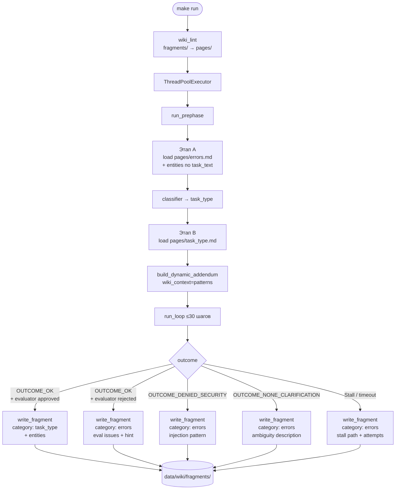
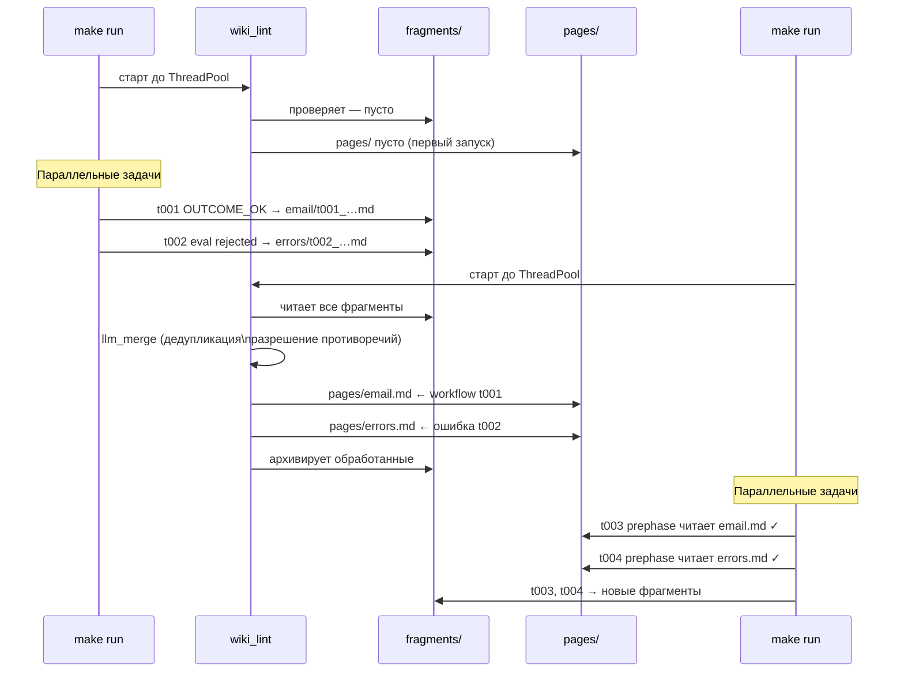
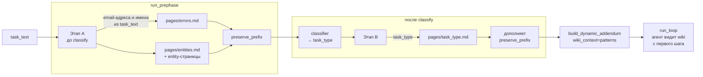
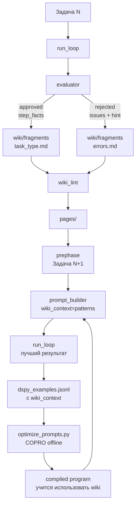
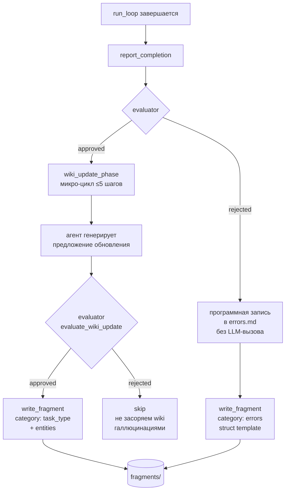

# Wiki-Memory: Mermaid-схемы

## 1. Общий flow: чтение и запись wiki в рамках одной задачи



---

## 2. Жизненный цикл fragments → pages (два прогона)



---

## 3. Двухэтапная загрузка wiki в prephase



---

## 4. Петля обратной связи: wiki ↔ DSPy



---

## 5. Роль evaluator как гейткипера wiki



---

## 6. Физическое расположение данных и потоки чтения/записи

```mermaid
graph LR
    subgraph DISK [Локальный диск]
        subgraph WIKI [data/wiki/]
            PAGES[pages/\nerrors.md\nemail.md\ncrm.md\nentities.md\n…]
            FRAGS[fragments/\nerrors/\nemail/\nentities/\n…]
            ARCH[archive/]
        end
        DSPY[data/\nprompt_builder_program.json\nevaluator_program.json]
    end

    subgraph VAULT [Harness Vault per-trial]
        VF[/contacts/\n/inbox/\n/outbox/\n…]
    end

    PAGES -->|read_text до prephase\nбез vault-инструментов| PRE[prephase.py]
    PRE --> LOOP[run_loop]
    LOOP --> VF
    VF --> LOOP
    LOOP -->|write_text после run_loop\nновый файл на задачу| FRAGS
    FRAGS -->|llm_merge\nначало make run| PAGES
    FRAGS -->|архив| ARCH
```
