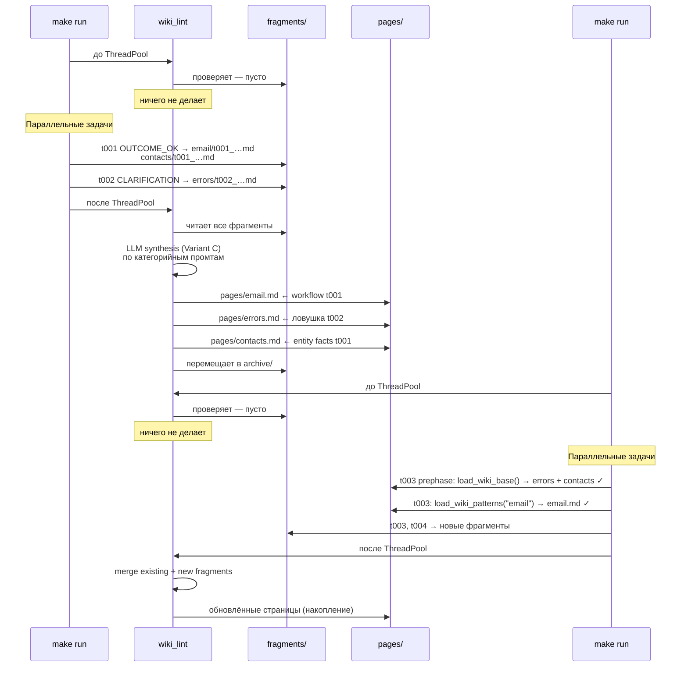
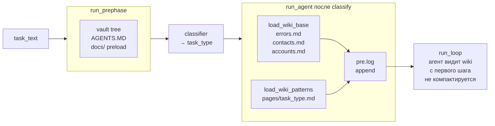
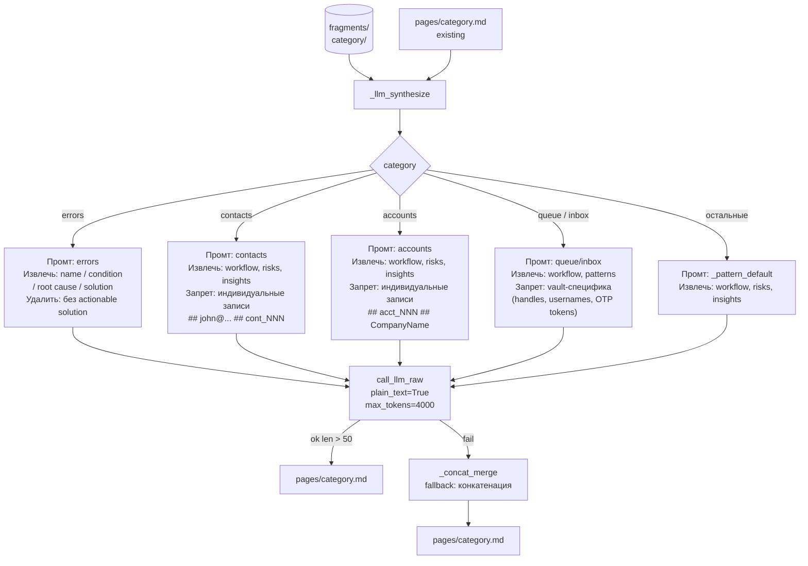
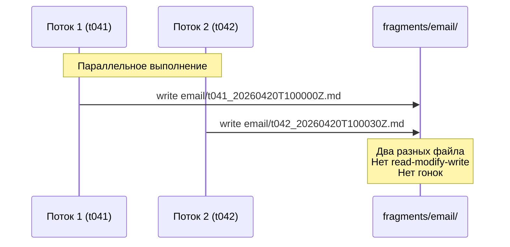
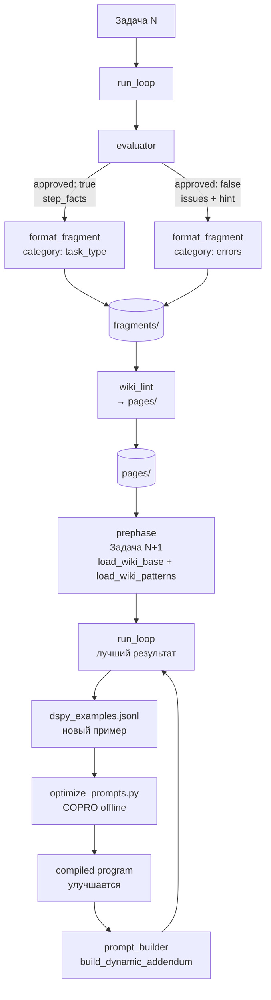

# Wiki-Memory: Mermaid-схемы

---

## 1. Полный flow: чтение и запись wiki за одну задачу

```mermaid
flowchart TD
    START([make run]) --> LINT1[wiki_lint\nфрагменты прошлых запусков\n→ pages/]
    LINT1 --> POOL[ThreadPoolExecutor]

    POOL --> PRE[run_prephase\nvault tree + AGENTS.MD]
    PRE --> CLS[classifier\n→ task_type]
    CLS --> WA[load_wiki_base\nerrors + contacts + accounts]
    WA --> WB[load_wiki_patterns\npages/task_type.md]
    WB --> LOOP[run_loop ≤30 шагов]

    LOOP --> OUTCOME{outcome}

    OUTCOME -->|OUTCOME_OK| FF1[format_fragment\ncategory: task_type]
    OUTCOME -->|OUTCOME_DENIED_SECURITY| FF2[format_fragment\ncategory: errors]
    OUTCOME -->|OUTCOME_NONE_CLARIFICATION| FF3[format_fragment\ncategory: errors]
    OUTCOME -->|Stall hints присутствуют| FF4[format_fragment\ncategory: errors]

    FF1 --> EF[+ entity fragments\ncontacts + accounts\nиз step_facts]
    FF2 --> EF
    FF3 --> EF
    FF4 --> EF

    EF --> WF[write_fragment\nappend-only\n{task_id}_{ts}.md]
    WF --> FRAG[(data/wiki/fragments/)]

    POOL -->|после всех задач| LINT2[wiki_lint\nфрагменты этого запуска\n→ pages/]
    LINT2 --> ARCH[архив обработанных\nfragments → archive/]
```

---

## 2. Жизненный цикл fragments → pages (два прогона)



---

## 3. Двухэтапная загрузка wiki в run_agent()



---

## 4. LLM-синтез (Variant C): категорийные промты



---

## 5. Параллельность: append-only fragments



```mermaid
flowchart LR
    subgraph BAD["❌ Без fragments (race condition)"]
        direction TB
        R1A[T1: read email.md] --> W1A[T1: write email.md]
        R1B[T2: read email.md] --> W1B[T2: write email.md]
        W1A -. "перезаписывает" .-> W1B
    end

    subgraph GOOD["✓ С fragments (thread-safe)"]
        direction TB
        F1[T1: write t041_{ts}.md]
        F2[T2: write t042_{ts}.md]
        F1 --- LINT2[Lint (однопоточно)\nобъединяет оба]
        F2 --- LINT2
        LINT2 --> PAGE[pages/email.md]
    end
```

---

## 6. Петля обратной связи: wiki ↔ evaluator ↔ DSPy



---

## 7. Физическое расположение: диск vs vault

```mermaid
graph LR
    subgraph DISK["Локальный диск (персистентен между runs)"]
        subgraph WIKI["data/wiki/"]
            PAGES["pages/\nerrors.md\nemail.md\ncontacts.md\naccounts.md\n…"]
            FRAGS["fragments/\nerrors/…\nemail/…\ncontacts/…\n…"]
            ARCH["archive/"]
        end
    end

    subgraph VAULT["Harness Vault (изолирован per-trial)"]
        VF["/contacts/\n/accounts/\n/inbox/\n/outbox/\nAGENTS.MD"]
    end

    PAGES -->|"read_text()\nбез vault-инструментов"| PREPHASE[prephase.py\nrun_agent()]
    PREPHASE --> RUNLOOP[run_loop]
    RUNLOOP <-->|"PCM tool calls\n(read/write/delete/…)"| VF
    RUNLOOP -->|"write_text()\nновый файл на задачу"| FRAGS
    FRAGS -->|"llm_merge\nLint дважды за run"| PAGES
    FRAGS -->|"архив после lint"| ARCH
```
